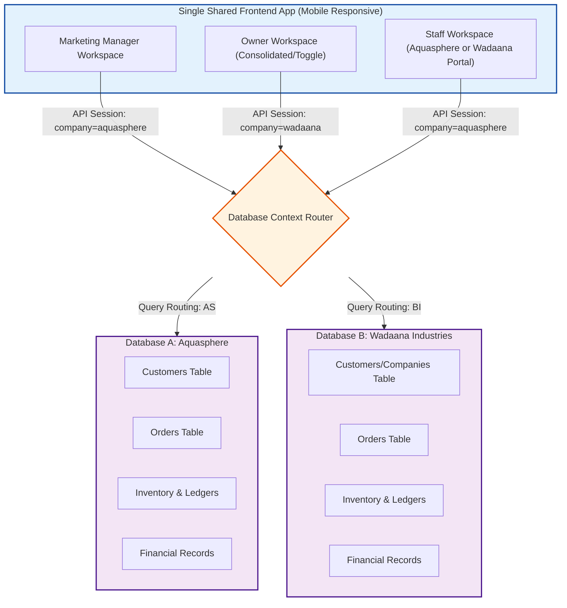
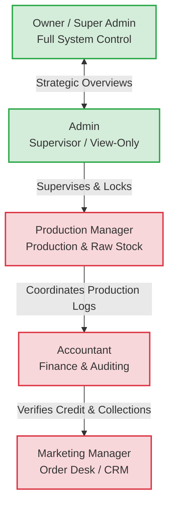
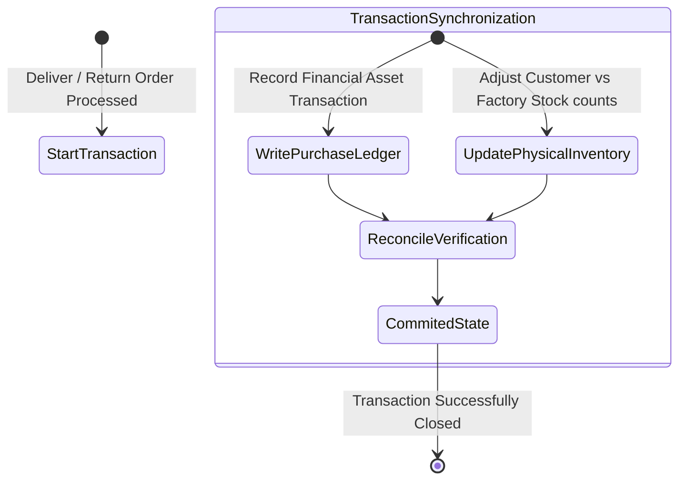
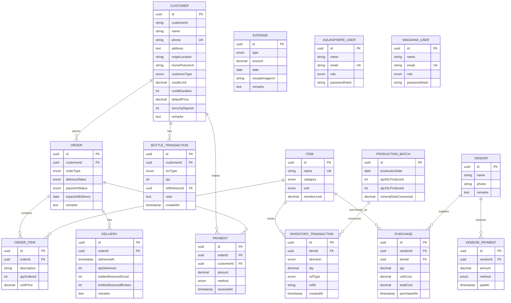

# AQUA Sphere OS — Master Requirements Document

> **Stack:** PERN (PostgreSQL, Express, React, Node.js) — JavaScript (ES6+)  
> **Status:** Requirements Consolidation — Ready for Development  
> **Last Updated:** July 2026  
> **Purpose:** Single source of truth combining all manager notes, blueprints, system documentation, and context documents into one crystal-clear build guide.

---

## Table of Contents

1. [System Overview](#1-system-overview)
2. [Architecture & Database Design](#2-architecture--database-design)
3. [Role Hierarchy & Permissions](#3-role-hierarchy--permissions)
4. [Division 1: Aquasphere (Water Business)](#4-division-1-aquasphere-water-business)
5. [Division 2: Wadaana Industries (Blowing Machine)](#5-division-2-wadaana-industries-blowing-machine)
6. [Inventory & Production Calculations](#6-inventory--production-calculations)
7. [Order & Customer Management](#7-order--customer-management)
8. [Credit Limits & Alerts](#8-credit-limits--alerts)
9. [19L Bottle Asset Ledger](#9-19l-bottle-asset-ledger)
10. [Purchasing & Vendor Management](#10-purchasing--vendor-management)
11. [Financial & Expense Tracking](#11-financial--expense-tracking)
12. [Dashboard & Reports](#12-dashboard--reports)
13. [Data Model (Database Schema)](#13-data-model-database-schema)
14. [Open Questions & Confirmations](#14-open-questions--confirmations)
15. [Build Phases](#15-build-phases)

---

## 1. System Overview

### 1.1 Two Separate Businesses

AQUA Sphere OS runs **two completely separate businesses**. Each division has its own dedicated users, roles, and logins.

```
┌───────────────┐       ┌───────────────┐
│ Wadaana        │       │ Aquasphere    │
│ Industries    │       │ (Water        │
│ (Blowing      │       │ Business)     │
│  Machine)     │       │               │
└───────────────┘       └───────────────┘
        │                       │
        ▼                       ▼
┌───────────────┐       ┌───────────────┐
│ Works         │       │ Works         │
│ Completely    │◄─────►│ Completely    │
│ Separately    │       │ Separately    │
└───────────────┘       └───────────────┘
```

> **Critical Rule:** These two sides **never share data**. Inventory, orders, customers, and reports are fully isolated. The same 5 roles operate in both, but their actions in one division have zero impact on the other. Users and authentication are also completely separate for each division.

### 1.2 Company Contexts

| Division | Business | Products |
|----------|----------|----------|
| **Aquasphere** | Water manufacturing & delivery | 19L reusable bottles, 0.5L PET packs, 1.5L PET packs |
| **Wadaana Industries** | Bottle manufacturing (Blowing Machine) | Preform-based bottles for 3 client companies |

### 1.3 Tech Stack

```
┌─────────────────────────────────────────────┐
│              React Frontend                   │
│         (Mobile-First Responsive)             │
│         Single Page Application               │
└──────────────────┬────────────────────────────┘
                   │ REST API / WebSocket
                   ▼
┌─────────────────────────────────────────────┐
│              Node.js + Express                │
│         (API Server / Auth Router)            │
│         Company Context Middleware            │
└──────────────────┬────────────────────────────┘
                   │
       ┌───────────┴───────────┐
       ▼                       ▼
┌──────────────┐      ┌──────────────┐
│ PostgreSQL   │      │ PostgreSQL   │
│ Database A   │      │ Database B   │
│ (Aquasphere) │      │ (Wadaana)     │
└──────────────┘      └──────────────┘
```

---

## 2. Architecture & Database Design

### 2.1 Multi-Tenant Dual-Database Architecture



### 2.2 Separation Rules

| Rule | Description |
|------|-------------|
| **Database Isolation** | All transactional records, sales history, customer databases, credit ledgers, and inventories are completely segregated |
| **Separate Users** | Users and authentication are entirely isolated per company. Aquasphere has its own users, Wadaana has its own users. |
| **Dedicated Roles** | Roles operate within their specific company context. |
| **Branding** | Invoices and alerts dynamically render branding matching the active database context |

---

## 3. Role Hierarchy & Permissions

### 3.1 Role Hierarchy Diagram



### 3.2 Permission Matrix

| Role | Access Level | Can See | Can Edit | Cannot See |
|------|-------------|---------|----------|------------|
| **Owner / Super Admin** | Full System Admin | Everything across both divisions | All data, passwords, credit limits, inventory corrections, website settings | Nothing |
| **Admin** | Supervisor (View-Only) | Inventory, Daily Production, Daily Orders, Customer Alerts | End-of-day close (click OK to lock day) | Profit, Cost, Cannot place orders |
| **Production Manager** | Operational Input | Inventory (Minerals, Caps, Bottles, Labels, Shrink Wrap, PETs) | Daily production counts, broken bottles | Financials, Sales, Customer records |
| **Accountant** | Financial Auditor | Customers, Expenses, Cash collections | Expenses (with receipt photo), Spot sales, Cash reports | Direct inventory adjustment |
| **Marketing Manager** | Operational Sales | Customer profiles, Orders, Inventory levels | Orders, Delivery status, Prices, Payment methods, New customers | Delete customers, Profit margins |

### 3.3 Critical Permission Rules

```
┌─────────────────────────────────────────────────────────────┐
│  OWNER / SUPER ADMIN — The Only Role That Can:              │
│  • Delete customer records                                  │
│  • Manually override inventory counts (logged adjustment)   │
│  • Modify all passwords                                     │
│  • Update website parameters                                │
│  • Edit credit limits                                       │
│  • View and correct which inventory items a purchase used   │
│  • See profit, losses, charts, overall reports              │
└─────────────────────────────────────────────────────────────┘

┌─────────────────────────────────────────────────────────────┐
│  ADMIN — Strictly View-Only:                                  │
│  • Cannot insert/edit daily transactions                    │
│  • Cannot view net profit calculations                      │
│  • Cannot view raw material cost metrics                    │
│  • Can view stock counts, production totals, orders           │
│  • Manually closes daily ledger (locks editing for the day) │
│  • Cross-verifies via WhatsApp + Portal before closing      │
└─────────────────────────────────────────────────────────────┘
```

---

## 4. Division 1: Aquasphere (Water Business)

### 4.1 Business Units

| Unit | Description | Inventory Type |
|------|-------------|---------------|
| **19L Reusable Bottles** | Delivered filled to customers. No finished goods stock — filled at delivery time. | Bottle asset ledger (capital equipment) |
| **0.5L PET Packs** | Packaged water, 12 bottles per pack. Produced and stored before sale. | Finished goods inventory |
| **1.5L PET Packs** | Packaged water, 6 bottles per pack. Produced and stored before sale. | Finished goods inventory |

### 4.2 Role Workflows — Aquasphere

#### Admin (View-Only Supervisor)

```
┌─────────────────────────────────────────┐
│         ADMIN CLOSE-OF-DAY FLOW         │
└─────────────────────────────────────────┘
                    │
        ┌───────────┴───────────┐
        ▼                       ▼
┌───────────────┐       ┌───────────────┐
│ Check Stock   │       │ Check         │
│ Numbers       │       │ Production    │
│ (0.5L, 1.5L)  │       │ (0.5L, 1.5L)  │
└───────┬───────┘       └───────┬───────┘
        │                       │
        ▼                       ▼
┌───────────────┐       ┌───────────────┐
│     OK        │       │     OK        │
└───────┬───────┘       └───────┬───────┘
        │                       │
        └───────────┬───────────┘
                    ▼
        ┌───────────────────────┐
        │   Check Orders        │
        │   (WhatsApp + Portal) │
        └───────────┬───────────┘
                    ▼
        ┌───────────────────────┐
        │   Click "Close Day"   │
        │   (Locks all entries  │
        │    for that date)     │
        └───────────────────────┘
```

> **Note:** After Admin closes the day, no entries can be added or edited by any role except Owner.

#### Production Manager (PM)

- Enters how many 0.5L and 1.5L packs ("pats") were made
- Records bottles broken during production
- Sees inventory: Minerals, Caps, Empty Bottles, Labels, Shrink Wraps, Already-Made PETs
- Closes their section by end of day

#### Marketing Manager (Order Desk)

```
┌─────────────────────────────────────────┐
│      MARKETING MANAGER ORDER FLOW       │
└─────────────────────────────────────────┘
                    │
                    ▼
        ┌───────────────────────┐
        │  Search Customer      │
        │  (Phone / Name / ID)  │
        └───────────┬───────────┘
                    │
        ┌───────────┴───────────┐
        │                       │
        ▼                       ▼
┌───────────────┐       ┌───────────────┐
│ Found?        │       │ Not Found?    │
│ Show Profile: │       │ "Add New      │
│ • Name        │       │  Customer"    │
│ • Balance     │       │  Modal opens  │
│ • Bottles     │       │  within order │
│ • Last Order  │       │  workflow     │
│ • Avg/Month   │       │               │
└───────┬───────┘       └───────────────┘
        │
        ▼
┌───────────────────────┐
│  Enter Order:         │
│  • 0.5L / 1.5L / 19L  │
│  • Quantity           │
│  • Price              │
│  • Expected Delivery  │
│  • Remarks            │
└───────────┬───────────┘
            │
            ▼
┌───────────────────────┐
│  Check Payment:       │
│  • Cash paid?         │
│  • Payment method     │
│  • Update delivery    │
│    status             │
└───────────────────────┘
```

**Key Features:**
- Can add and view customers, **cannot delete them**
- Places orders against existing customer list
- Closes and checks orders by date
- Checks whether today's orders are complete or pending
- **Target: Order entry under 20 seconds once customer is found**

#### Accountant

```
┌─────────────────────────────────────────┐
│      ACCOUNTANT DAILY WORKFLOW          │
└─────────────────────────────────────────┘
                    │
        ┌───────────┴───────────┐
        ▼                       ▼
┌───────────────┐       ┌───────────────┐
│ Daily Expense │       │ Spot Sale     │
│ Entry         │       │ (Counter)     │
└───────┬───────┘       └───────┬───────┘
        │                       │
        ▼                       ▼
┌───────────────┐       ┌───────────────┐
│ ITEM          │       │ Litres sold   │
│    ↓          │       │ Caps used     │
│ PURCHASE      │       │ Cash collected│
│    ↓          │       │ Total         │
│ Detail +      │       │               │
│ Picture +     │       │               │
│ Bill          │       │               │
└───────────────┘       └───────────────┘
```

**Expense Rules:**
- **Every expense entry MUST have a picture attached** (fuel receipt photo, etc.)
- Alternative: Upload picture of paper ledger, then add typed details
- Cross-verifies all entries
- Records cash collected and produces reports
- Generates invoices
- Can see customers, has **no access to inventory**

### 4.3 Customer Profile Fields

| Field | Type | Required | Notes |
|-------|------|----------|-------|
| `id` | UUID | Auto | Primary key |
| `customerId` | String | Yes | System-generated display ID |
| `name` | String | Yes | |
| `phone` | String | Yes | **Unique — primary search key** |
| `address` | Text | Yes | |
| `mapsLocation` | String | Yes | GPS/Google Maps link or coordinates |
| `homePictureUrl` | String | Yes | Photo of building exterior for delivery drivers |
| `customerType` | Enum | Yes | `home` / `restaurant` / `shop` / `distributor` |
| `creditLimit` | Decimal | Yes | `0` = unlimited |
| `creditDuration` | Int | Default 1 | Months |
| `defaultPrice` | Decimal | Optional | Suggested default at order time |
| `securityDeposit` | Int | Optional | Number of 19L bottles held as deposit |
| `remarks` | Text | Optional | Free text |

---

## 5. Division 2: Wadaana Industries (Blowing Machine)

### 5.1 Current Architecture & Feature Parity

Wadaana Industries currently operates identically to Aquasphere in terms of frontend UI and backend infrastructure. The `wadaana` database schema is a 100% exact mirror of the `aquasphere` schema.

- Same CRM and Order Management flows.
- Same Inventory and Dashboard logic.
- Same role-based access controls, simply segregated into the `wadaana` context.

### 5.2 Future B2B Expansion

The specialized blowing machine features (Preform procurement, Blowing production batches for specific client companies like Deosani/Pivrifine, and complex B2B sales logic) will be integrated in a later phase. Until then, the system will support standard operations natively inherited from the Aquasphere baseline.

---

## 6. Inventory & Production Calculations

### 6.1 Core Design Principle: No Manually-Edited Numbers

> **This is the single most important architectural constraint.**

```
┌─────────────────────────────────────────────────────────────┐
│  RULE: Every inventory quantity, bottle count, and balance  │
│        must be CALCULATED from transaction history.         │
│        NEVER stored as a directly-editable field.           │
│                                                             │
│  Purchases  →  Positive inventory transactions              │
│  Production →  Negative raw-material + positive finished    │
│  Deliveries →  Negative finished-goods (PET)                │
│                + bottle-ledger movements (19L)              │
│  Payments   →  Separate transaction stream                 │
│                                                             │
│  Mistakes? Use explicit ADJUSTMENT/REVERSAL transaction   │
│  with required reason/note — never back-door edits.        │
└─────────────────────────────────────────────────────────────┘
```

### 6.2 Mineral Treatment Formulations

**Mineral Set Composition:**
```
1 Mineral Set = 2 kg Calcium + 1 kg Magnesium + 0.5 kg Sodium
```

**Confirmed Conversion:**
| Input | Result |
|-------|--------|
| 2 kg Calcium | **15,140 L** water treated |
| 0.5 kg Sodium | Used per set |

> **Note:** This confirms 15,140L (from latest handwritten notes), not the 13,248L in earlier blueprint. Use **15,140L** as the mineral-set conversion basis.

**Decimal Precision Mandate:** Mineral consumption must be calculated and deducted using **exact decimal fractions**. Rounding must not occur at transaction runtime to prevent cumulative calculation drift.

### 6.3 Water Consumption Rates

| Product | Water Used |
|---------|-----------|
| One 19L bottle sold/filled | ≈ 23 litres |
| One 0.5L PET bottle produced | ≈ 9 litres |
| One 1.5L PET bottle produced | ≈ 12 litres |

**Timing Distinction:**
- **PET water/mineral consumption** → happens at **PRODUCTION** time (bottles made and stored)
- **19L water/mineral consumption** → happens at **DELIVERY** time (filled only when delivered)
- **Large Cap consumption (19L)** → happens at **DELIVERY**, not production

### 6.4 PET Production — Automatic Deductions

For every **0.5L PET pack (12 bottles)** produced:

| Item | Action | Quantity |
|------|--------|----------|
| 0.5L Empty Bottles | Reduce inventory | 12 units |
| Small Caps | Reduce inventory | 12 units |
| Labels | Reduce inventory | **6.72g** per pack |
| Shrink Wrap | Reduce inventory | *(pending confirmation)* |
| Mineral Sets | Reduce inventory | Exact fraction for 12 × 9L = 108L |
| 0.5L PET Finished Goods | Increase inventory | 1 pack |

For every **1.5L PET pack (6 bottles)** produced:

| Item | Action | Quantity |
|------|--------|----------|
| 1.5L Empty Bottles | Reduce inventory | 6 units |
| Small Caps | Reduce inventory | 6 units |
| Labels | Reduce inventory | **7.86g** per pack |
| Shrink Wrap | Reduce inventory | *(pending confirmation)* |
| Mineral Sets | Reduce inventory | Exact fraction for 6 × 12L = 72L |
| 1.5L PET Finished Goods | Increase inventory | 1 pack |

### 6.5 Stock Alert Thresholds (Reorder Levels)

| Raw Material | Reorder Alert Level |
|-------------|-------------------|
| Sodium | 3 kg |
| Calcium | 10 kg |
| Magnesium | 5 kg |
| 1.5L Empty Bottles | 6,000 units |
| 0.5L Empty Bottles | 6,000 units |
| 1.5L Labels | 15 kg |
| 0.5L Labels | 10 kg |
| Shrink Wrap | 10 kg |
| Small Caps | 6,000 units |
| Large Caps (19L) | 500 units |
| 19L Empty Bottles | 50 units |

### 6.6 Raw Material — No Re-Order Feature

- In Inventory → Raw Material: **no re-order feature needed**
- Raw material is tracked, but reordering logic isn't required for this phase

---

## 7. Order & Customer Management

### 7.1 Order Entry Design Target

```
┌─────────────────────────────────────────────────────────────┐
│  TARGET: Place an order in UNDER 20 SECONDS                 │
│  once the customer is found.                                │
│                                                             │
│  Design constraints:                                        │
│  • Minimal required fields                                  │
│  • Sensible defaults                                        │
│  • No unnecessary navigation                                │
│  • Large touch targets for phone use                        │
└─────────────────────────────────────────────────────────────┘
```

### 7.2 Customer Search

- **Only a search option** — no separate browse/list-first view
- Search by: Phone Number, Name, or Customer ID
- On find, instantly display:
  - Customer name, phone, address
  - Outstanding balance
  - Current 19L bottle balance (how many they hold)
  - Last delivery date
  - Average monthly orders

### 7.3 Smart Add Customer Flow

```
┌─────────────────────────────────────────┐
│  Order Entry Screen                     │
│  Search: [________________] 🔍           │
│                                         │
│  "Customer not found"                   │
│                                         │
│  [+ Add New Customer] ← Button        │
│       │                                 │
│       ▼                                 │
│  ┌─────────────────────────────┐       │
│  │  Modal within order flow:   │       │
│  │  • Name                     │       │
│  │  • Phone (unique)           │       │
│  │  • Address                  │       │
│  │  • GPS/Maps Location Pin    │       │
│  │  • Home/Building Picture    │       │
│  │  • Customer Type            │       │
│  │  • Credit Limit             │       │
│  │  • Default Price            │       │
│  └─────────────────────────────┘       │
│       │                                 │
│       ▼                                 │
│  Returns to order with customer auto-   │
│  selected                               │
└─────────────────────────────────────────┘
```

### 7.4 Order Types

**Decision:** 19L orders and PET orders are kept as **two separate order types** — a single order does not mix both.

#### 19L Order

| Field | Type | Notes |
|-------|------|-------|
| Quantity ordered | Int | Number of 19L bottles |
| Amount charged | Decimal | |
| Expected delivery date | Date | |
| Remarks | Text | Optional |

#### PET Order

| Field | Type | Notes |
|-------|------|-------|
| 0.5L PET packs | Int | |
| 1.5L PET packs | Int | |
| Amount charged | Decimal | |
| Expected delivery date | Date | |
| Remarks | Text | Optional |

### 7.5 Dual Independent Status Tracks

```
┌─────────────────────────────────────────────────────────────┐
│  TWO INDEPENDENT STATUS TRACKS PER ORDER                    │
│  (NOT a single linear pipeline)                              │
└─────────────────────────────────────────────────────────────┘

    DELIVERY STATUS              PAYMENT STATUS
    ───────────────              ──────────────

    pending  ──────┐           unpaid  ──────┐
         │         │                │         │
         ▼         │                ▼         │
    partial  ──────┤           partial ──────┤
         │         │                │         │
         ▼         │                ▼         │
    delivered ◄────┘           paid    ◄────┘

    Why independent: A distributor gets delivered today
    and pays over the following weeks in installments.
```

### 7.6 Delivery Completion

#### For 19L Orders:

| Field | Type | Notes |
|-------|------|-------|
| Quantity delivered | Int | |
| Empty bottles returned — good | Int | Reusable |
| Empty bottles returned — broken | Int | Written off |
| Cash received | Decimal | |
| Payment method | Enum | cash / bank / mobile_wallet / other |
| Remarks | Text | Optional |

#### For PET Orders:

| Field | Type | Notes |
|-------|------|-------|
| Delivered quantity | Int | |
| Cash received | Decimal | |
| Payment method | Enum | cash / bank / mobile_wallet / other |
| Remarks | Text | Optional |

### 7.7 Auto-Updates on Delivery Submission

On submission, system automatically (no manual calculation):

1. Update delivery status and payment status (recomputed from totals)
2. Update customer's bottle balance
3. Update customer's outstanding balance
4. Update raw material inventory (Large Caps, Mineral Sets consumed — 19L only)
5. Update finished goods inventory (PET only — reduce by quantity delivered)
6. Update cash and profit figures
7. Update dashboard and all relevant reports
8. Update customer's Last Delivery Date and Average Monthly Orders

### 7.8 Partial Deliveries

- A single order may have **more than one delivery record** over time
- Delivery status and payment status computed by **summing all delivery/payment records** against the order
- Not by a single stored flag

### 7.9 Bottle Return Validation

```
┌─────────────────────────────────────────────────────────────┐
│  SOFT-BLOCK RULE:                                           │
│  A customer can NEVER return more bottles than they         │
│  currently hold, per balance calculated from transaction    │
│  history.                                                   │
│                                                             │
│  When attempted:                                            │
│  • Show WARNING with customer's actual current balance        │
│  • Require EXPLICIT CONFIRMATION to proceed                 │
│  • Never silently allow an impossible number                │
└─────────────────────────────────────────────────────────────┘
```

### 7.10 Daily Cleanliness Policy

- All orders placed on the current date must be closed or marked complete by end-of-day
- Any un-cleared orders automatically escalate to Owner's and Admin's dashboard with warning indicators

---

## 8. Credit Limits & Alerts

### 8.1 Soft-Block Philosophy (System-Wide)

```
┌─────────────────────────────────────────────────────────────┐
│  WHEN AN ACTION WOULD EXCEED A LIMIT:                       │
│                                                             │
│  • Show a CLEAR WARNING                                     │
│  • Require EXPLICIT CONFIRMATION to proceed                 │
│  • NEVER hard-block the operator                            │
│                                                             │
│  The front desk must NEVER get stuck mid-call because       │
│  of a system restriction.                                   │
└─────────────────────────────────────────────────────────────┘
```

### 8.2 Credit Limit Rules

| Scenario | Behavior |
|----------|----------|
| Credit limit exceeded | Warn with current balance, limit, and projected new balance — operator can proceed anyway |
| Raw material stock below zero | Warn but allow — operations sometimes log after the fact |
| Credit limit = 0 | Treated as **"no limit" (unlimited)** — NOT "block everything" |
| Bottle return exceeds balance | Warn with actual balance, require explicit confirmation |

### 8.3 Credit Limit Breach Alert

```
┌─────────────────────────────────────────┐
│  CREDIT BREACH NOTIFICATION FLOW        │
└─────────────────────────────────────────┘
                    │
        ┌───────────┴───────────┐
        ▼                       ▼
┌───────────────┐       ┌───────────────┐
│ Customer      │       │ System        │
│ doesn't pay   │       │ detects       │
│ for a month   │       │ breach        │
└───────┬───────┘       └───────┬───────┘
        │                       │
        └───────────┬───────────┘
                    ▼
        ┌───────────────────────┐
        │ Credit Limit: 5,000   │
        │ Unpaid Balance: 6,000   │
        │ BREACH DETECTED        │
        └───────────┬───────────┘
                    ▼
        ┌───────────────────────┐
        │ Auto-generate notice: │
        │ • WhatsApp message    │
        │ • Email (optional)    │
        │ • Dashboard flag      │
        └───────────────────────┘
```

### 8.4 Inactivity Alert

- If a customer goes **1 week** without placing an order
- CRM automatically highlights them on Marketing Manager's dashboard as **"Requires Follow-Up"**

---

## 9. 19L Bottle Asset Ledger

### 9.1 Bottle Ledger State Diagram



### 9.2 Reconciled Balance Rule

The system must maintain strict mathematical alignment across five variables:

```
┌─────────────────────────────────────────────────────────────┐
│  BOTTLE BALANCE EQUATION (must always reconcile):          │
│                                                             │
│  Total Owned = At Factory + With Customers + Broken        │
│                                                             │
│  • Lost bottles: Subtracted from Total Owned (written off)  │
│  • Return Split: Good Returns vs Broken Returns             │
│  • Loss is NOT automatically inferred from "not returned"   │
│    — must be a deliberate, explicit action                   │
└─────────────────────────────────────────────────────────────┘
```

### 9.3 Bottle Transaction Types

| Transaction Type | Description | Effect |
|-----------------|-------------|--------|
| `delivered_to_customer` | 19L bottle delivered filled | -Factory, +Customer |
| `returned_good` | Empty bottle returned, reusable | +Factory, -Customer |
| `returned_broken` | Empty bottle returned, damaged | +Broken, -Customer |
| `lost` | Bottle written off as lost | -Total Owned |
| `purchased_new` | New bottles bought to grow fleet | +Total Owned, +Factory |
| `factory_adjustment` | Manual correction (Owner only) | Logged with reason |

### 9.4 19L Bottle Purchase

- New bottles bought to grow the fleet are recorded in the **bottle asset ledger**
- **NOT** as a regular inventory item — they are a durable asset, not a consumable

---

## 10. Purchasing & Vendor Management

### 10.1 Vendor Must Exist First Rule (Applies to BOTH Divisions)

```
┌─────────────────────────────────────────────────────────────┐
│  CRITICAL PURCHASING RULE:                                  │
│                                                             │
│  A purchase can ONLY be recorded against a vendor that      │
│  ALREADY EXISTS in the system.                              │
│                                                             │
│  There is NO "quick add" shortcut to create a vendor      │
│  halfway through filling out a purchase.                    │
│                                                             │
│  The purchase form CANNOT be submitted without a valid,    │
│  existing vendor attached.                                  │
└─────────────────────────────────────────────────────────────┘
```

### 10.2 Correct Order of Operations

```
┌─────────────────────────────────────────┐
│  ADDING A NEW PURCHASE                  │
└─────────────────────────────────────────┘
                    │
        ┌───────────┴───────────┐
        │                       │
        ▼                       ▼
┌───────────────┐       ┌───────────────┐
│ Vendor exists?│       │ Vendor new?   │
│ Select from   │       │ [Add New      │
│ dropdown      │       │  Vendor]      │
└───────┬───────┘       └───────┬───────┘
        │                       │
        │               ┌───────┴───────┐
        │               ▼               │
        │       ┌───────────────┐     │
        │       │ Fill vendor   │     │
        │       │ form:         │     │
        │       │ • Name        │     │
        │       │ • Phone       │     │
        │       │ • Remarks     │     │
        │       └───────┬───────┘     │
        │               │             │
        └───────────────┼─────────────┘
                        ▼
        ┌───────────────────────┐
        │ Return to Purchase    │
        │ form — vendor now     │
        │ appears in dropdown   │
        └───────────┬───────────┘
                    ▼
        ┌───────────────────────┐
        │ Complete Purchase:    │
        │ • Select vendor       │
        │ • Select item         │
        │ • Enter quantity      │
        │ • Enter unit cost     │
        │ • Upload bill photo   │
        │ • Submit              │
        └───────────────────────┘
```

### 10.3 Purchase Auto-Effects

On purchase submission, system automatically:
1. Increase relevant raw material inventory (InventoryTransaction IN)
2. Increase vendor's outstanding payable
3. Update financial records

### 10.4 Vendor Payment

- Recorded **separately** from purchases
- Reduces vendor's payable
- Mirrors customer-side payment model
- Purchases are **NOT** assumed paid in full at time of purchase

---

## 11. Financial & Expense Tracking

### 11.1 Operating Expenses

| Expense Type | Description |
|-------------|-------------|
| Fuel | Vehicle fuel costs |
| Salaries | Employee wages |
| Electricity | Plant electricity bills |
| Plant Rent | Facility rental |
| Vehicle Repair | Maintenance and repairs |
| Machine Repair | Equipment maintenance |
| Miscellaneous | Other operational costs |

> **Rule:** Expenses reduce profit on reports and dashboard but **never affect inventory**.

### 11.2 Expense Entry Requirements

```
┌─────────────────────────────────────────────────────────────┐
│  EVERY EXPENSE ENTRY MUST HAVE:                             │
│                                                             │
│  • A picture of the physical bill/receipt attached          │
│  • Text-only entries are DISALLOWED                         │
│                                                             │
│  Alternative method:                                        │
│  • Upload picture of hand-written paper ledger              │
│  • Then transcribe details below the image                  │
└─────────────────────────────────────────────────────────────┘
```

### 11.3 Spot Sales (Counter Sales)

Walk-in customers bring non-standard personal containers:

| Field | Description |
|-------|-------------|
| Total water sold | Quantified in Litres |
| Number of caps issued | |
| Cash collected | |
| Assigned credit limits | If applicable |

### 11.4 Accountant Cash Report

- Records how much cash was collected
- Produces daily cash report
- Cross-verifies all entries
- Generates invoices

---

## 12. Dashboard & Reports

### 12.1 Owner Dashboard (Live Calculated)

```
┌─────────────────────────────────────────────────────────────┐
│                    OWNER DASHBOARD                          │
├─────────────────────────────────────────────────────────────┤
│  TODAY'S METRICS                                            │
│  ┌─────────────┐ ┌─────────────┐ ┌─────────────┐          │
│  │ Sales       │ │ Cash        │ │ Credit      │          │
│  │ Rs. XXXX    │ │ Collected   │ │ Sales       │          │
│  │             │ │ Rs. XXXX    │ │ Rs. XXXX    │          │
│  └─────────────┘ └─────────────┘ └─────────────┘          │
│  ┌─────────────┐ ┌─────────────┐ ┌─────────────┐          │
│  │ Expenses    │ │ Est. Profit │ │ Pending     │          │
│  │ Rs. XXXX    │ │ Rs. XXXX    │ │ Orders: XX  │          │
│  └─────────────┘ └─────────────┘ └─────────────┘          │
├─────────────────────────────────────────────────────────────┤
│  INVENTORY STATUS                                           │
│  • Raw Materials (with low-stock flags)                    │
│  • Finished Goods                                           │
│  • 19L Bottle Summary (all 5 figures)                      │
│  • Low Stock Alerts                                         │
├─────────────────────────────────────────────────────────────┤
│  OUTSTANDING BALANCES                                       │
│  • Customer Balances                                        │
│  • Vendor Balances                                          │
├─────────────────────────────────────────────────────────────┤
│  COMPLETED ORDERS                                           │
│  • Today's completed count                                  │
└─────────────────────────────────────────────────────────────┘
```

### 12.2 Reports Module

| Report Type | Frequency | Covers |
|------------|-----------|--------|
| Sales | Daily / Weekly / Monthly / Yearly | Revenue breakdown |
| Profit | Daily / Weekly / Monthly / Yearly | Revenue - Expenses |
| Expenses | Daily / Weekly / Monthly / Yearly | Categorized expenses |
| Inventory | Daily / Weekly / Monthly / Yearly | Stock movements |
| Production | Daily / Weekly / Monthly / Yearly | PET production counts |
| Customer Credits | Daily / Weekly / Monthly / Yearly | Outstanding balances |
| Vendor Balances | Daily / Weekly / Monthly / Yearly | Payables |
| Bottle Summary | Daily / Weekly / Monthly / Yearly | 19L ledger reconciliation |
| Pending Orders | Real-time | Unfulfilled orders |

---

## 13. Data Model (Database Schema)

### 13.1 Entity Relationship Diagram



### 13.2 Table Definitions

#### Customer

| Field | Type | Constraints |
|-------|------|-------------|
| `id` | UUID | PRIMARY KEY |
| `customer_id` | VARCHAR | Unique display ID |
| `name` | VARCHAR | NOT NULL |
| `phone` | VARCHAR | UNIQUE, NOT NULL — primary search key |
| `address` | TEXT | NOT NULL |
| `maps_location` | VARCHAR | GPS coordinates or link |
| `home_picture_url` | VARCHAR | Image path of building exterior |
| `customer_type` | ENUM | `home`, `restaurant`, `shop`, `distributor` |
| `credit_limit` | DECIMAL(12,2) | DEFAULT 0 (0 = unlimited) |
| `credit_duration` | INT | DEFAULT 1 (months) |
| `default_price` | DECIMAL(12,2) | Optional |
| `security_deposit` | INT | Number of 19L bottles |
| `remarks` | TEXT | Free text |
| `created_at` | TIMESTAMP | DEFAULT NOW() |
| `updated_at` | TIMESTAMP | AUTO UPDATE |

#### Order

| Field | Type | Constraints |
|-------|------|-------------|
| `id` | UUID | PRIMARY KEY |
| `customer_id` | UUID | FOREIGN KEY → Customer |
| `order_type` | ENUM | `19L`, `PET` — never mixed |
| `delivery_status` | ENUM | `pending`, `partial`, `delivered` — computed |
| `payment_status` | ENUM | `unpaid`, `partial`, `paid` — computed |
| `expected_delivery` | DATE | |
| `remarks` | TEXT | |
| `created_at` | TIMESTAMP | DEFAULT NOW() |

#### OrderItem

| Field | Type | Constraints |
|-------|------|-------------|
| `id` | UUID | PRIMARY KEY |
| `order_id` | UUID | FOREIGN KEY → Order |
| `description` | VARCHAR | e.g., "19L Bottle", "0.5L PET" |
| `qty_ordered` | INT | |
| `unit_price` | DECIMAL(12,2) | Snapshotted at order time |

#### Delivery

| Field | Type | Constraints |
|-------|------|-------------|
| `id` | UUID | PRIMARY KEY |
| `order_id` | UUID | FOREIGN KEY → Order |
| `delivered_at` | TIMESTAMP | |
| `qty_delivered` | INT | |
| `bottles_returned_good` | INT | 19L orders only |
| `bottles_returned_broken` | INT | 19L orders only |
| `remarks` | TEXT | |

#### Payment

| Field | Type | Constraints |
|-------|------|-------------|
| `id` | UUID | PRIMARY KEY |
| `order_id` | UUID | FOREIGN KEY → Order, NULLABLE |
| `customer_id` | UUID | FOREIGN KEY → Customer |
| `amount` | DECIMAL(12,2) | |
| `method` | ENUM | `cash`, `bank`, `mobile_wallet`, `other` |
| `received_at` | TIMESTAMP | |

#### BottleTransaction

| Field | Type | Constraints |
|-------|------|-------------|
| `id` | UUID | PRIMARY KEY |
| `customer_id` | UUID | FOREIGN KEY → Customer, NULL = factory-level |
| `txn_type` | ENUM | `delivered_to_customer`, `returned_good`, `returned_broken`, `lost`, `purchased_new`, `factory_adjustment` |
| `qty` | INT | |
| `ref_delivery_id` | UUID | FOREIGN KEY → Delivery, NULLABLE |
| `note` | TEXT | Required for adjustments |
| `created_at` | TIMESTAMP | DEFAULT NOW() |

#### Item (Master Inventory Table)

| Field | Type | Constraints |
|-------|------|-------------|
| `id` | UUID | PRIMARY KEY |
| `name` | VARCHAR | UNIQUE — single table for raw + finished |
| `category` | ENUM | `raw_material`, `finished_good` |
| `unit` | ENUM | `pcs`, `kg`, `set`, `litre` |
| `reorder_level` | DECIMAL(12,3) | Drives low-stock alert |

#### InventoryTransaction

| Field | Type | Constraints |
|-------|------|-------------|
| `id` | UUID | PRIMARY KEY |
| `item_id` | UUID | FOREIGN KEY → Item |
| `direction` | ENUM | `IN`, `OUT` |
| `qty` | DECIMAL(12,4) | Supports exact fractions |
| `ref_type` | ENUM | `purchase`, `production_consume`, `production_output`, `sale`, `adjustment` |
| `ref_id` | VARCHAR | UUID mapping to causing record |
| `created_at` | TIMESTAMP | DEFAULT NOW() |

#### ProductionBatch

| Field | Type | Constraints |
|-------|------|-------------|
| `id` | UUID | PRIMARY KEY |
| `production_date` | DATE | |
| `qty_05l_produced` | INT | Number of packs |
| `qty_15l_produced` | INT | Number of packs |
| `mineral_sets_consumed` | DECIMAL(12,6) | Exact decimal, computed automatically |

#### Vendor

| Field | Type | Constraints |
|-------|------|-------------|
| `id` | UUID | PRIMARY KEY |
| `name` | VARCHAR | NOT NULL |
| `phone` | VARCHAR | |
| `remarks` | TEXT | |

#### Purchase

| Field | Type | Constraints |
|-------|------|-------------|
| `id` | UUID | PRIMARY KEY |
| `vendor_id` | UUID | FOREIGN KEY → Vendor |
| `item_id` | UUID | FOREIGN KEY → Item |
| `qty` | DECIMAL(12,3) | |
| `unit_cost` | DECIMAL(12,2) | |
| `total_cost` | DECIMAL(12,2) | Computed |
| `purchased_at` | TIMESTAMP | |
| `bill_image_url` | VARCHAR | Receipt photo |

#### VendorPayment

| Field | Type | Constraints |
|-------|------|-------------|
| `id` | UUID | PRIMARY KEY |
| `vendor_id` | UUID | FOREIGN KEY → Vendor |
| `amount` | DECIMAL(12,2) | |
| `method` | ENUM | `cash`, `bank`, `mobile_wallet`, `other` |
| `paid_at` | TIMESTAMP | |

#### Expense

| Field | Type | Constraints |
|-------|------|-------------|
| `id` | UUID | PRIMARY KEY |
| `type` | ENUM | `fuel`, `salaries`, `electricity`, `plant_rent`, `vehicle_repair`, `machine_repair`, `misc` |
| `amount` | DECIMAL(12,2) | |
| `date` | DATE | |
| `receipt_image_url` | VARCHAR | REQUIRED — photo of bill |
| `remarks` | TEXT | |

#### Aquasphere User

| Field | Type | Constraints |
|-------|------|-------------|
| `id` | UUID | PRIMARY KEY |
| `name` | VARCHAR | NOT NULL |
| `email` | VARCHAR | UNIQUE |
| `phone` | VARCHAR | |
| `role` | ENUM | `owner`, `admin`, `production_manager`, `accountant`, `marketing_manager` |
| `password_hash` | VARCHAR | bcrypt/argon2 |
| `is_active` | BOOLEAN | DEFAULT true |
| `created_at` | TIMESTAMP | DEFAULT NOW() |

#### Wadaana User

| Field | Type | Constraints |
|-------|------|-------------|
| `id` | UUID | PRIMARY KEY |
| `name` | VARCHAR | NOT NULL |
| `email` | VARCHAR | UNIQUE |
| `phone` | VARCHAR | |
| `role` | ENUM | `owner`, `admin`, `production_manager`, `accountant`, `marketing_manager` |
| `password_hash` | VARCHAR | bcrypt/argon2 |
| `is_active` | BOOLEAN | DEFAULT true |
| `created_at` | TIMESTAMP | DEFAULT NOW() |

---

## 14. Open Questions & Confirmations

### 14.1 Corrections Made (Handwriting Fixed)

| Original | Corrected To | Status |
|----------|-------------|--------|
| "Dasai" | **"Deosani"** | ✅ Confirmed by manager's own note |
| "Deosai" (blueprint) | **"Deosani"** | ⚠️ Needs final confirmation |
| Super Admin permissions | Merged into Owner | ⚠️ Needs confirmation if separate tier |

### 14.2 Please Confirm With Manager

| # | Question | Impact |
|---|----------|--------|
| 1 | **Final spelling of second Blowing Machine client:** "Deosai" (original blueprint) or "Deosani" (latest notes)? | Database consistency, all references |
| 2 | **Preform weights:** 0.5L Mix uses 27g, 1.5L Mix uses 15g — smaller bottle uses MORE preform. Verify before building formulas. | Every Mix-preform deduction will be wrong if swapped |
| 3 | **Is "Super Admin" the same as "Owner" or a distinct fourth tier above Owner?** | Role hierarchy, permission model |
| 4 | **Label conversion for water business:** Exact shrink-wrap kg per pack still pending. | Production formula accuracy |
| 5 | **Why would PM draw raw preform from Warehouse** (described as holding finished bottles, not raw material)? | Production form design, location logic |
| 6 | **Shrink wrap conversion factor** (kg per PET pack) — still pending from manager. | Production auto-deduction |

### 14.3 New Information to Update in Planning Documents

- [ ] Add Production Manager and Marketing Manager to role/permission model
- [ ] Admin is fully view-only/supervisory — distinct third permission level
- [ ] Mineral conversion resolved: 2kg Calcium → 15,140L
- [ ] Credit-limit breach triggers outbound WhatsApp/email notice
- [ ] Division 3 (Blowing Machine) detail: 3 client companies, Pure/Mix preform, Factory vs Warehouse, exact conversions, vendor-must-exist rule
- [ ] Purchases across both businesses require existing vendor — no inline create
- [ ] Update: `project-requirements.md`, `architecture.md`, `rules.md`, `phases.md`

---

## 15. Build Phases

The full execution roadmap and prioritized hierarchy has been moved to a dedicated document.

> **See `context/phases.md` for the official, up-to-date build phases.**


---

## Appendix A: Manager's Handwritten Notes — Transcribed

### Page 1 Notes

| # | Item | Interpretation |
|---|------|---------------|
| 1 | Purchase → Stock → Expense | Purchase feeds stock, expenses tracked separately |
| 2 | Credit: 5000 / 1 month | Credit limit = Rs. 5000, duration = 1 month |
| 3 | Customer Reminder (1 week) | Alert if no order for 1 week |
| 4 | Customer Database fields | ID, Phone, Name, Address, Location, Bottles, Home Picture |
| 5 | Search by ID/Name/Phone | Primary lookup methods |
| 6 | Bill Generation | Invoice generation feature |
| 7 | Counter Sale: Litres, Caps, Cash, Credit | Spot sale fields |
| 8 | Website: aquasphere.org | Website optimization needed |

### Page 2 Notes

| # | Item | Interpretation |
|---|------|---------------|
| 9 | Blowing Machine: Deosani, Dasani | Client companies (Dasani → Deosani corrected) |
| 10 | Bottle Types: Aquasphere→Pure, Deosani→Pure+Mix, Pivrifine→Pure+Mix | Preform type mapping |
| 11 | Blowing Inventory: Factory → Warehouse | Production flow; Sale from Factory or Warehouse |
| 12 | Preform weights | See Section 6.4 for full table |
| 13 | Website interface: Customers, Reviews, Work With Us, Find Us | Public website sections |
| 14 | Shrink Wrap? | Pending confirmation |
| 15 | Data (dummy) | Use sample data initially |
| 16 | Labels: 0.5L=6.72g, 1.5L=7.86g | Label weights per pack |
| 17 | Minerals: 1 Set = 15,140 Litres | Confirmed conversion |
| 18 | Inventory Alerts | See Section 6.5 for full table |

### Page 3 Notes

| # | Item | Interpretation |
|---|------|---------------|
| 19 | PETS initial stock examples | 1.5L→1000, 0.5L→200, Small Caps→6000, Big Caps→500, 19L Bottles→50 |
| 20 | Mineral Set composition | 2kg Ca + 1kg Mg + 0.5kg Na = 15,140L |
| 21 | New Bottles Added | Module to add newly purchased 19L bottles |
| 22 | Production Rules | 9L (0.5L), 12L (1.5L) water consumption |
| 23 | Add New Customer → Delete Customer | CRUD functionality |
| 24 | Separate Portals/Login for Admin | Admin can reset password with Accountant's permission |
| 25 | Daily Closing — Not Editable by Accountant | Once closed, locked for all except Owner |
| 26 | Driver Route Assignment | Assign deliveries to drivers (future phase?) |
| 27 | Account + Admin → Dashboard → Security Setup | Navigation flow |

---

## Appendix B: Key Business Rules Summary

```
┌─────────────────────────────────────────────────────────────┐
│  1. NO MANUAL INVENTORY EDITS — All derived from transactions│
│  2. SOFT-BLOCK ONLY — Warn, don't hard-block                │
│  3. CREDIT LIMIT 0 = UNLIMITED — Not "block everything"      │
│  4. VENDOR MUST EXIST FIRST — No inline vendor creation      │
│  5. EVERY EXPENSE NEEDS PHOTO — Text-only disallowed         │
│  6. ADMIN CLOSES DAY — Locks all entries for that date       │
│  7. TWO COMPANIES, ZERO SHARED DATA — Complete isolation     │
│  8. PURE/MIX NEVER MERGED — Separate running totals always  │
│  9. 19L NO FINISHED GOODS — Filled at delivery, not stored  │
│ 10. DECIMAL PRECISION — Exact fractions, no rounding        │
└─────────────────────────────────────────────────────────────┘
```

---

*Document compiled from:*
- `AQUA_Sphere_Master_Notebook.pdf` (Manager's handwritten notes — transcribed and corrected)
- `Aqua Sphere OS Master Requirements.pdf` (Technical architecture & data model)
- `AQUA_Sphere_OS_Blueprint.md` (Original software blueprint & functional specification)

*Compiled for PERN Stack development. All diagrams render in VS Code Markdown Preview and GitHub.*
