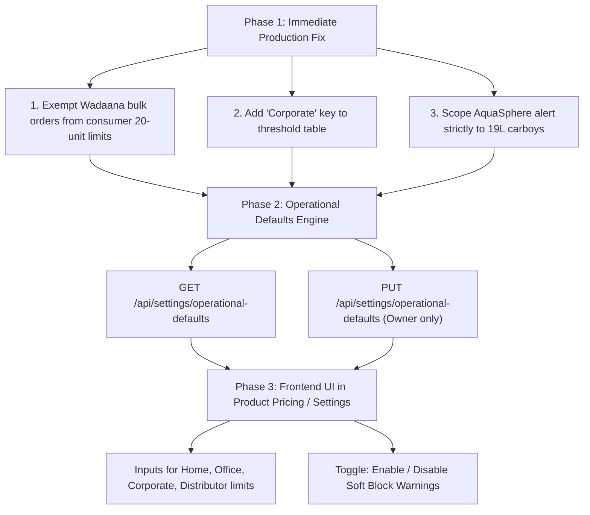

# Architecture & Engineering Plan: Operational Defaults & Order Quantity Thresholds

**Document Target**: Team & Lead Developers  
**Author**: Engineering Team  
**Date**: October 2026  
**Status**: Proposal & Technical Specification  

---

## 1. Executive Summary

During order generation in **Wadaana**, entering a bulk order of 111 bottles triggers a blocking warning modal:

> *"Unusual quantity detected. A Corporate customer typically does not order 111 items at once (Limit: 20). Are you sure you want to proceed?"*

This document breaks down **where this limit originates**, evaluates the proposal to make it **configurable from a settings UI without database schema alterations**, compares implementation approaches (file-based JSON vs. DB key-value vs. tenant-aware logic), and outlines a clean execution roadmap.

---

## 2. Root Cause Analysis

### 2.1 The Hardcoded Threshold Map
The threshold is hardcoded in [`backend/src/controllers/order.controller.js`](backend/src/controllers/order.controller.js#L10-L17):

```javascript
const QTY_THRESHOLDS = {
  Home: 5,
  Office: 20,
  Shop: 30,
  Restaurant: 50,
  Commercial: 100,
  Distributor: 500
};
```

### 2.2 The Evaluation Logic
In [`backend/src/controllers/order.controller.js`](backend/src/controllers/order.controller.js#L79-L88):

```javascript
// Soft-block check for unusual quantity
const maxQty = QTY_THRESHOLDS[customer.type] || 20;
if (totalQty > maxQty && !bypassCreditCheck) {
  return res.status(200).json({
    success: false,
    softBlock: true,
    blockReason: 'UNUSUAL_QUANTITY',
    message: `Unusual quantity detected. A ${customer.type} customer typically does not order ${totalQty} items at once (Limit: ${maxQty}). Are you sure you want to proceed?`
  });
}
```

### 2.3 The Three Architectural Flaws
1. **Missing Customer Type Key**:
   - The customer form provides `Corporate` (`Corporate / Office`), but the threshold map only has `Office`.
   - Any `Corporate` customer falls back to `20` (`|| 20`).
2. **Business Model Mismatch (AquaSphere vs. Wadaana)**:
   - **AquaSphere** delivers heavy **19L water bottles** to homes and offices. A household ordering > 5 or an office ordering > 20 is typically a data entry typo (e.g., typing `111` instead of `11`).
   - **Wadaana** is a **plastic blow-molding factory** manufacturing PET bottles and preforms. Clients routinely purchase by the hundreds, thousands, or bundles. Capping an industrial factory at 20 units is contradictory to factory operations.
3. **Product Agnostic Count**:
   - The check sums all item quantities together regardless of unit (`totalQty = resolvedItems.reduce(...)`). Ordering 100 small 0.5L bottles or preform caps is penalized with the same logic intended for 19L heavy carboys.

---

## 3. Proposal Evaluation: Configurable Defaults Without Database Changes

### The Idea:
Expose a settings screen (either inside **Product Pricing** or a new **Operational Defaults** view) allowing owners to customize order quantity thresholds and operational parameters, saving the state in the backend without modifying Prisma schemas.

### Trade-Off Comparison

| Approach | Implementation | Pros | Cons & Risks | Recommendation |
| :--- | :--- | :--- | :--- | :--- |
| **Option A: Backend JSON File** | Store configs in `backend/config/tenantSettings.json` with read/write API endpoints. | • Zero database migrations<br>• Fast to implement<br>• Easy manual editing | • **Dokploy/Docker Ephemeral Disks**: Re-deploying containers or updating images wipes container storage unless persistent volumes are mapped.<br>• File concurrency race conditions if multiple admins write simultaneously. | Good for local dev, fragile in production without persistent volume mounts. |
| **Option B: Database Key-Value / Settings Model** | Simple `TenantSetting` table: `(tenant, key, jsonValue)`. | • Fully persistent across all deployments & replicas<br>• Tenant-isolated<br>• Standard ERP design | • Requires one simple Prisma migration (`npx prisma db push`). | **Best Long-Term Production Standard.** |
| **Option C: Sensible Code Defaults First + Optional UI Override** | Separate tenant limits in code (Wadaana: no cap / 10,000; AquaSphere: 19L-only cap), with file/DB override. | • Fixes production blockers immediately<br>• Wadaana runs unobstructed<br>• 0-second deployment friction | • Defaults remain in code until settings page is implemented. | **Best Immediate Step.** |

---

## 4. Proposed Technical Solution & Architecture

### Step 1: Immediate Domain Isolation (Backend Guardrail)
1. **Wadaana Tenant Exemption**: Disable consumer typo checks for `wadaana_` tenant, or set industrial thresholds (e.g. `Distributor: 50,000`, `Corporate: 10,000`).
2. **Scope AquaSphere Check to 19L Refills**: Only count quantities of 19L carboys towards the threshold. PET 0.5L/1.5L bottle packs should not trip carboy limits.
3. **Map `Corporate`**: Ensure `Corporate` is mapped alongside `Office` (or given `100+`).

### Step 2: Configurable Defaults Interface

#### Location Options:
1. **Sub-tab inside `Product Pricing`** (`/pricing` -> Tab: *"Operational Limits & Thresholds"*):
   - Keeps pricing and minimum order / quantity rules in one financial control room.
2. **Dedicated Settings Tab** (Under Owner/Admin navigation):
   - *"Operational Defaults"* / *"System Rules"*.

#### Configurable Parameters:
```json
{
  "orderThresholds": {
    "Home": 10,
    "Office": 50,
    "Corporate": 200,
    "Commercial": 500,
    "Distributor": 5000
  },
  "enableQuantityAlert": true,
  "enforceOnlyOn19L": true
}
```

### Step 3: Backend Persistence Strategy (No-Migration Friendly)
If database migration must be avoided:
- Use a dedicated JSON store file at `backend/data/operational_settings.json` (or read from environment variables/Redis if present).
- Wrap file read/write with atomic file operations:
  ```javascript
  import fs from 'fs/promises';
  // Atomic write to prevent file corruption
  await fs.writeFile(filePath + '.tmp', JSON.stringify(data, null, 2));
  await fs.rename(filePath + '.tmp', filePath);
  ```

---

## 5. Implementation Roadmap



---

## 6. Verification & Test Plan

1. **Wadaana Bulk Order Test**:
   - Create order in Wadaana with quantity = 111 (or 5,000) for a `Corporate` customer.
   - Verify order creates directly without displaying the "Unusual Quantity Alert" soft-block modal.
2. **AquaSphere 19L Typo Guard Test**:
   - Create order in AquaSphere for `Home` customer with 50 units of 19L refill.
   - Verify modal appears as an informational confirmation against accidental typos.
3. **AquaSphere PET Pack Exemption**:
   - Create order in AquaSphere with 120 units of 0.5L PET bottles.
   - Verify 0.5L PET bottles do not trip the 19L carboy limits.
