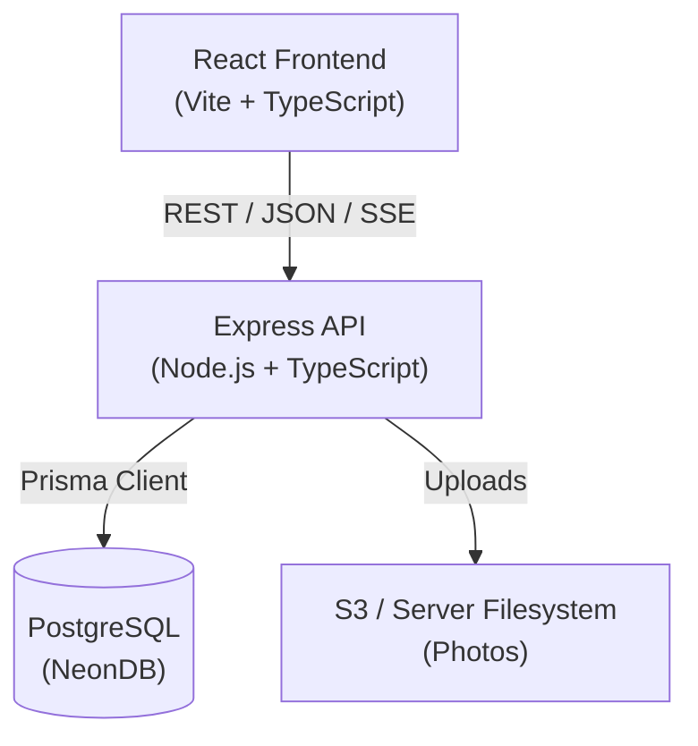
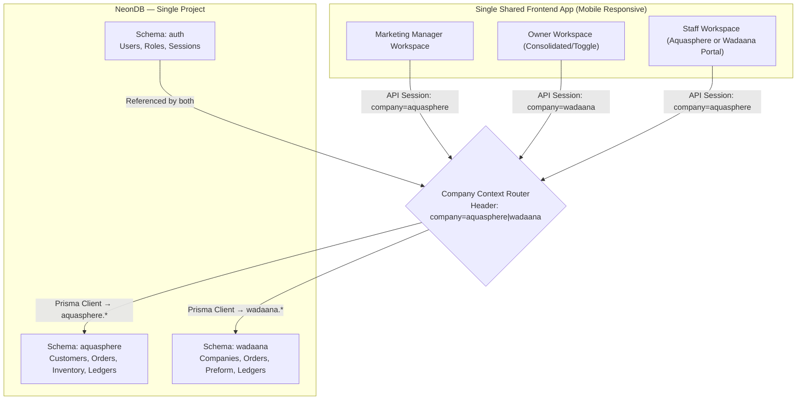
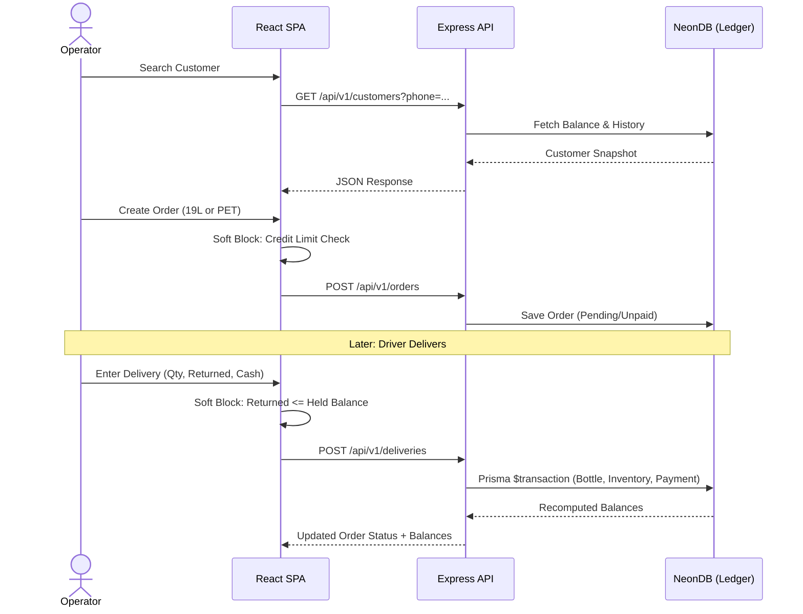
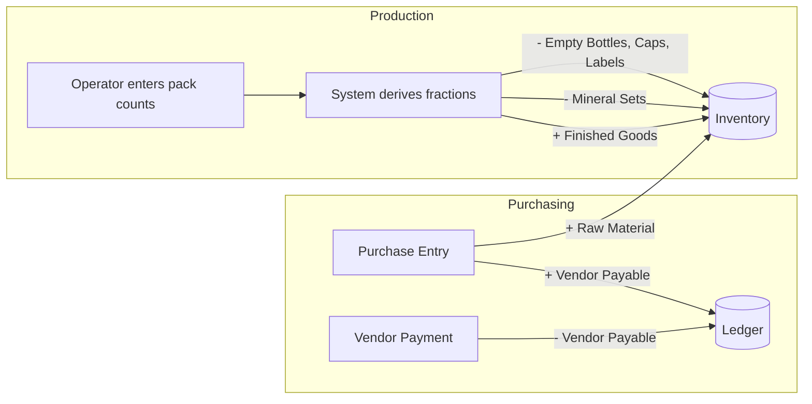
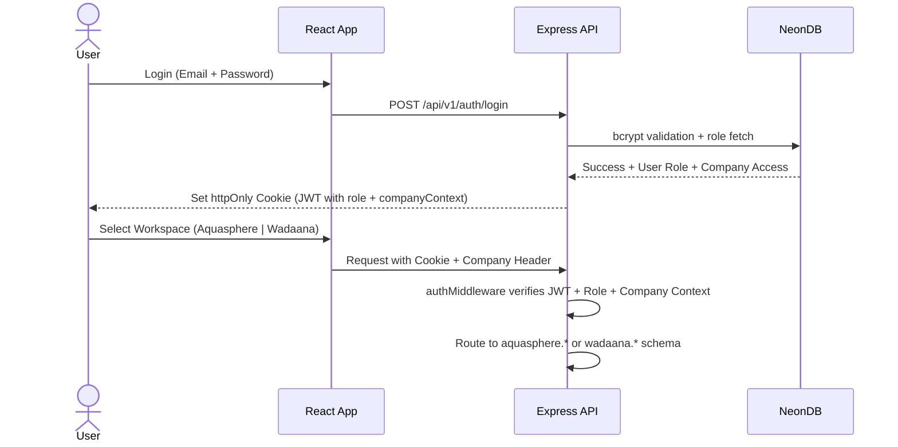
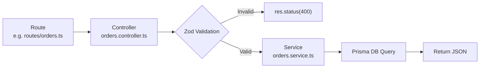

# Architecture — AQUA Sphere OS

This document defines **how** AQUA Sphere OS is built, based on what `AQUA_Sphere_OS_Master_Requirements.md` defines it needs to **do**. The single principle every decision below serves: **no number is ever hand-edited — everything is derived from a transaction log.**

---

## 1. System Architecture

AQUA Sphere OS runs **two completely separate businesses** under one login system. After login, every user selects their active workspace:

```
┌─────────────────────────────────────────┐
│     "Would you like to enter           │
│      Wadaana or Aquasphere?"            │
└─────────────────────────────────────────┘
                    │
        ┌───────────┴───────────┐
        ▼                       ▼
┌───────────────┐       ┌───────────────┐
│ Wadaana        │       │ Aquasphere    │
│ Industries    │       │ (Water        │
│ (Blowing      │       │ Business)     │
│  Machine)     │       │               │
└───────────────┘       └───────────────┘
        │                       │
        ▼                       ▼
┌───────────────┐       ┌───────────────┐
│ Works         │       │ Works         │
│ Completely    │◄─────►│ Completely    │
│ Separately    │       │ Separately    │
└───────────────┘       └───────────────┘
```

> **Critical Rule:** These two sides **never share data**. Inventory, orders, customers, and reports are fully isolated. The same 5 roles operate in both, but their actions in one division have zero impact on the other.

### 1.1 High-Level Stack



**Why this shape:**
- **Two deployables** — React SPA talks to Express over REST. Frontend can be served from any static host (Vercel, Netlify, S3). Backend can run on Railway, Render, or any Node host.
- **PostgreSQL (NeonDB) is the single source of truth.** Every "balance" the app shows (bottle counts, customer balance, stock) is a `SUM()` over a transaction table — never a stored, editable field. This directly implements Section 12 of the requirements ("No Manually-Edited Numbers").
- **Prisma ORM** for type-safe queries and migrations — one data access layer, no raw SQL unless truly necessary.

### 1.2 Multi-Schema Database Strategy

The system uses **one NeonDB project** with **three PostgreSQL schemas**:

| Schema | Purpose |
|--------|---------|
| `auth` | Shared user accounts, roles, sessions, password hashes |
| `aquasphere` | All transactional data for the water business |
| `wadaana` | All transactional data for the blowing machine business |



**Separation Rules:**
- All transactional records, sales history, customer databases, credit ledgers, and inventories are completely segregated by schema.
- The `schema.prisma` file is **generated dynamically** via `scripts/generate-schema.js` from `base-models.prisma` to ensure perfectly identical schemas for `aquasphere` and `wadaana` without manual duplication.
- The `auth` schema is global — shared users log in once and switch context dynamically.
- A persistent header shows `[Active Workspace: Aquasphere | Wadaana Industries]` allowing instant context switch.
- Invoices and alerts dynamically render branding matching the active schema context.
- **No browser localStorage/sessionStorage** is used for business-critical data. Company context is stored in an httpOnly cookie or JWT claim.

---

## 2. App Flow

### 2.1 Aquasphere — Order to Delivery

The system flow mirrors the real front-desk phone call, end to end:



### 2.2 Aquasphere — Production & Purchasing

Production and purchasing run as parallel, simpler flows that feed the same inventory ledger:



### 2.3 Wadaana Industries — Full 5-Step Cycle

```
┌─────────────────────────────────────────────────────────────┐
│           WADAANA INDUSTRIES — 5-STEP CYCLE                  │
└─────────────────────────────────────────────────────────────┘

    STEP 1: BUY PREFORM
    ┌─────────────────┐
    │  Purchase from  │
    │  Vendor         │
    │  (Pure or Mix, │
    │   measured in   │
    │   kg)           │
    └────────┬────────┘
             │
             ▼
    STEP 2: STOCK AT FACTORY OR WAREHOUSE
    ┌─────────────────┐
    │  Preform Stock  │
    │  Sits at        │
    │  Factory OR     │
    │  Warehouse      │
    └────────┬────────┘
             │
             ▼
    STEP 3: BLOW INTO BOTTLES
    ┌─────────────────┐
    │  Production     │
    │  Manager runs   │
    │  a batch        │
    │  (System auto   │
    │   deducts       │
    │   preform)      │
    └────────┬────────┘
             │
             ▼
    STEP 4: MOVE TO WAREHOUSE
    ┌─────────────────┐
    │  Finished       │
    │  Bottles move   │
    │  to Warehouse   │
    └────────┬────────┘
             │
             ▼
    STEP 5: FULFILL ORDERS
    ┌─────────────────┐
    │  Marketing      │
    │  Manager takes  │
    │  orders —       │
    │  reduces        │
    │  Warehouse      │
    │  stock          │
    └─────────────────┘
```

**Client Companies & Preform Types:**

| Company | Preform Type(s) Used | Notes |
|---------|---------------------|-------|
| **Aqua Sphere** | Pure only | Own bottles — only draws from Pure stock. Order form doesn't ask preform type. |
| **Deosani** | Pure + Mix | Client company — can draw from either preform type. Order form asks which type. |
| **Pivrifine** | Pure + Mix | Client company — can draw from either preform type. Order form asks which type. |

> **Note:** Marketing Manager must check and filter orders **separately per company** — three independent order lists, not one shared list.

**Preform Conversion Table (Hardcoded):**

| Bottle Size | Preform Type | Preform Weight (per bottle) |
|-------------|-------------|----------------------------|
| 0.5L | Mix | **27g** |
| 1.5L | Mix | **15g** |
| 1.5L | Pure | **13g** |
| 0.5L | Pure | **15g** |

**Inventory Locations:**
- **Factory** — Raw preform stock (Pure kg, Mix kg). Answers: "How much raw preform left to work with?"
- **Warehouse** — Finished bottles ready to sell. Answers: "How many finished bottles to sell?"
- **Both locations can store preform** — PM selects source location per batch.

---

## 3. Authentication Flow

- **JWT-based**, stateless auth with httpOnly cookies.
- **Five roles** at login, embedded as claims in the JWT and checked by Express middleware on every protected route:
  1. **Owner / Super Admin** — Full system control across both divisions.
  2. **Admin** — View-only supervisor. Can close the day (lock entries). Cannot see profit, cannot place orders, cannot edit transactions.
  3. **Production Manager** — Enters production counts. Sees inventory. Cannot see financials or customer records.
  4. **Accountant** — Financial auditor. Enters expenses (with receipt photos), spot sales, cash reports. Cannot adjust inventory directly.
  5. **Marketing Manager** — Order desk / CRM. Places orders, manages customers, checks delivery status. Cannot delete customers or see profit margins.

- Passwords hashed with **bcrypt**; never stored or logged in plain text.
- **Access token** stored in httpOnly cookie. Short-lived (~1h). Refresh via a `/auth/refresh` endpoint using a longer-lived refresh token (also httpOnly cookie).
- **Admin password reset requires accountant confirmation** — implemented as a two-step flow: Admin initiates reset → Accountant approves → new temporary password issued.
- **Company context** (`aquasphere` or `wadaana`) is stored in the JWT claim `companyContext` and sent with every request. The API router uses this to select the correct Prisma schema.



---

## 4. Database Strategy

**Core rule: ledgers, not counters.** Every entity that represents a "balance" is backed by an append-only transaction table, and the balance itself is a derived value — either computed live via `SUM()` or kept in a cached column that is *provably* re-synced from the ledger (never written to directly by the UI).

### 4.1 Multi-Schema Design

- **PostgreSQL on NeonDB** as the single relational store — one database project, three schemas.
- **Prisma ORM** with multi-schema support (`schemas` in datasource block) for type-safe queries and migrations.
- Duplicate schemas are maintained automatically using `node scripts/generate-schema.js`.
- **Transaction tables drive everything:**
  - `BottleTransaction` → derives total-owned / at-factory / with-customer / broken / lost.
  - `InventoryTransaction` → derives current stock per `Item` (raw material or finished good).
  - `Payment` / `VendorPayment` → derive outstanding customer/vendor balances.

### 4.2 Bottle Ledger Reconciliation

The system must maintain strict mathematical alignment across **five** variables:

```
┌─────────────────────────────────────────────────────────────┐
│  BOTTLE BALANCE EQUATION (must always reconcile):          │
│                                                             │
│  Total Owned = At Factory + With Customers + Broken + Lost │
│                                                             │
│  • Lost bottles: Subtracted from Total Owned (written off)  │
│  • Return Split: Good Returns vs Broken Returns             │
│  • Loss is NOT automatically inferred from "not returned"   │
│    — must be a deliberate, explicit action                   │
└─────────────────────────────────────────────────────────────┘
```

### 4.3 Concurrency & Safety

- **Database-level transactions (Prisma `$transaction`) + row locking** wrap every "read balance, then write" operation (e.g., delivery completion) to keep concurrent operator/owner usage safe.
- **Adjustment/reversal transaction type** exists on every ledger, carrying a mandatory `reason` field — this is the *only* sanctioned way to correct a mistake, never a direct edit.
- **Soft deletes** for Customers/Vendors/Items (an `archivedAt` field) instead of hard deletes, to keep historical orders/reports intact.

### 4.4 Daily Closing

- A `DailyClose` record locks all transactions dated on/before it.
- **Admin** (not Accountant) closes the day by clicking "Close Day" after cross-verifying via WhatsApp + Portal.
- After Admin closes the day, **no role except Owner** can add or edit transactions dated on/before the latest close.
- The API layer rejects edits from all roles (Marketing Manager, Production Manager, Accountant, Admin) for closed dates.

---

## 5. Module Architecture

Express backend is organized by domain — one folder per business area, each with its own routes, controller, service, and validation schema.



**Pattern:** Route defines HTTP verb + path. Controller handles req/res. Service owns business logic + DB calls. Zod schema validates input. Clean separation.

`mineralCalc` logic is deliberately isolated as a shared service since the exact-fraction mineral math (Section 6 of requirements) is the single most error-prone calculation in the system and must live in exactly one place.

**Mineral Precision Mandate:**
- **1 Mineral Set = 2 kg Calcium + 1 kg Magnesium + 0.5 kg Sodium**
- **2 kg Calcium → 15,140 litres water treated**
- Mineral consumption must be calculated and deducted using **exact decimal fractions**. Rounding must not occur at transaction runtime to prevent cumulative calculation drift.

---

## 6. Folder Structure

```text
aqua-sphere-os/
├── frontend/                          # React frontend (Vite)
│   ├── src/
│   │   ├── features/                # Domain-driven feature modules
│   │   │   ├── auth/                # components, api, types for auth
│   │   │   ├── customers/
│   │   │   ├── orders/
│   │   │   ├── deliveries/
│   │   │   ├── bottles/
│   │   │   ├── inventory/
│   │   │   ├── production/          # PET production batches
│   │   │   ├── expenses/            # Expense entry with photo
│   │   │   ├── vendors/             # Vendor CRUD (must exist first)
│   │   │   ├── purchases/           # Purchase entry with bill photo
│   │   │   ├── dashboard/
│   │   │   └── wadaana/              # Wadaana Industries portal
│   │   │       ├── companies/       # Client companies (Aqua Sphere, Deosani, Pivrifine)
│   │   │       ├── preform/         # Pure/Mix inventory
│   │   │       ├── production/      # Blowing machine batches
│   │   │       └── orders/          # Per-company order lists
│   │   ├── components/              # Global/shared UI components only
│   │   │   ├── ui/                  # Primitives (Button, Input, Table)
│   │   │   └── layout/              # Sidebar, Header, ProtectedRoute, CompanyToggle
│   │   ├── lib/                     # Axios instance, global utils
│   │   ├── hooks/                   # useCompanyContext, useAuth
│   │   ├── App.tsx
│   │   └── main.tsx
│   ├── index.html
│   ├── tailwind.config.ts
│   └── vite.config.ts
│
├── backend/                          # Express backend
│   ├── src/
│   │   ├── controllers/             # Request handling and response formatting
│   │   ├── db/                      # Database connection and Prisma client wrappers
│   │   │   ├── prisma-aquasphere.ts # Prisma client for aquasphere schema
│   │   │   ├── prisma-wadaana.ts     # Prisma client for wadaana schema
│   │   │   └── prisma-auth.ts       # Prisma client for auth schema
│   │   ├── middlewares/             # Express middlewares
│   │   │   ├── auth.ts              # JWT verification + role checking
│   │   │   ├── company-context.ts   # Routes request to correct schema
│   │   │   ├── validation.ts        # Zod request validation
│   │   │   ├── error-handler.ts     # Global error handler
│   │   │   └── daily-close-guard.ts # Blocks edits on closed dates
│   │   ├── routes/                  # API route definitions
│   │   │   ├── auth.routes.ts
│   │   │   ├── customer.routes.ts
│   │   │   ├── order.routes.ts
│   │   │   ├── delivery.routes.ts
│   │   │   ├── bottle-ledger.routes.ts
│   │   │   ├── inventory.routes.ts
│   │   │   ├── production.routes.ts
│   │   │   ├── expense.routes.ts
│   │   │   ├── vendor.routes.ts
│   │   │   ├── purchase.routes.ts
│   │   │   ├── payment.routes.ts
│   │   │   ├── spot-sale.routes.ts
│   │   │   ├── daily-close.routes.ts
│   │   │   ├── report.routes.ts
│   │   │   └── wadaana/              # Wadaana-specific routes
│   │   │       ├── company.routes.ts
│   │   │       ├── preform.routes.ts
│   │   │       ├── production.routes.ts
│   │   │       └── order.routes.ts
│   │   ├── services/                # Business logic and complex operations
│   │   │   ├── mineral-calc.service.ts
│   │   │   ├── balance.service.ts
│   │   │   └── wadaana/              # Wadaana-specific services
│   │   ├── utils/                   # Generic utilities and helpers
│   │   ├── app.ts                   # Express app setup and middleware registration
│   │   ├── constants.ts             # Global constants and business rules
│   │   └── index.ts                 # Entry point (server start)
│   ├── tests/
│   │   ├── integration/
│   │   └── unit/
│   ├── prisma/
│   │   ├── schema.prisma            # Multi-schema Prisma definition
│   │   └── migrations/
│   └── tsconfig.json
│
├── shared/                          # Shared between client & server
│   └── schemas/                     # Zod schemas (validation on both ends)
│       ├── customer.schema.ts
│       ├── order.schema.ts
│       ├── delivery.schema.ts
│       ├── expense.schema.ts
│       ├── vendor.schema.ts
│       └── wadaana/
│           ├── production.schema.ts
│           └── order.schema.ts
│
├── .env.example
├── package.json                     # Root workspace (npm workspaces)
└── turbo.json                       # Optional: Turborepo for monorepo scripts
```

---

## 7. Tech Stack

| Layer | Choice |
|---|---|
| Frontend framework | React 19 + Vite + TypeScript |
| Routing (client) | React Router v7 |
| Styling | Tailwind CSS v4 + Lucide React icons |
| Forms & validation | React Hook Form + Zod |
| Server state | TanStack Query v5 |
| HTTP client | Axios |
| Tables | TanStack Table |
| Charts | Recharts |
| Dates | date-fns |
| Backend framework | Express (TypeScript) |
| Security | helmet, cookie-parser, cors |
| ORM | Prisma (+ Prisma Migrate) with multi-schema support |
| Database | PostgreSQL (NeonDB) |
| Auth | JWT (jsonwebtoken) + bcrypt |
| File uploads | Multer → S3 (production) or server filesystem (dev) |
| Validation (API) | Zod (shared schemas) |
| Scheduled jobs | node-cron |
| Real-time push | Server-Sent Events (native) |
| PDF generation | PDFKit |
| Excel export | ExcelJS |

---

## 8. Naming Conventions

- **Files & folders**: `kebab-case` (`bottle-ledger.service.ts`, `customer-form.tsx`).
- **Classes / Interfaces / Types**: `PascalCase` (`CreateOrderInput`, `BottleTransaction`).
- **Variables & functions**: `camelCase` (`getCustomerBalance`, `mineralFraction`).
- **Database tables (Prisma models)**: singular `PascalCase` in schema (`Customer`, `BottleTransaction`), mapped to snake_case tables via `@@map` for Postgres convention.
- **Enums**: `PascalCase` type, `SCREAMING_SNAKE_CASE` members (`OrderType.NINETEEN_L`, `DeliveryStatus.PARTIAL`).
- **React components**: `PascalCase` (`CustomerSearchBar.tsx`); hooks prefixed `use` (`useCustomerBalance.ts`).
- **API routes**: plural, kebab-case (`/api/v1/customers`, `/api/v1/bottle-ledger`).
- **Environment variables**: `SCREAMING_SNAKE_CASE`, prefixed by concern (`DATABASE_URL`, `JWT_SECRET`, `S3_BUCKET`).

---

## 9. API Structure

REST over JSON, versioned from day one (`/api/v1/...`).

### 9.1 Auth & System
```text
POST   /api/v1/auth/login
POST   /api/v1/auth/refresh
POST   /api/v1/auth/logout
POST   /api/v1/auth/reset-password-request      # Admin initiates
POST   /api/v1/auth/reset-password-confirm      # Accountant approves
```

### 9.2 Customers & Orders
```text
GET    /api/v1/customers?search=
POST   /api/v1/customers
PATCH  /api/v1/customers/:id
DELETE /api/v1/customers/:id                    # Owner only

POST   /api/v1/orders/19l
POST   /api/v1/orders/pet
GET    /api/v1/orders/pending
GET    /api/v1/orders/overdue                   # 1 week inactivity alert
PATCH  /api/v1/orders/:id
```

### 9.3 Deliveries & Bottles
```text
POST   /api/v1/deliveries
GET    /api/v1/bottle-ledger/summary
GET    /api/v1/bottle-ledger/:customerId
POST   /api/v1/bottle-ledger/adjustment         # Owner only, logged with reason
```

### 9.4 Inventory & Production
```text
GET    /api/v1/inventory
POST   /api/v1/inventory/adjustments            # Owner only
POST   /api/v1/production/pet-batch
GET    /api/v1/production/summary
```

### 9.5 Purchasing & Vendors
```text
GET    /api/v1/vendors
POST   /api/v1/vendors                          # Must exist before purchase
PATCH  /api/v1/vendors/:id
DELETE /api/v1/vendors/:id

POST   /api/v1/purchases                        # Requires vendor_id + bill photo
GET    /api/v1/purchases
POST   /api/v1/vendor-payments
GET    /api/v1/vendor-balances
```

### 9.6 Expenses & Spot Sales
```text
POST   /api/v1/expenses                         # Requires receipt photo
GET    /api/v1/expenses
POST   /api/v1/spot-sales                       # Counter/walk-in sales
GET    /api/v1/spot-sales
```

### 9.7 Daily Close & Reports
```text
POST   /api/v1/daily-close                      # Admin only
GET    /api/v1/daily-close/status
GET    /api/v1/dashboard/summary
GET    /api/v1/reports/:period                  # sales, profit, expenses, inventory, production, credits, vendors, bottles
GET    /api/v1/reports/:period/export           # ExcelJS export

### 9.9 Server-Sent Events (SSE)
```text
GET    /api/v1/events/stream                    # SSE endpoint — auth required via cookie
                                            # Events: order.created, delivery.completed,
                                            #         credit.breach, stock.low, daily.close
```
```

### 9.8 Wadaana Industries (Blowing Machine)
```text
GET    /api/v1/wadaana/companies
POST   /api/v1/wadaana/companies
GET    /api/v1/wadaana/companies/:id/orders
POST   /api/v1/wadaana/companies/:id/orders

GET    /api/v1/wadaana/preform/summary           # Pure kg, Mix kg, per location
POST   /api/v1/wadaana/production/batch          # Auto-deducts preform
GET    /api/v1/wadaana/production/batches
GET    /api/v1/wadaana/warehouse/finished
```

### 9.9 File Upload
```text
POST   /api/v1/files/upload                     # Generic upload endpoint
                                            # Types: customer-photo, expense-receipt, purchase-bill
```

**API Conventions:**
- Every mutating endpoint that touches a balance returns the **recomputed balances**, not just a success flag — the frontend never re-derives numbers itself.
- Soft-block warnings come back as a structured `{ warning: true, message, currentValue, limit }` payload with a `200`, not an error — the operator can then resubmit with `confirm: true`.
- **Credit limit = 0 is treated as "unlimited"** — NOT "block everything." The soft-block warning is skipped when `creditLimit === 0`.
- All list endpoints support pagination (`?page=&limit=`) + search query params.
- Global error handler returns consistent `{ status, message, errors? }` shape.

---

## 10. State Management

- **TanStack Query** owns all server state — customer records, orders, inventory, dashboard numbers. Handles caching, background refetch, and optimistic updates.
- **React state** (`useState` / `useContext`) for true frontend/UI state: sidebar toggles, active draft order, active company context.
- **Company Context** is stored in React Context at the app root and synchronized with the API via a custom header (`X-Company-Context: aquasphere | wadaana`) on every request. It is **never stored in localStorage**.
- After any mutation, the relevant Query keys are invalidated to fetch the latest derived balances.
- **Real-time strategy:** Dashboard and credit-breach alerts use **Server-Sent Events (SSE)** for one-way server→client push. An `/api/v1/events` SSE endpoint streams events (new order, delivery completed, credit breach, low stock alert) to connected clients. This gives near-real-time updates without the overhead of WebSockets. For the initial phase with low concurrent users, SSE is sufficient and simpler to implement over standard HTTP. TanStack Query listens to SSE events and invalidates relevant query keys to refresh data. Fallback to 30s polling if SSE connection drops.

---

## 11. File Upload Strategy

**Use cases:**
1. **Customer house photos** — saved on `Customer.homePictureUrl`
2. **Expense receipt photos** — **MANDATORY** for every expense entry. Text-only expense entry is disallowed.
3. **Purchase bill photos** — **MANDATORY** for every purchase entry.

**Flow:** React → `multipart/form-data` → Express (Multer, memory storage, size/type validation) → S3 (production) or server `uploads/` folder (dev) → URL saved on the relevant record.

**Validation rules:**
- Image types only: `image/jpeg`, `image/png`, `image/webp`
- Max size: 5MB per file
- Expense and purchase forms **cannot be submitted** without a valid file attachment.

**Generated files** (invoices via PDFKit, exports via ExcelJS) are generated on-demand in the API and streamed directly to the client.

---

## 12. Role Permissions Summary

| Role | Can See | Can Edit | Cannot See | Cannot Edit |
|------|---------|----------|------------|-------------|
| **Owner** | Everything across both divisions | All data, passwords, credit limits, inventory corrections | Nothing | — |
| **Admin** | Inventory, Daily Production, Daily Orders, Customer Alerts | End-of-day close (click OK to lock day) | Profit, Cost, Raw material cost metrics | Daily transactions, Orders |
| **Production Manager** | Inventory (Minerals, Caps, Bottles, Labels, Shrink Wrap, PETs) | Daily production counts, broken bottles | Financials, Sales, Customer records | — |
| **Accountant** | Customers, Expenses, Cash collections | Expenses (with receipt photo), Spot sales, Cash reports | Direct inventory adjustment | Inventory |
| **Marketing Manager** | Customer profiles, Orders, Inventory levels | Orders, Delivery status, Prices, Payment methods, New customers | Delete customers, Profit margins | Credit limits |

---

## 13. How This Maps Back to the Business

Every architectural choice traces to a specific requirement:

| Architecture Decision | Requirement Rule |
|---|---|
| Multi-schema database (`auth` + `aquasphere` + `wadaana`) | §1.1, §2.1 — Two businesses, zero shared data |
| 5-role JWT hierarchy | §3 — Owner, Admin, PM, Accountant, Marketing Manager |
| Ledger-first database (transaction tables + `SUM()`) | §6.1 — No manually-edited numbers |
| Soft-block API contract (`warning` + `confirm`) | §8 — Credit philosophy, never hard-block |
| Daily close guarded by middleware | §4.2, §11 — Admin closes, Owner overrides |
| Mandatory photo uploads (expense + purchase) | §10.2, §11.2 — Text-only disallowed |
| Shared `mineral-calc` service with exact decimal precision | §6.2 — Exact fractions, 15,140L per set |
| Credit limit `0 = unlimited` | §8.2 — Zero means no limit |
| Vendor must exist before purchase | §10.1 — No inline vendor creation |
| Bottle ledger: `Total = Factory + Customers + Broken + Lost` | §9.2 — Lost is explicit, not inferred |
| Company context in JWT + header | §1.1, §2.2 — Dynamic workspace switching |
| No browser localStorage for business data | Security rules — Server-side context only |

---

*Architecture aligned with AQUA_Sphere_OS_Master_Requirements.md — July 2026*
