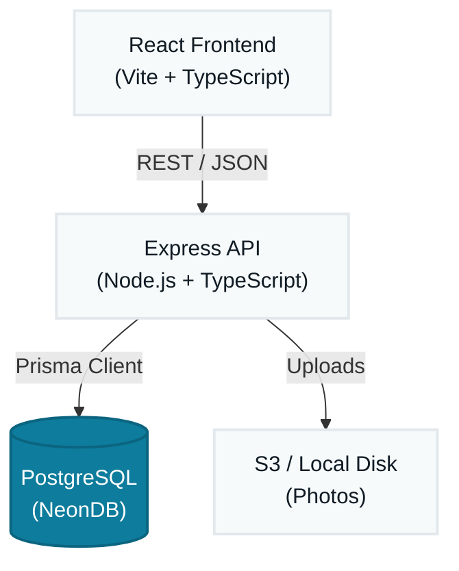
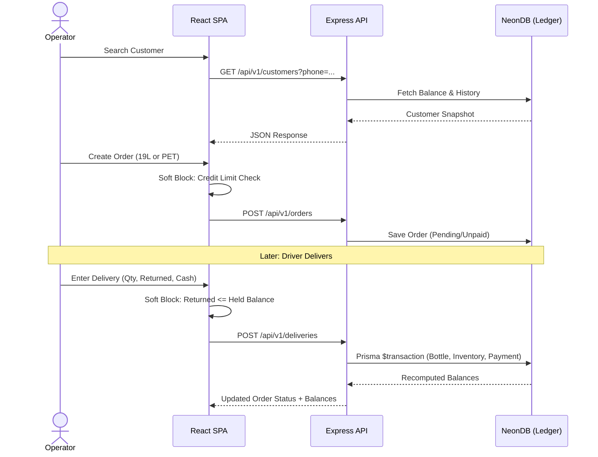
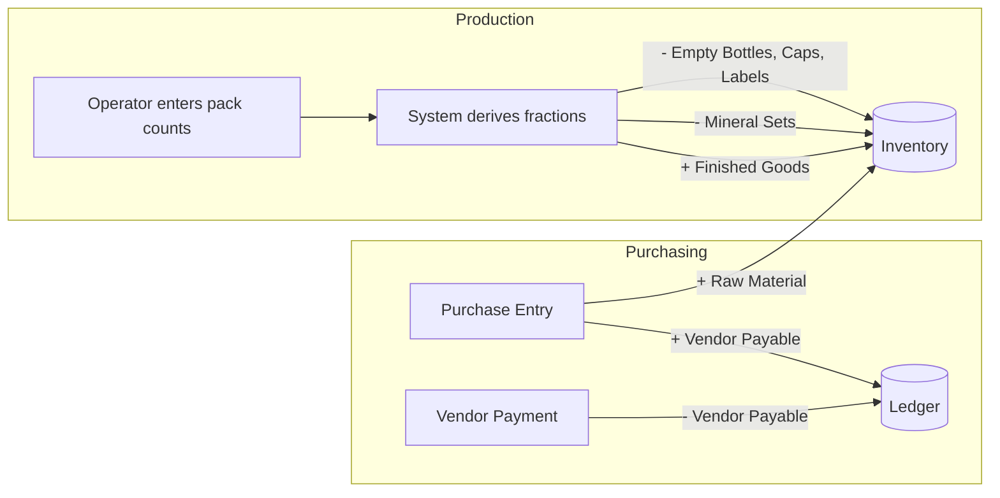
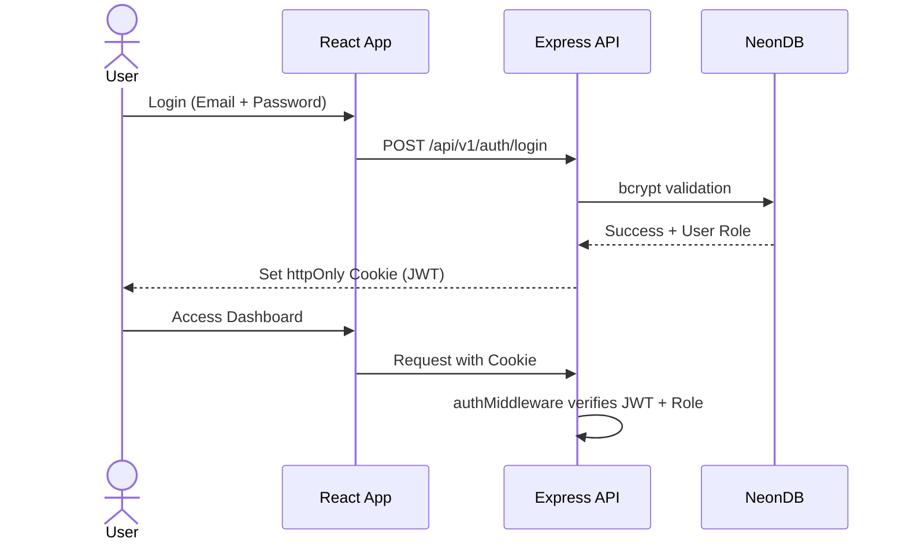
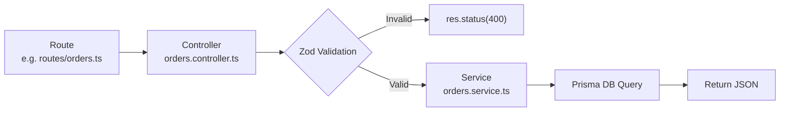

# Architecture — AQUA Sphere OS

This document defines **how** AQUA Sphere OS is built, based on what `project-requirements.md` defines it needs to **do**. The single principle every decision below serves: **no number is ever hand-edited — everything is derived from a transaction log.**

---

## 1. System Architecture

AQUA Sphere OS is a **classic PERN stack** — two separate deployables (React frontend + Express API), kept simple because the business is single-tenant and the traffic is low (a handful of concurrent staff).



**Why this shape:**
- **Two deployables** — React SPA talks to Express over REST. Frontend can be served from any static host (Vercel, Netlify, S3). Backend can run on Railway, Render, or any Node host.
- **PostgreSQL (NeonDB) is the single source of truth.** Every "balance" the app shows (bottle counts, customer balance, stock) is a `SUM()` over a transaction table — never a stored, editable field. This directly implements Section 12 of the requirements ("No Manually-Edited Numbers").
- **Prisma ORM** for type-safe queries and migrations — one data access layer, no raw SQL unless truly necessary.

---

## 2. App Flow

The system flow mirrors the real front-desk phone call, end to end:



Production and purchasing run as parallel, simpler flows that feed the same inventory ledger:



---

## 3. Authentication Flow

- **JWT-based**, stateless auth with httpOnly cookies.
- Two roles at login: **Operator/Accountant** and **Owner/Admin**. Role is embedded as a claim in the JWT and checked by Express middleware on every protected route.
- Passwords hashed with **bcrypt**; never stored or logged in plain text.
- **Access token** stored in httpOnly cookie. Short-lived (~1h). Refresh via a `/auth/refresh` endpoint using a longer-lived refresh token (also httpOnly cookie).
- **Admin password reset requires accountant confirmation** (per manager notes) — implemented as a two-step flow: Admin initiates reset → Accountant approves via a confirmation action → new temporary password issued.



---

## 4. Database Strategy

**Core rule: ledgers, not counters.** Every entity that represents a "balance" is backed by an append-only transaction table, and the balance itself is a derived value — either computed live via `SUM()` or kept in a cached column that is *provably* re-synced from the ledger (never written to directly by the UI).

- **PostgreSQL on NeonDB** as the single relational store — one database, one schema, no sharding needed at this scale.
- **Prisma ORM** for type-safe queries and migrations (`prisma migrate`).
- **Transaction tables drive everything:**
  - `BottleTransaction` → derives total-owned / at-factory / with-customer / broken / lost.
  - `InventoryTransaction` → derives current stock per `Item` (raw material or finished good).
  - `Payment` / `VendorPayment` → derive outstanding customer/vendor balances.
- **Database-level transactions (Prisma `$transaction`) + row locking** wrap every "read balance, then write" operation (e.g. delivery completion) to keep concurrent operator/owner usage safe, per the concurrency requirement.
- **Adjustment/reversal transaction type** exists on every ledger, carrying a mandatory `reason` field — this is the *only* sanctioned way to correct a mistake, never a direct edit.
- **Soft deletes** for Customers/Vendors/Items (an `archivedAt` field) instead of hard deletes, to keep historical orders/reports intact.
- **Daily closing**: a `DailyClose` record locks all transactions dated on/before it; the accountant role is blocked (at the API layer) from writing transactions dated before the latest close.

---

## 5. Module Architecture

Express backend is organized by domain — one folder per business area, each with its own routes, controller, service, and validation schema.



**Pattern:** Route defines HTTP verb + path. Controller handles req/res. Service owns business logic + DB calls. Zod schema validates input. Clean separation.

`mineralCalc` logic is deliberately isolated as a shared service since the exact-fraction mineral math (Section 3 of requirements) is the single most error-prone calculation in the system and must live in exactly one place.

---

## 6. Folder Structure

```text
aqua-sphere-os/
├── client/                          # React frontend (Vite)
│   ├── src/
│   │   ├── pages/
│   │   │   ├── login/
│   │   │   ├── dashboard/
│   │   │   ├── customers/
│   │   │   ├── orders/
│   │   │   │   ├── nineteen-l/
│   │   │   │   └── pet/
│   │   │   ├── deliveries/
│   │   │   ├── bottles/
│   │   │   ├── inventory/
│   │   │   ├── production/
│   │   │   ├── purchasing/
│   │   │   ├── expenses/
│   │   │   └── reports/
│   │   ├── components/
│   │   │   ├── ui/                  # Reusable primitives (Button, Input, Table, etc.)
│   │   │   ├── forms/
│   │   │   └── layout/             # Sidebar, Header, ProtectedRoute
│   │   ├── hooks/                   # TanStack Query hooks per domain
│   │   ├── lib/                     # Axios instance, utils, constants
│   │   ├── types/                   # Shared TypeScript types
│   │   ├── App.tsx
│   │   └── main.tsx
│   ├── index.html
│   ├── tailwind.config.ts
│   └── vite.config.ts
│
├── server/                          # Express backend
│   ├── src/
│   │   ├── modules/
│   │   │   ├── auth/                # routes, controller, service
│   │   │   ├── customers/
│   │   │   ├── orders/
│   │   │   ├── deliveries/
│   │   │   ├── bottle-ledger/
│   │   │   ├── inventory/
│   │   │   ├── production/
│   │   │   ├── mineral-calc/        # Shared service only (no routes)
│   │   │   ├── purchasing/
│   │   │   ├── expenses/
│   │   │   ├── dashboard/
│   │   │   ├── reports/
│   │   │   └── files/
│   │   ├── middleware/
│   │   │   ├── auth.middleware.ts    # JWT verification
│   │   │   ├── role.middleware.ts    # Role-based access
│   │   │   ├── validate.middleware.ts # Zod validation
│   │   │   └── error.middleware.ts   # Global error handler
│   │   ├── lib/
│   │   │   ├── prisma.ts            # Prisma client singleton
│   │   │   └── constants.ts         # Business-rule constants
│   │   └── index.ts                 # Express app entry
│   ├── prisma/
│   │   ├── schema.prisma
│   │   └── migrations/
│   └── tsconfig.json
│
├── shared/                          # Shared between client & server
│   └── schemas/                     # Zod schemas (validation on both ends)
│       ├── customer.schema.ts
│       ├── order.schema.ts
│       └── delivery.schema.ts
│
├── .env.example
├── package.json                     # Root workspace (npm workspaces)
└── turbo.json                       # Optional: Turborepo for monorepo scripts
```

---

## 7. Tech Stack

| Layer | Choice |
|---|---|
| Frontend framework | React 19 + Vite + TypeScript |
| Routing (client) | React Router v7 |
| Styling | Tailwind CSS v4 + Lucide React icons |
| Forms & validation | React Hook Form + Zod |
| Server state | TanStack Query v5 |
| HTTP client | Axios |
| Tables | TanStack Table |
| Charts | Recharts |
| Dates | date-fns |
| Backend framework | Express (TypeScript) |
| ORM | Prisma (+ Prisma Migrate) |
| Database | PostgreSQL (NeonDB) |
| Auth | JWT (jsonwebtoken) + bcrypt |
| File uploads | Multer → S3 (or local disk for dev) |
| Validation (API) | Zod (shared schemas) |
| Scheduled jobs | node-cron |
| PDF generation | PDFKit |
| Excel export | ExcelJS |

---

## 8. Naming Conventions

- **Files & folders**: `kebab-case` (`bottle-ledger.service.ts`, `customer-form.tsx`).
- **Classes / Interfaces / Types**: `PascalCase` (`CreateOrderInput`, `BottleTransaction`).
- **Variables & functions**: `camelCase` (`getCustomerBalance`, `mineralFraction`).
- **Database tables (Prisma models)**: singular `PascalCase` in schema (`Customer`, `BottleTransaction`), mapped to snake_case tables via `@@map` for Postgres convention.
- **Enums**: `PascalCase` type, `SCREAMING_SNAKE_CASE` members (`OrderType.NINETEEN_L`, `DeliveryStatus.PARTIAL`).
- **React components**: `PascalCase` (`CustomerSearchBar.tsx`); hooks prefixed `use` (`useCustomerBalance.ts`).
- **API routes**: plural, kebab-case (`/api/v1/customers`, `/api/v1/bottle-ledger`).
- **Environment variables**: `SCREAMING_SNAKE_CASE`, prefixed by concern (`DATABASE_URL`, `JWT_SECRET`, `S3_BUCKET`).

---

## 9. API Structure

REST over JSON, versioned from day one (`/api/v1/...`).

```text
POST   /api/v1/auth/login
POST   /api/v1/auth/refresh
POST   /api/v1/auth/logout

GET    /api/v1/customers?search=
POST   /api/v1/customers
PATCH  /api/v1/customers/:id
DELETE /api/v1/customers/:id

POST   /api/v1/orders/19l
POST   /api/v1/orders/pet
GET    /api/v1/orders/pending
PATCH  /api/v1/orders/:id

POST   /api/v1/deliveries
GET    /api/v1/bottle-ledger/summary
GET    /api/v1/bottle-ledger/:customerId

GET    /api/v1/inventory
POST   /api/v1/inventory/adjustments

POST   /api/v1/production/pet-batch

POST   /api/v1/purchases
POST   /api/v1/vendor-payments

POST   /api/v1/expenses

GET    /api/v1/dashboard/summary
GET    /api/v1/reports/:period

POST   /api/v1/files/upload
```

**Conventions:**
- Every mutating endpoint that touches a balance returns the **recomputed balances**, not just a success flag — the frontend never re-derives numbers itself.
- Soft-block warnings come back as a structured `{ warning: true, message, currentValue, limit }` payload with a `200`, not an error — the operator can then resubmit with `confirm: true`.
- All list endpoints support pagination (`?page=&limit=`) + search query params.
- Global error handler returns consistent `{ status, message, errors? }` shape.

---

## 10. State Management

- **TanStack Query** owns all server state — customer records, orders, inventory, dashboard numbers. Handles caching, background refetch, and optimistic updates.
- **React state** (`useState` / `useContext`) for true client/UI state: sidebar toggles, active draft order. No additional state library.
- After any mutation, the relevant Query keys are invalidated to fetch the latest derived balances.

---

## 11. File Upload Strategy

- **Use case**: customer house photos.
- **Flow**: React → `multipart/form-data` → Express (Multer, memory storage, size/type validation) → S3 (production) or local `uploads/` folder (dev) → URL saved on `Customer` record.
- **Generated files** (invoices via PDFKit, exports via ExcelJS) are generated on-demand in the API and streamed directly to the client.

---

### How this maps back to the business

Every architectural choice traces to a specific rule: the ledger-first database strategy implements "no manually-edited numbers" (Section 12); the soft-block API contract implements the credit philosophy (Section 9); the shared `mineral-calc` service implements the exact-fraction rule (Section 3); and JWT + role middleware implements the operator/owner visibility split.
