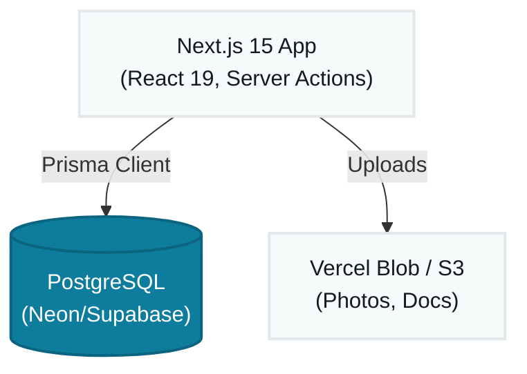
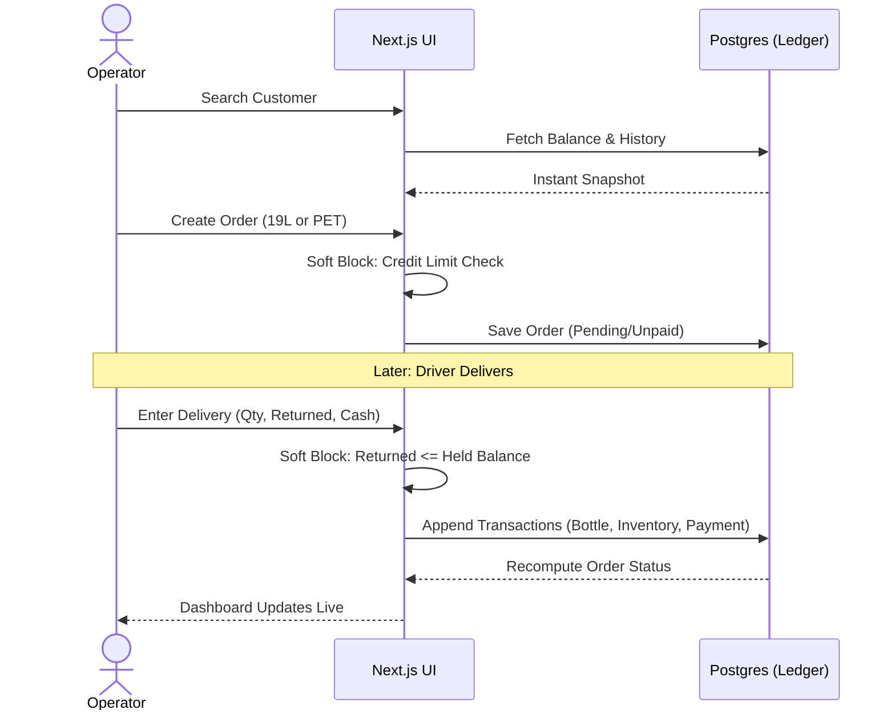
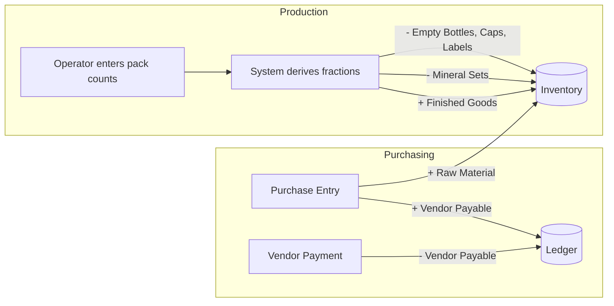
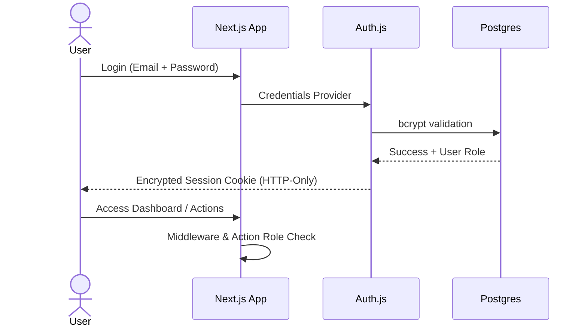

# Architecture — AQUA Sphere OS

This document defines **how** AQUA Sphere OS is built, based on what `project-requirements.md` defines it needs to **do**. The single principle every decision below serves: **no number is ever hand-edited — everything is derived from a transaction log.**

---

## 1. System Architecture

AQUA Sphere OS is a **Next.js monolith**, kept deliberately simple because the business is single-tenant and the traffic is low (a handful of concurrent staff). 



**Why this shape:**
- **One Deployable, Zero API Boilerplate** — Next.js Server Actions talk directly to Prisma. No separate backend, no CORS, no duplicated types.
- **PostgreSQL is the single source of truth.** Every "balance" the app shows (bottle counts, customer balance, stock) is a `SUM()` over a transaction table — never a stored, editable field. This directly implements Section 12 of the requirements ("No Manually-Edited Numbers").
- **No server to manage** — everything runs on managed, free-tier-friendly platforms, matching the low-cost hosting requirement.

---

## 2. App Flow

The system flow mirrors the real front-desk phone call, end to end:



Production and purchasing run as parallel, simpler flows that feed the same inventory ledger:



---

## 3. Authentication Flow

- **Auth.js (NextAuth)** handles all session management using secure, HTTP-only cookies.
- Two roles at login: **Operator/Accountant** and **Owner/Admin**. Role is embedded in the session and checked by Server Actions and Middleware.
- Passwords hashed with **bcrypt** (via a Custom Credentials Provider in Auth.js).
- **Admin password reset requires accountant confirmation** (per manager notes) — implemented as a two-step flow: Admin initiates reset → Accountant approves via a confirmation action → new temporary password issued.



---

## 4. Database Strategy

**Core rule: ledgers, not counters.** Every entity that represents a "balance" is backed by an append-only transaction table, and the balance itself is a derived value — either computed live via `SUM()` or kept in a cached column that is *provably* re-synced from the ledger (never written to directly by the UI).

- **PostgreSQL** as the single relational store — one database, one schema, no sharding needed at this scale.
- **Prisma ORM** for type-safe queries and migrations (`Prisma Migrate`).
- **Transaction tables drive everything:**
  - `BottleTransaction` → derives total-owned / at-factory / with-customer / broken / lost.
  - `InventoryTransaction` → derives current stock per `Item` (raw material or finished good).
  - `Payment` / `VendorPayment` → derive outstanding customer/vendor balances.
- **Database-level transactions (Prisma `$transaction`) + row locking** wrap every "read balance, then write" operation (e.g. delivery completion) to keep concurrent operator/owner usage safe, per the concurrency requirement.
- **Adjustment/reversal transaction type** exists on every ledger, carrying a mandatory `reason` field — this is the *only* sanctioned way to correct a mistake, never a direct edit.
- **Soft deletes** for Customers/Vendors/Items (an `archivedAt` field) instead of hard deletes, to keep historical orders/reports intact.
- **Daily closing**: a `DailyClose` record locks all transactions dated on/before it; the accountant role is blocked from writing transactions dated before the latest close.

---

## 5. Module Architecture

Logic is organized by domain using Next.js Server Actions, keeping frontend components close to their server counterparts.

```mermaid
graph LR
    A[Server Action<br>e.g. actions/orders.ts] --> B{Zod Schema<br>Validation}
    B -->|Invalid| C[Return {error}]
    B -->|Valid| D[Business Logic<br>e.g. MineralCalc]
    D --> E[Prisma DB Mutation]
    E --> F[revalidatePath<br>Return fresh data]
```

`MineralCalc` logic is deliberately isolated as a shared utility since the exact-fraction mineral math (Section 3 of requirements) is the single most error-prone calculation in the system and must live in exactly one place.

---

## 6. Folder Structure

```text
aqua-sphere-os/
├── app/
│   ├── (auth)/login/
│   ├── (dashboard)/
│   │   ├── dashboard/
│   │   ├── customers/
│   │   ├── orders/
│   │   │   ├── 19l/
│   │   │   └── pet/
│   │   ├── deliveries/
│   │   ├── bottles/
│   │   ├── inventory/
│   │   ├── production/
│   │   ├── purchasing/
│   │   ├── expenses/
│   │   └── reports/
│   ├── api/auth/[...nextauth]/  # Auth.js route
│   └── layout.tsx
├── actions/                      # Server Actions (Business Logic)
│   ├── auth.ts
│   ├── customers.ts
│   ├── orders.ts
│   ├── deliveries.ts
│   ├── inventory.ts
│   ├── mineral-calc.ts           # Shared exact-fraction math
│   ├── dashboard.ts
│   └── files.ts
├── components/
│   ├── ui/                       # shadcn/ui primitives
│   ├── forms/
│   └── tables/
├── hooks/                        # TanStack Query wrappers for Server Actions
├── store/                        # Zustand slices (ui state)
├── lib/                          # Utils, Auth options
├── prisma/
│   ├── schema.prisma
│   └── migrations/
└── types/                        # Shared Zod schemas & types
```

---

## 7. Tech Stack

| Layer | Choice |
|---|---|
| Framework | Next.js 15 (App Router + Server Actions) |
| UI library | React 19 + TypeScript |
| Styling | Tailwind CSS v4 + shadcn/ui + Lucide icons |
| Animation | Framer Motion |
| Forms & validation | React Hook Form + Zod |
| Server state | TanStack Query |
| Global/client state | Zustand |
| Tables | TanStack Table |
| Charts | Recharts |
| Dates | date-fns |
| ORM | Prisma (+ Prisma Migrate) |
| Database | PostgreSQL |
| Auth | Auth.js (NextAuth) + bcrypt |
| Scheduled jobs | Vercel Cron / external cron pinging a Route Handler |
| File storage | Vercel Blob / S3 |
| PDF generation | PDFKit |
| Excel export | ExcelJS |

---

## 8. Naming Conventions

- **Files & folders**: `kebab-case` (`bottle-ledger.ts`, `customer-form.tsx`).
- **Classes / Interfaces / Types**: `PascalCase` (`CreateOrderInput`, `BottleTransaction`).
- **Variables & functions**: `camelCase` (`getCustomerBalance`, `mineralFraction`).
- **Database tables (Prisma models)**: singular `PascalCase` in schema (`Customer`, `BottleTransaction`), mapped to snake_case tables via `@@map` for Postgres convention (`customer`, `bottle_transaction`).
- **Enums**: `PascalCase` type, `SCREAMING_SNAKE_CASE` members (`OrderType.NINETEEN_L`, `DeliveryStatus.PARTIAL`).
- **React components**: `PascalCase` (`CustomerSearchBar.tsx`); hooks prefixed `use` (`useCustomerBalance.ts`).
- **Zustand stores**: `useXStore` (`useSessionStore`).
- **Environment variables**: `SCREAMING_SNAKE_CASE`, prefixed by concern (`DATABASE_URL`, `BLOB_READ_WRITE_TOKEN`).

---

## 9. API & Data Fetching Structure

No REST endpoints needed for internal use. The app uses **Next.js Server Actions** for mutations and direct Prisma calls for server components, wrapped in TanStack Query for client-side caching.

**Conventions:**
- Every Server Action that mutates a balance returns the **recomputed balances**, not just a success flag — the frontend never re-derives numbers itself.
- Soft-block warnings come back as a structured `{ warning: true, message, currentValue, limit }` payload, not an error throw — the operator can then resubmit with `confirm: true`. This keeps the "never hard-block" rule consistent.
- Validation: The exact same Zod schema is used by `react-hook-form` on the client and the Server Action on the backend.

---

## 10. State Management

- **TanStack Query** owns server state — customer records, orders, inventory. It handles background refetch and optimistic updates.
- **Zustand** owns only client/UI state: sidebar toggles, active draft order. It deliberately does **not** cache server data.
- After any mutation via a Server Action, the relevant Query keys are invalidated to fetch the latest derived balances.

---

## 11. File Upload Strategy

- **Use case**: customer house photos.
- **Flow**: Frontend → Server Action → **Vercel Blob or S3** → URL saved on `Customer` record.
- **Generated files** (invoices via PDFKit, Excel exports) are generated on-demand in Server Actions/Route Handlers and streamed directly to the client.

---

### How this maps back to the business

Every architectural choice traces to a specific rule: the ledger-first database strategy implements "no manually-edited numbers" (Section 12); the soft-block contract implements the credit philosophy (Section 9); the shared `mineral-calc.ts` implements the exact-fraction rule (Section 3); and Auth.js with role checks implements the operator/owner visibility split.
