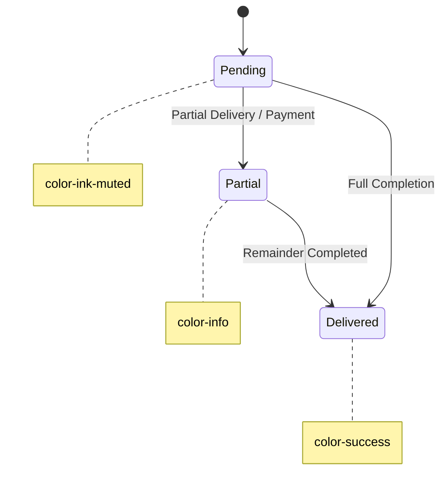

# Design System — AQUA Sphere OS

This is the visual rulebook for AQUA Sphere OS. The product is an **operations tool used at speed** — an operator answering a phone call needs to read a customer's balance in one glance, and the owner needs to trust a number on their phone without squinting. So every choice here is judged against one question: *does this help someone see the right number, fast, without doubt?*

The one deliberate personality note: this is a **water company**. The palette leans into clean, cool, "clear water" tones rather than a generic SaaS blue-and-gray — but it never gets playful or decorative, because this is a tool for cash, stock, and bottles, not a marketing site.

---

## 1. Colors

Named tokens, defined once as CSS variables and reused everywhere — no ad hoc hex codes in components.

| Token | Hex | Use |
|---|---|---|
| `--color-bg` | `#F7FAFB` | App background — a barely-blue off-white, evokes clean water without being cold |
| `--color-surface` | `#FFFFFF` | Cards, tables, modals |
| `--color-border` | `#E2E8EC` | Dividers, table borders, input borders |
| `--color-ink` | `#101B24` | Primary text |
| `--color-ink-muted` | `#5B6B76` | Secondary text, labels, captions |
| `--color-primary` | `#0E7C9C` | Deep aqua-teal — primary actions, links, active states (the brand color) |
| `--color-primary-hover` | `#0B6580` | Hover/pressed state of primary |
| `--color-accent` | `#38B6C4` | Lighter cyan — used sparingly for highlights, chart accents |
| `--color-success` | `#1F9D62` | Paid, delivered, in-stock |
| `--color-warning` | `#D98C1F` | Soft-block warnings (credit limit, negative stock) — **never red**, because warnings in this system are informational, not blocking errors |
| `--color-danger` | `#D14343` | Genuine errors only (failed request, invalid input) — reserved so it stays meaningful |
| `--color-info` | `#3B7DD8` | Neutral informational badges (e.g. "partial") |

**Rule:** `--color-warning` (amber) is reserved exclusively for soft-block situations described in the requirements doc (credit limit, bottle-return overage, negative stock) — this is a deliberate visual signal that the system is *warning, not blocking*. `--color-danger` (red) is reserved for actual failures. Mixing these up would misrepresent the soft-block philosophy that's core to this product.

### Dark Mode
Dark mode is a "should have," not a "must have" for launch — the owner's primary use is a phone screen in daylight/office light, where light mode reads faster. Define the dark tokens now so it can be toggled on later without a redesign:

| Token | Hex |
|---|---|
| `--color-bg` (dark) | `#0B1418` |
| `--color-surface` (dark) | `#121F26` |
| `--color-border` (dark) | `#233139` |
| `--color-ink` (dark) | `#EAF2F5` |
| `--color-ink-muted` (dark) | `#8FA3AC` |
| `--color-primary` (dark) | `#38B6C4` (swap primary/accent so it stays bright against dark bg) |

---

## 2. Typography

Two faces, both chosen for legibility at speed over personality:

- **UI / body face**: **Inter** — the whole app (labels, buttons, table cells, forms). It's neutral, has excellent number legibility, and is free.
- **Numeric / tabular face**: Inter with `font-variant-numeric: tabular-nums` for anywhere numbers appear in a column (tables, dashboard figures) — so digits align vertically and an operator can scan a column of balances without numbers visually "wobbling." This is the one typographic decision worth being deliberate about, since this app is full of number columns.

No separate display/serif face — this isn't a marketing surface, and a second decorative face would only slow down scanning.

## 3. Font Sizes

A small, disciplined type scale — six sizes, nothing in between:

| Token | Size | Use |
|---|---|---|
| `--text-xs` | 12px | Table meta text, timestamps, helper text |
| `--text-sm` | 14px | Table body, form labels, secondary UI text |
| `--text-base` | 16px | Default body text, input text |
| `--text-lg` | 18px | Card titles, section headers |
| `--text-xl` | 24px | Page titles |
| `--text-2xl` | 32px | Dashboard headline numbers (Today's Sales, Profit) |

**Rule:** dashboard headline figures are the *only* place `--text-2xl` is used — it exists to make the owner's most-checked numbers readable at arm's length on a phone.

## 4. Spacing

A 4px base unit, used consistently instead of arbitrary pixel values:

| Token | Value |
|---|---|
| `--space-1` | 4px |
| `--space-2` | 8px |
| `--space-3` | 12px |
| `--space-4` | 16px |
| `--space-6` | 24px |
| `--space-8` | 32px |
| `--space-12` | 48px |

Component padding defaults: cards `--space-4` to `--space-6`; form fields `--space-3`; page-level section gaps `--space-8`.

## 5. Border Radius

Soft but not playful — enough to feel modern, not enough to feel like a consumer app:

| Token | Value | Use |
|---|---|---|
| `--radius-sm` | 6px | Badges, chips, small buttons |
| `--radius-md` | 10px | Inputs, buttons, table containers |
| `--radius-lg` | 14px | Cards, modals |

No fully-rounded (pill) buttons except status badges/chips — pills are reserved for status indicators (Paid / Pending / Delivered) so that shape itself becomes a recognizable "this is a status" signal across the app.

## 6. Shadows

Minimal — this is a data-dense tool, and heavy shadows just add visual noise between an operator's eye and a number.

| Token | Value | Use |
|---|---|---|
| `--shadow-sm` | `0 1px 2px rgba(16,27,36,0.06)` | Cards at rest |
| `--shadow-md` | `0 4px 12px rgba(16,27,36,0.10)` | Dropdowns, popovers, hover-raised cards |
| `--shadow-lg` | `0 12px 32px rgba(16,27,36,0.16)` | Modals, dialogs |

No shadow on tables or table rows — flat, bordered surfaces read faster for dense data.

---

## 7. Buttons

- **Primary** — solid `--color-primary` fill, white text, `--radius-md`. Used for the one main action per screen (Save Order, Complete Delivery, Confirm Payment).
- **Secondary** — `--color-surface` fill, `--color-border` outline, `--color-ink` text. Used for Cancel, Back, and secondary actions.
- **Destructive** — `--color-danger` fill, reserved for irreversible actions (Delete Customer) and always paired with a confirmation dialog.
- **Warning-confirm** — `--color-warning` outline with a filled confirm variant, used specifically for the soft-block "proceed anyway" action (e.g. "Deliver anyway — exceeds credit limit") — this button must never look identical to a normal primary action, since clicking it is an acknowledged exception, not a routine save.
- **Sizes**: `sm` (32px height, for inline table actions), `md` (40px height, default), `lg` (48px height, for the one-tap mobile actions the owner uses most — e.g. "Mark Delivered").
- **Touch targets**: minimum 40px height/width on any button reachable from a phone, per the mobile-first requirement.

## 8. Cards

- `--color-surface` background, `--radius-lg`, `--shadow-sm` at rest, `--shadow-md` on hover only where the card is clickable (e.g. a dashboard tile linking to a report).
- Card header: title at `--text-lg`, optional muted subtitle at `--text-sm` below it.
- Dashboard summary cards (Today's Sales, Pending Orders, etc.) follow one fixed layout: label (muted, small, top) → big number (`--text-2xl`) → optional trend/comparison line (small, colored by success/warning) — consistent enough that the owner's eye learns exactly where to look on every card without re-reading labels each time.

## 9. Tables

Tables are the most-used surface in this app (orders, inventory, ledgers) — they get the most design discipline:

- Header row: `--text-xs`, uppercase, `--color-ink-muted`, `--color-bg` background (subtly distinct from row background) — sticky on scroll for long lists.
- Row height: comfortable 44px minimum (touch-friendly, not cramped).
- Zebra striping **off** by default — use a hairline `--color-border` row divider instead; stripes compete visually with status badges.
- Numeric columns: right-aligned, tabular-nums, so digits stack cleanly.
- Status columns (delivery/payment status): rendered as small pill badges using the status colors below — never plain text — so status is scannable by color/shape before reading the word.
- Row hover: subtle `--color-bg` tint, to help track a row across a wide table on a phone in landscape.
- Every list table supports server-side pagination and a persistent search/filter bar above it (per `architecture.md` §9).

**Status badge colors** (used across orders, deliveries, payments):
| Status | Color |
|---|---|
| Pending / Unpaid | `--color-ink-muted` (neutral gray-blue) |
| Partial | `--color-info` |
| Delivered / Paid | `--color-success` |
| Soft-block warning shown | `--color-warning` |

## 10. Forms

- Labels always above the field (not placeholder-as-label — placeholders disappear the moment someone starts typing, and this app's operators need the label visible while they work).
- Field height 40px, `--radius-md`, `--color-border` outline, `--color-primary` outline on focus (2px, visible — accessibility requirement, never remove focus rings).
- Required fields marked with a small asterisk next to the label, not color alone.
- Inline validation errors appear directly below the field, in `--color-danger`, `--text-sm`, with a specific message ("Phone number already exists" — not "Invalid input").
- Soft-block warnings inside forms (credit limit, bottle overage) render as an inline banner **within the form**, in `--color-warning`, with the actual numbers stated and a single explicit "Proceed anyway" action — never a blocking modal that dead-ends the operator.
- The order-entry form is the most latency-sensitive UI in the app: fields are ordered by real call-taking order (customer found → quantity → amount → date → remarks), with smart defaults pre-filled (default price, today+expected delivery gap) to hit the 20-second target.

## 11. Icons

- **Lucide React** exclusively — no mixing icon sets.
- Icons are always paired with a text label in navigation and buttons (never icon-only for primary actions) — this is an operational tool used under time pressure, not a polished consumer app where icon literacy can be assumed.
- Icon-only buttons are reserved for dense, repeated table-row actions (edit, delete, view) where a tooltip provides the label on hover/long-press.
- Icon size standard: 16px inline with text, 20px in buttons, 24px in nav/sidebar.
- Icon color matches text color by default (`--color-ink-muted` for secondary icons); status icons use their matching status color.

## 12. Dashboard Style

- **Above the fold, phone-first**: the owner's most-checked numbers (Today's Sales, Cash Collection, Profit Estimate, Pending Orders count) appear first, in a responsive grid that collapses to a single column on mobile — no horizontal scrolling to find a number.
- **Traffic-light scanning, not decoration**: low-stock items and overdue balances use `--color-warning`/`--color-danger` accents on the number itself, not decorative icons — the color is the alert.
- **No charts above the fold.** Recharts visualizations (sales trend, inventory levels) sit below the summary cards — the owner should see the headline numbers in under a second, then scroll for trends if curious.
- **Bottle Summary** gets its own dedicated card (not folded into general inventory) with the five reconciling figures (total owned / at factory / with customers / broken / lost) shown together, since this reconciliation is a core trust signal for the business (per requirements §10).
- **Live, not "refresh to update"**: dashboard cards use TanStack Query's background refetch so numbers update without the owner needing to pull-to-refresh — trust in real-time accuracy is the whole point of this dashboard.

## 13. Dark Mode

Tokens are defined (Section 1) but dark mode ships as a **user-toggleable preference, not the default** — implemented via a `class="dark"` root toggle so Tailwind's `dark:` variants apply app-wide with no per-component rework. Priority: light mode must be complete and polished for launch; dark mode is a fast-follow once the token system proves out in light mode, since it's mostly a token swap at that point, not new design work.

---

### Summary of intent

Nothing in this system exists to look impressive — it exists to make a number trustworthy at a glance, an action fast on a phone, and a warning distinguishable from an error. Every future screen should be checked against that bar before checking it against pixel polish.
