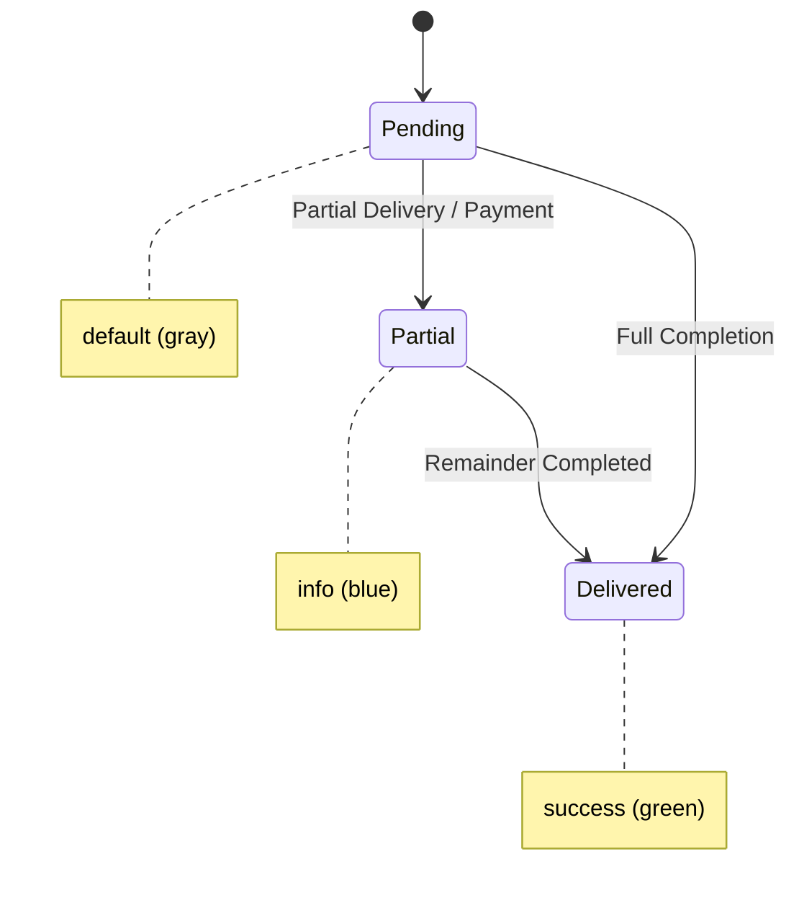

# Design System — AQUA Sphere OS

This is the visual rulebook for AQUA Sphere OS. The product is an **operations tool used at speed** — an operator answering a phone call needs to read a customer's balance in one glance, and the owner needs to trust a number on their phone without squinting. So every choice here is judged against one question: *does this help someone see the right number, fast, without doubt?*

The one deliberate personality note: this is a **water company**. The palette leans into clean, cool, "clear water" tones rather than a generic SaaS blue-and-gray — but it never gets playful or decorative, because this is a tool for cash, stock, and bottles, not a marketing site.

---

## 0. Component Strategy: MUI + shadcn/ui

### Why This Combination

| Library | Role | Why |
|---------|------|-----|
| **Material UI (MUI)** | Core component system + theme engine | Mature, accessible, data-dense friendly (DataGrid, DatePicker, Autocomplete), mobile-optimized touch targets, built-in RTL support |
| **shadcn/ui** | Specific UI patterns + dashboard primitives | Copy-paste components you fully own — dashboard cards, form layouts, command palettes, calendar pickers. Fully customizable because the code lives in your repo, not a node_module. |
| **Tailwind CSS** | Utility styling for shadcn components | shadcn is built on Tailwind. MUI uses its own `styled()` / `sx` system. Both coexist: MUI handles the theme tokens, Tailwind handles shadcn component micro-layouts. |
| **Lucide React** | Icons | Consistent icon set across both MUI and shadcn components. MUI's `@mui/icons-material` is avoided to keep one icon language. |

### shadcn/ui Customization

> **Critical clarification:** shadcn/ui is NOT a traditional npm package you install and override with CSS. It is a **collection of copy-paste React components** built on Radix UI primitives + Tailwind CSS. When you add a shadcn component to your project, the full source code is copied into your `components/ui/` folder. You own every line. You can change props, styling logic, behavior, or replace Tailwind classes with MUI's `styled()` — there are no "black box" internals. This makes it ideal for a business-critical operations tool where every pixel must be deliberate.

**Integration pattern:**
- MUI `ThemeProvider` at the app root defines all design tokens (colors, spacing, typography, shadows)
- shadcn components are wrapped with MUI's `styled()` or accept an `sx` prop to consume MUI theme values
- shadcn's internal Tailwind classes are kept for micro-layouts (flex, grid, padding) but color/spacing values reference CSS variables that MUI's theme also sets
- Result: one visual system, two component sources, zero visual inconsistency

---

## 1. Colors

Named tokens, defined once in the MUI theme palette and reused everywhere — no ad hoc hex codes in components.

### MUI Theme Palette Mapping

```typescript
// frontend/src/theme.ts
import { createTheme } from '@mui/material/styles';

export const theme = createTheme({
  palette: {
    background: {
      default: '#F7FAFB',    // --color-bg
      paper: '#FFFFFF',       // --color-surface
    },
    text: {
      primary: '#101B24',     // --color-ink
      secondary: '#5B6B76',  // --color-ink-muted
    },
    primary: {
      main: '#0E7C9C',        // --color-primary
      dark: '#0B6580',        // --color-primary-hover
      light: '#E3F2F5',       // primary tint for hover backgrounds
      contrastText: '#FFFFFF',
    },
    secondary: {
      main: '#38B6C4',        // --color-accent
      contrastText: '#101B24',
    },
    success: {
      main: '#1F9D62',        // --color-success
      light: '#E8F5E9',
      dark: '#166E46',
    },
    warning: {
      main: '#D98C1F',        // --color-warning
      light: '#FFF8E1',
      dark: '#9A6300',
    },
    error: {
      main: '#D14343',        // --color-danger
      light: '#FFEBEE',
      dark: '#9E2B2B',
    },
    info: {
      main: '#3B7DD8',        // --color-info
      light: '#E3F2FD',
      dark: '#1A5BB5',
    },
    divider: '#E2E8EC',       // --color-border
  },
});
```

| Token | Hex | MUI Palette Key | Use |
|---|---|---|---|
| `--color-bg` | `#F7FAFB` | `palette.background.default` | App background — a barely-blue off-white, evokes clean water without being cold |
| `--color-surface` | `#FFFFFF` | `palette.background.paper` | Cards, tables, modals |
| `--color-border` | `#E2E8EC` | `palette.divider` | Dividers, table borders, input borders |
| `--color-ink` | `#101B24` | `palette.text.primary` | Primary text |
| `--color-ink-muted` | `#5B6B76` | `palette.text.secondary` | Secondary text, labels, captions |
| `--color-primary` | `#0E7C9C` | `palette.primary.main` | Deep aqua-teal — primary actions, links, active states (the brand color) |
| `--color-primary-hover` | `#0B6580` | `palette.primary.dark` | Hover/pressed state of primary |
| `--color-accent` | `#38B6C4` | `palette.secondary.main` | Lighter cyan — used sparingly for highlights, chart accents |
| `--color-success` | `#1F9D62` | `palette.success.main` | Paid, delivered, in-stock |
| `--color-warning` | `#D98C1F` | `palette.warning.main` | Soft-block warnings (credit limit, bottle overage, negative stock) — **never red**, because warnings in this system are informational, not blocking errors |
| `--color-danger` | `#D14343` | `palette.error.main` | Genuine errors only (failed request, invalid input) — reserved so it stays meaningful |
| `--color-info` | `#3B7DD8` | `palette.info.main` | Neutral informational badges (e.g. "partial") |

**Rule:** `--color-warning` (amber) is reserved exclusively for soft-block situations described in the requirements doc (credit limit, bottle overage, negative stock) — this is a deliberate visual signal that the system is *warning, not blocking*. `--color-danger` (red) is reserved for actual failures. Mixing these up would misrepresent the soft-block philosophy that's core to this product.

### Division Branding

When the active workspace switches between **Aquasphere** and **Badana Industries**, the branding bar at the top of the app changes subtly to reinforce context:

| Workspace | MUI AppBar Color | Badge Label |
|---|---|---|
| **Aquasphere** | `palette.primary.main` (`#0E7C9C`) | "AQUA SPHERE" |
| **Badana Industries** | `#6B4C9A` (muted purple — distinct from water teal, signals manufacturing context) | "BADANA IND." |

This is a single AppBar color change only — not a full theme swap. The rest of the UI remains consistent so operators don't re-learn patterns when switching workspaces.

```typescript
// Division-aware AppBar
const divisionColors = {
  aquasphere: theme.palette.primary.main,
  badana: '#6B4C9A',
};

<AppBar sx={{ bgcolor: divisionColors[companyContext] }} />
```

### Dark Mode
Dark mode is a "should have," not a "must have" for launch — the owner's primary use is a phone screen in daylight/office light, where light mode reads faster. Define the dark tokens now so it can be toggled on later without a redesign:

```typescript
export const darkTheme = createTheme({
  palette: {
    mode: 'dark',
    background: { default: '#0B1418', paper: '#121F26' },
    text: { primary: '#EAF2F5', secondary: '#8FA3AC' },
    primary: { main: '#38B6C4', dark: '#2A9CA8', light: '#4ECBD8' },
    divider: '#233139',
    // ... success, warning, error, info stay the same or slightly brightened
  },
});
```

| Token | Hex |
|---|---|
| `--color-bg` (dark) | `#0B1418` |
| `--color-surface` (dark) | `#121F26` |
| `--color-border` (dark) | `#233139` |
| `--color-ink` (dark) | `#EAF2F5` |
| `--color-ink-muted` (dark) | `#8FA3AC` |
| `--color-primary` (dark) | `#38B6C4` (swap primary/accent so it stays bright against dark bg) |

---

## 2. Typography

Two faces, both chosen for legibility at speed over personality:

- **UI / body face**: **Inter** — the whole app (labels, buttons, table cells, forms). It's neutral, has excellent number legibility, and is free.
- **Numeric / tabular face**: Inter with `font-variant-numeric: tabular-nums` for anywhere numbers appear in a column (tables, dashboard figures) — so digits align vertically and an operator can scan a column of balances without numbers visually "wobbling." This is the one typographic decision worth being deliberate about, since this app is full of number columns.

No separate display/serif face — this isn't a marketing surface, and a second decorative face would only slow down scanning.

### MUI Typography Configuration

```typescript
typography: {
  fontFamily: '"Inter", "Roboto", "Helvetica", "Arial", sans-serif',
  fontSize: 14, // Base = 14px (--text-sm)
  h1: { fontSize: '32px', fontWeight: 700, lineHeight: 1.2 },   // --text-2xl
  h2: { fontSize: '24px', fontWeight: 600, lineHeight: 1.3 },   // --text-xl
  h3: { fontSize: '18px', fontWeight: 600, lineHeight: 1.4 },   // --text-lg
  body1: { fontSize: '16px', fontWeight: 400, lineHeight: 1.5 }, // --text-base
  body2: { fontSize: '14px', fontWeight: 400, lineHeight: 1.5 }, // --text-sm
  caption: { fontSize: '12px', fontWeight: 400, lineHeight: 1.4, letterSpacing: '0.025em' }, // --text-xs
  // Tabular numbers for data
  fontFamily: '"Inter", sans-serif',
  fontVariantNumeric: 'tabular-nums',
},
```

**MUI Component Mapping:**

| Token | Size | MUI Variant | Use |
|---|---|---|---|
| `--text-xs` | 12px | `caption` | Table meta text, timestamps, helper text |
| `--text-sm` | 14px | `body2` | Table body, form labels, secondary UI text |
| `--text-base` | 16px | `body1` | Default body text, input text |
| `--text-lg` | 18px | `h3` / `subtitle1` | Card titles, section headers |
| `--text-xl` | 24px | `h2` | Page titles |
| `--text-2xl` | 32px | `h1` | Dashboard headline numbers (Today's Sales, Profit) |

**Rule:** dashboard headline figures are the *only* place `h1` (`--text-2xl`) is used — it exists to make the owner's most-checked numbers readable at arm's length on a phone.

---

## 3. Spacing

A 4px base unit, used consistently instead of arbitrary pixel values. MUI's default spacing unit is 8px; we override to 4px for finer control.

```typescript
spacing: 4, // 1 unit = 4px
```

| Token | Value | MUI `spacing()` | Use |
|---|---|---|---|
| `--space-1` | 4px | `spacing(1)` | Inline gaps, icon margins |
| `--space-2` | 8px | `spacing(2)` | Tight component gaps |
| `--space-3` | 12px | `spacing(3)` | Form field padding |
| `--space-4` | 16px | `spacing(4)` | Card padding, button padding |
| `--space-6` | 24px | `spacing(6)` | Section gaps |
| `--space-8` | 32px | `spacing(8)` | Page-level section gaps |
| `--space-12` | 48px | `spacing(12)` | Major section separators |

Component padding defaults: cards `spacing(4)` to `spacing(6)`; form fields `spacing(3)`; page-level section gaps `spacing(8)`.

---

## 4. Border Radius

Soft but not playful — enough to feel modern, not enough to feel like a consumer app:

```typescript
shape: {
  borderRadius: 10, // Default --radius-md
},
```

| Token | Value | MUI Shape Override | Use |
|---|---|---|---|
| `--radius-sm` | 6px | `borderRadius: 6` | Badges, chips, small buttons |
| `--radius-md` | 10px | `borderRadius: 10` (default) | Inputs, buttons, table containers |
| `--radius-lg` | 14px | `borderRadius: 14` | Cards, modals |

No fully-rounded (pill) buttons except status badges/chips — pills are reserved for status indicators (Paid / Pending / Delivered) so that shape itself becomes a recognizable "this is a status" signal across the app.

```typescript
// Status chip (pill shape)
<Chip 
  label="Pending" 
  sx={{ borderRadius: 6, height: 24, fontSize: 12 }} 
/>
```

---

## 5. Shadows

Minimal — this is a data-dense tool, and heavy shadows just add visual noise between an operator's eye and a number.

```typescript
shadows: [
  'none',
  '0 1px 2px rgba(16,27,36,0.06)',   // --shadow-sm (cards at rest)
  '0 4px 12px rgba(16,27,36,0.10)',  // --shadow-md (dropdowns, popovers)
  '0 12px 32px rgba(16,27,36,0.16)', // --shadow-lg (modals, dialogs)
  // ... MUI requires 25 shadow entries, rest can be copies of shadow-3
],
```

| Token | Value | MUI Shadow Index | Use |
|---|---|---|---|
| `--shadow-sm` | `0 1px 2px rgba(16,27,36,0.06)` | `shadows[1]` | Cards at rest |
| `--shadow-md` | `0 4px 12px rgba(16,27,36,0.10)` | `shadows[2]` | Dropdowns, popovers, hover-raised cards |
| `--shadow-lg` | `0 12px 32px rgba(16,27,36,0.16)` | `shadows[3]` | Modals, dialogs |

No shadow on tables or table rows — flat, bordered surfaces read faster for dense data.

---

## 6. Buttons

MUI provides `Button` variants that map directly to our action hierarchy:

| Design Role | MUI Variant | Color | Use |
|---|---|---|---|
| **Primary** | `contained` | `primary` | Save Order, Complete Delivery, Confirm Payment |
| **Secondary** | `outlined` | `primary` | Cancel, Back, secondary actions |
| **Destructive** | `contained` | `error` | Delete Customer (Owner only), always with confirmation dialog |
| **Warning-confirm** | `outlined` | `warning` | Soft-block "proceed anyway" — must never look identical to primary |
| **Text/Link** | `text` | `primary` | Inline actions, navigation |

**Sizes:**
- `size="small"` (32px height) — inline table actions
- `size="medium"` (40px height) — default
- `size="large"` (48px height) — one-tap mobile actions (owner's "Mark Delivered")

**Touch targets:** minimum 40px height/width on any button reachable from a phone, per the mobile-first requirement. MUI enforces this by default on `size="medium"` and `size="large"`.

```typescript
// Warning-confirm button (soft-block)
<Button 
  variant="outlined" 
  color="warning"
  startIcon={<AlertTriangle />}
  size="large"
>
  Proceed Anyway — I Understand
</Button>
```

---

## 7. Cards

MUI `Card` + `CardContent` + `CardHeader` for all card surfaces.

- `bgcolor: 'background.paper'` (`--color-surface`)
- `borderRadius: 14` (`--radius-lg`)
- `boxShadow: 1` (`--shadow-sm`) at rest
- `boxShadow: 2` (`--shadow-md`) on hover only where the card is clickable (e.g. a dashboard tile linking to a report)
- Card header: `title` prop at `subtitle1` (`--text-lg`), optional `subheader` at `body2` (`--text-sm`)

### Dashboard Summary Cards (MUI + shadcn pattern)

Dashboard summary cards (Today's Sales, Pending Orders, etc.) follow one fixed layout using a shadcn `Card` component customized with MUI theme:

```tsx
// components/dashboard/metric-card.tsx (shadcn Card, styled with MUI sx)
<Card sx={{ 
  borderRadius: 3, // 12px → close to 14px
  boxShadow: 1,
  '&:hover': { boxShadow: 2 }, // only if clickable
}}>
  <CardContent sx={{ p: 3 }}>
    <Typography variant="caption" color="text.secondary">
      Today's Sales
    </Typography>
    <Typography variant="h1" color="primary.main" sx={{ mt: 1 }}>
      Rs. 45,200
    </Typography>
    <Typography variant="caption" color="success.main">
      +12% vs yesterday
    </Typography>
  </CardContent>
</Card>
```

Consistent enough that the owner's eye learns exactly where to look on every card without re-reading labels each time.

---

## 8. Tables

Tables are the most-used surface in this app (orders, inventory, ledgers) — they get the most design discipline. MUI `DataGrid` is the primary table component for all list views.

### MUI DataGrid Configuration

```typescript
<DataGrid
  rows={rows}
  columns={columns}
  pageSizeOptions={[10, 25, 50]}
  initialState={{ pagination: { paginationModel: { pageSize: 25 } } }}
  sx={{
    border: 'none',
    '& .MuiDataGrid-columnHeaders': {
      bgcolor: 'background.default', // --color-bg
      color: 'text.secondary',       // --color-ink-muted
      fontSize: 12,                  // --text-xs
      textTransform: 'uppercase',
      letterSpacing: '0.025em',
    },
    '& .MuiDataGrid-row': {
      minHeight: 44, // touch-friendly
      '&:hover': { bgcolor: 'background.default' },
    },
    '& .MuiDataGrid-cell': {
      borderBottom: '1px solid',
      borderColor: 'divider', // --color-border
    },
  }}
/>
```

- Header row: `caption` variant (`--text-xs`), uppercase, `--color-ink-muted`, `--color-bg` background — sticky on scroll for long lists.
- Row height: comfortable 44px minimum (touch-friendly, not cramped).
- Zebra striping **off** by default — use a hairline `--color-border` row divider instead; stripes compete visually with status badges.
- Numeric columns: right-aligned, `font-variant-numeric: tabular-nums`, so digits stack cleanly.
- Status columns (delivery/payment status): rendered as MUI `Chip` components using the status colors below — never plain text — so status is scannable by color/shape before reading the word.
- Row hover: subtle `--color-bg` tint, to help track a row across a wide table on a phone in landscape.
- Every list table supports server-side pagination and a persistent search/filter bar above it (per `architecture.md` §9).

**Status badge colors** (used across orders, deliveries, payments):

| Status | MUI Color | Chip Variant |
|---|---|---|
| Pending / Unpaid | `default` (gray) | `filled` |
| Partial | `info` | `filled` |
| Delivered / Paid | `success` | `filled` |
| Soft-block warning shown | `warning` | `outlined` |

```tsx
// Status column renderCell
<Chip 
  label={status} 
  color={statusColorMap[status]} 
  size="small" 
  sx={{ borderRadius: 1, height: 24, fontSize: 12 }}
/>
```



---

## 9. Forms

MUI `TextField`, `Select`, `DatePicker` (from MUI X), `RadioGroup`, `Checkbox` for all form inputs.

- Labels always above the field via `label` prop (not placeholder-as-label — placeholders disappear the moment someone starts typing, and this app's operators need the label visible while they work).
- Field height: MUI `size="medium"` (40px effective height), `variant="outlined"`, `borderColor: 'divider'` outline, `borderColor: 'primary.main'` on focus (2px, visible — accessibility requirement, never remove focus rings).
- Required fields marked with a small asterisk next to the label (`required` prop), not color alone.
- Inline validation errors appear directly below the field via `helperText` prop, in `error` color (`--color-danger`), `body2` (`--text-sm`), with a specific message ("Phone number already exists" — not "Invalid input").
- Soft-block warnings inside forms render as an inline MUI `Alert` banner **within the form**, in `severity="warning"` (`--color-warning`), with the actual numbers stated and a single explicit "Proceed anyway" action — never a blocking modal that dead-ends the operator.

### Soft-Block Warning Banner (MUI Alert)

```tsx
<Alert 
  severity="warning"
  icon={<AlertTriangle />}
  action={
    <Button color="warning" size="small" variant="outlined">
      Proceed Anyway
    </Button>
  }
  sx={{ mb: 2 }}
>
  <AlertTitle>Credit Limit Warning</AlertTitle>
  Credit limit: Rs. 5,000 | Current balance: Rs. 4,200 | 
  This order: Rs. 2,000 | New balance would be: Rs. 6,200
</Alert>
```

- **Background**: `warning.light` at 10% opacity
- **Border**: 1px solid `warning.main`
- **Icon**: `AlertTriangle` (Lucide), `warning.main`
- **Text**: `text.primary`, `body2`
- **Placement**: Between the form fields and the submit button, so the operator sees the warning before they click Save but can still proceed with one extra tap.

### Order-Entry Form Layout (20-Second Target)

The order-entry form is the most latency-sensitive UI in the app. Fields are ordered by real call-taking order using MUI `Stack` + `Grid`:

1. **Customer search** (MUI `Autocomplete` with phone/name/ID) — auto-focus on load
2. **Customer found** → auto-populated read-only `Card` (name, balance, bottles, last order)
3. **Order type selector** (MUI `ToggleButtonGroup`: 19L | PET) — large touch targets, side-by-side on desktop, stacked on mobile
4. **Quantity** (MUI `TextField` type="number" with `InputAdornment` +/- steppers, min 1)
5. **Amount** (MUI `TextField` type="number") — auto-filled from default price, editable
6. **Expected delivery date** (MUI X `DatePicker`, default = today + 1 day)
7. **Remarks** (MUI `TextField` multiline, optional, collapsible)
8. **[Submit]** — Primary `Button`, full width on mobile

Smart defaults: default price pre-filled, expected delivery = tomorrow, quantity = 1. The operator should only need to type/search, confirm quantity, and tap submit.

### Add Customer Modal (Within Order Flow)

When "Customer not found" is triggered during order entry, a MUI `Dialog` opens inline:

- **Dialog width**: max 480px on desktop, full-screen on mobile (< 640px via `fullScreen` prop)
- **Fields**: Name, Phone (unique validation via MUI `TextField` + server check), Address, Map Location (GPS pin or link), Home Photo (MUI `Button` + hidden `input type="file"`), Customer Type (MUI `RadioGroup`: Home | Restaurant | Shop | Distributor), Credit Limit (default 0 = unlimited), Default Price (optional), Security Deposit (optional), Remarks (optional)
- **Actions**: [Save Customer & Continue] (Primary `Button`) + [Cancel] (Secondary `Button`)
- **On save**: dialog closes, customer auto-selected in order form, flow continues without losing context

---

## 10. Icons

**Lucide React** exclusively — no mixing icon sets. Lucide works seamlessly with both MUI (via `SvgIcon` wrapper or direct use) and shadcn components.

Icons are always paired with a text label in navigation and buttons (never icon-only for primary actions) — this is an operational tool used under time pressure, not a polished consumer app where icon literacy can be assumed.

Icon-only buttons are reserved for dense, repeated table-row actions (edit, delete, view) where a MUI `Tooltip` provides the label on hover/long-press.

Icon size standard: 16px inline with text, 20px in buttons, 24px in nav/sidebar.
Icon color matches text color by default (`--color-ink-muted` for secondary icons); status icons use their matching status color.

### Lucide-to-MUI Integration

```tsx
import { Droplets } from 'lucide-react';
import { SvgIcon } from '@mui/material';

// Wrap Lucide icon in MUI SvgIcon for consistent sizing/coloring
<SvgIcon sx={{ fontSize: 20, color: 'primary.main' }}>
  <Droplets />
</SvgIcon>

// Or use directly in shadcn components (which accept any React node as icon)
<Button startIcon={<Droplets size={20} />}>
  Bottle Ledger
</Button>
```

### Key Icon Assignments

| Concept | Lucide Icon | MUI Usage | Notes |
|---|---|---|---|
| Search | `Search` | `startIcon` on Autocomplete | Customer lookup, global search |
| Add | `Plus` | `startIcon` on Button | New customer, new order, new batch |
| Warning / Soft-block | `AlertTriangle` | `Alert` icon, `Chip` icon | Credit limit, bottle overage, negative stock |
| Error | `XCircle` | `Alert` severity="error" | Failed request, invalid input |
| Success | `CheckCircle` | `Snackbar` icon, `Chip` icon | Delivered, paid, saved |
| Bottle | `Droplets` | `SvgIcon` wrapper | 19L bottle ledger, bottle count |
| Inventory | `Package` | `SvgIcon` wrapper | Stock levels, raw materials |
| Money | `Banknote` | `SvgIcon` wrapper | Payments, expenses, cash |
| Calendar | `Calendar` | `DatePicker` adornment | Delivery date, daily close |
| Photo / Upload | `Camera` | `Button` icon | Expense receipt, customer photo, purchase bill |
| Division toggle | `ArrowLeftRight` | `SvgIcon` wrapper | Workspace switcher in header |
| Lock | `Lock` | `SvgIcon` wrapper | Daily closed, password-protected |
| Chart | `BarChart3` | `SvgIcon` wrapper | Reports, dashboard |
| Close | `X` | `Dialog` close button | Modal close |
| Edit | `Pencil` | Icon-only table action | With Tooltip |
| Delete | `Trash2` | Icon-only table action | With Tooltip, Owner-only |
| View | `Eye` | Icon-only table action | With Tooltip |
| Filter | `Filter` | `Button` icon | Table filters |
| Download | `Download` | `Button` icon | Export reports |
| Refresh | `RefreshCw` | `IconButton` | Dashboard refresh |
| Phone | `Phone` | `TextField` adornment | Customer phone |
| Map Pin | `MapPin` | `Button` icon | Customer location |
| User | `User` | `Avatar` fallback | User menu |
| Logout | `LogOut` | `MenuItem` icon | Sign out |
| Settings | `Settings` | `MenuItem` icon | Admin settings |
| ChevronDown | `ChevronDown` | `Select` icon | Dropdowns |
| ChevronRight | `ChevronRight` | `ListItem` icon | Navigation expand |
| CreditCard | `CreditCard` | `SvgIcon` wrapper | Credit limit |
| Truck | `Truck` | `SvgIcon` wrapper | Delivery status |
| Factory | `Factory` | `SvgIcon` wrapper | Badana production |
| Warehouse | `Warehouse` | `SvgIcon` wrapper | Badana inventory |
| FlaskConical | `FlaskConical` | `SvgIcon` wrapper | Mineral sets |
| Receipt | `Receipt` | `SvgIcon` wrapper | Expenses, bills |
| FileText | `FileText` | `SvgIcon` wrapper | Invoices, reports |
| TrendingUp | `TrendingUp` | `SvgIcon` wrapper | Profit, sales trend |
| TrendingDown | `TrendingDown` | `SvgIcon` wrapper | Loss, expenses |
| AlertCircle | `AlertCircle` | `SvgIcon` wrapper | Low stock alert |
| Bell | `Bell` | `IconButton` | Notifications |
| Menu | `Menu` | `IconButton` | Mobile hamburger |
| Home | `Home` | `SvgIcon` wrapper | Customer type: home |
| Utensils | `Utensils` | `SvgIcon` wrapper | Customer type: restaurant |
| Store | `Store` | `SvgIcon` wrapper | Customer type: shop |
| Building2 | `Building2` | `SvgIcon` wrapper | Customer type: distributor |
| Check | `Check` | `Chip` icon | Completed status |
| Clock | `Clock` | `Chip` icon | Pending status |
| ArrowUpDown | `ArrowUpDown` | `TableHead` icon | Sort indicator |
| MoreHorizontal | `MoreHorizontal` | `IconButton` | Row actions menu |
| Printer | `Printer` | `Button` icon | Print invoice |
| Share2 | `Share2` | `Button` icon | Share (WhatsApp) |
| Mail | `Mail` | `Button` icon | Email notification |
| MessageCircle | `MessageCircle` | `Button` icon | WhatsApp message |
| Shield | `Shield` | `SvgIcon` wrapper | Security, admin |
| Key | `Key` | `SvgIcon` wrapper | Password reset |
| Database | `Database` | `SvgIcon` wrapper | Data backup |
| History | `History` | `SvgIcon` wrapper | Transaction history |
| Layers | `Layers` | `SvgIcon` wrapper | Inventory layers |
| Scale | `Scale` | `SvgIcon` wrapper | Balance, reconciliation |
| Zap | `Zap` | `SvgIcon` wrapper | Quick action |
| Sparkles | `Sparkles` | `SvgIcon` wrapper | New feature highlight |

---

## 11. Dashboard Style

- **Above the fold, phone-first**: the owner's most-checked numbers (Today's Sales, Cash Collection, Profit Estimate, Pending Orders count) appear first, in a MUI `Grid` container with `spacing={2}` that collapses to a single column on mobile (`xs={12}`) — no horizontal scrolling to find a number.
- **Traffic-light scanning, not decoration**: low-stock items and overdue balances use `warning.main`/`error.main` accents on the number itself via `Typography color="warning"`, not decorative icons — the color is the alert.
- **No charts above the fold.** Recharts visualizations (sales trend, inventory levels) sit below the summary cards in a second `Grid` row — the owner should see the headline numbers in under a second, then scroll for trends if curious.
- **Bottle Summary** gets its own dedicated MUI `Card` (not folded into general inventory) with the five reconciling figures (total owned / at factory / with customers / broken / lost) shown together in a MUI `Stack` row, since this reconciliation is a core trust signal for the business (per requirements §10).
- **Live, not "refresh to update"**: dashboard cards use TanStack Query's background refetch (e.g. 30s interval) and SSE event listeners so numbers update without the owner needing to pull-to-refresh — trust in real-time accuracy is the whole point of this dashboard.
- **Division-aware**: when the owner toggles between Aquasphere and Badana, the dashboard cards swap context instantly. The MUI `AppBar` changes color (§1.1) and the card labels update (e.g. "Today's Sales" → "Today's Sales — Badana"). No page reload.
- **Role-aware visibility**: Admin sees stock and order counts but NOT profit cards (those cards are hidden via conditional rendering, not just zeroed out). Production Manager sees only inventory and production cards. Marketing Manager sees orders and customer alerts.

### Dashboard Layout (MUI Grid)

```tsx
<Grid container spacing={2}>
  {/* Row 1: Key metrics — always visible, phone-first */}
  <Grid item xs={12} sm={6} md={4}>
    <MetricCard title="Today's Sales" value="Rs. 45,200" trend="+12%" />
  </Grid>
  <Grid item xs={12} sm={6} md={4}>
    <MetricCard title="Cash Collected" value="Rs. 32,100" trend="+8%" />
  </Grid>
  <Grid item xs={12} sm={6} md={4}>
    <MetricCard title="Pending Orders" value="12" alert={pendingOrders > 10} />
  </Grid>

  {/* Row 2: Bottle summary — dedicated card */}
  <Grid item xs={12}>
    <BottleSummaryCard 
      totalOwned={500} 
      atFactory={120} 
      withCustomers={350} 
      broken={20} 
      lost={10} 
    />
  </Grid>

  {/* Row 3: Charts — below the fold */}
  <Grid item xs={12} md={6}>
    <SalesTrendChart />
  </Grid>
  <Grid item xs={12} md={6}>
    <InventoryLevelChart />
  </Grid>
</Grid>
```

---

## 12. Navigation & Layout

### Persistent AppBar (MUI)

Always visible at the top of the app using MUI `AppBar` + `Toolbar`:

```
┌─────────────────────────────────────────────────────────────┐
│ [Logo]  AQUA Sphere OS          [Aquasphere ▼]  [User ▼]  │
│                                 [Badana Ind.  ]           │
└─────────────────────────────────────────────────────────────┘
```

- **Left**: Logo + app name (click returns to dashboard)
- **Center**: Division toggle — MUI `ToggleButtonGroup` (see §7). Only visible to users with `company_access: both`.
- **Right**: User avatar/menu (MUI `Avatar` + `Menu` with name, role, logout)
- **Height**: 56px on mobile, 64px on desktop
- **Background**: `background.paper` with `boxShadow: 1` on scroll (MUI `useScrollTrigger`)

```tsx
<AppBar 
  position="sticky" 
  sx={{ 
    bgcolor: divisionColors[companyContext],
    height: { xs: 56, md: 64 },
  }}
>
  <Toolbar>
    <Typography variant="h6">AQUA Sphere OS</Typography>
    <Box sx={{ flexGrow: 1 }} />
    <ToggleButtonGroup value={companyContext} exclusive>
      <ToggleButton value="aquasphere">Aquasphere</ToggleButton>
      <ToggleButton value="badana">Badana Ind.</ToggleButton>
    </ToggleButtonGroup>
    <UserMenu />
  </Toolbar>
</AppBar>
```

### Sidebar Navigation (Desktop)

Collapsible sidebar using MUI `Drawer` (persistent variant), 240px wide, icons + labels:

| Section | Items | Visible To | MUI Icon |
|---|---|---|---|
| **Order Desk** | Search Customer, New Order, Pending Orders | Marketing Manager, Owner, Admin (view-only) | `Search`, `Plus`, `Clock` |
| **Deliveries** | Today's Deliveries, Delivery History | Marketing Manager, Owner | `Truck`, `History` |
| **Customers** | Customer List, Add Customer | Marketing Manager, Owner, Accountant | `Users`, `UserPlus` |
| **Inventory** | Stock Levels, Low Stock Alerts, Production | Production Manager, Owner, Admin | `Package`, `AlertCircle`, `Factory` |
| **Purchasing** | Vendors, Purchases, Vendor Payments | Accountant, Owner | `Store`, `ShoppingCart`, `CreditCard` |
| **Expenses** | Daily Expenses, Spot Sales, Cash Report | Accountant, Owner | `Receipt`, `Zap`, `FileText` |
| **Bottle Ledger** | Summary, By Customer, Adjustments | Owner, Marketing Manager | `Droplets`, `Users`, `Scale` |
| **Reports** | Sales, Profit, Inventory, Production | Owner, Accountant (no profit for Accountant) | `BarChart3`, `TrendingUp`, `Package`, `Factory` |
| **Admin** | Daily Close, User Management | Admin, Owner | `Shield`, `Users` |
| **Badana** | Companies, Preform, Production, Orders | Owner, PM, MM (when in Badana context) | `Building2`, `FlaskConical`, `Factory`, `ShoppingCart` |

**Mobile**: sidebar becomes a MUI `BottomNavigation` (4-5 tabs max) or a `SwipeableDrawer` from a hamburger menu. The division toggle stays in the `AppBar`.

### Role-Based Empty States

When a role navigates to a screen they cannot see data on:

- **Background**: `background.default`
- **Icon**: `Lock` (24px, `text.secondary`)
- **Text**: "You don't have access to this section." (`text.secondary`, `body1`)
- **Action**: "Go to Dashboard" `Button` (Secondary variant)
- **MUI Component**: `Box` centered with `EmptyState` illustration

Never show a blank screen or a broken layout.

---

## 13. Modals & Dialogs

MUI `Dialog` + `DialogTitle` + `DialogContent` + `DialogActions` for all modal surfaces.

- **Standard dialog**: max-width `sm` (560px), `borderRadius: 3` (`--radius-lg`), `boxShadow: 3` (`--shadow-lg`), `bgcolor: 'background.paper'`. Centered on desktop, full-screen on mobile (< 640px via `fullScreen` prop).
- **Confirmation dialog** (Delete Customer, Override Daily Close): max-width `xs` (400px). `AlertTriangle` or `Lock` icon at top (MUI `DialogTitle` with `startIcon`), title in `h3` (`--text-lg`), body in `body1` (`--text-base`), two buttons: [Cancel] (Secondary) + [Confirm] (Destructive or Warning-confirm).
- **Photo preview dialog** (expense receipt, purchase bill, customer house photo): full-screen `Dialog` with `DialogContent` containing an `img` with `objectFit: 'contain'`, close `IconButton` top-right.
- **Soft-block confirmation dialog**: NOT a dialog — it is an inline MUI `Alert` within the form (see §9). Dialogs interrupt flow; soft-blocks are meant to be acknowledged and bypassed quickly.

---

## 14. Alerts & Notifications

### MUI Snackbar + Alert (Toast Notifications)

```tsx
<Snackbar open={open} autoHideDuration={3000} anchorOrigin={{ vertical: 'top', horizontal: 'right' }}>
  <Alert severity="success" icon={<CheckCircle />}>
    Order saved successfully
  </Alert>
</Snackbar>
```

- **Success**: `severity="success"`, `CheckCircle` icon, auto-dismiss 3s.
- **Error**: `severity="error"`, `XCircle` icon, manual dismiss (requires close button) — errors shouldn't disappear before the operator reads them.
- **Warning**: `severity="warning"`, `AlertTriangle` icon, auto-dismiss 5s — used for non-blocking system messages (e.g. "Low stock: Sodium below 3kg").
- **Info**: `severity="info"`, auto-dismiss 3s.

### In-App Credit Breach Alert (Marketing Manager Dashboard)

When a customer exceeds their credit limit or hasn't paid within the credit duration:

- A dedicated MUI `Card` appears at the top of the Marketing Manager dashboard: "Credit Breach Alerts"
- Each alert is a row in a MUI `List`: Customer Name | Phone | Credit Limit | Unpaid Balance | Days Overdue | [Send Reminder] button
- Background: `warning.light` at 5% opacity, border 1px `warning.main`
- Badge: "BREACH" in `warning` `Chip`
- Action: "Send WhatsApp" `Button` (Secondary) + "Mark Resolved" (Secondary)

### Customer Inactivity Alert

When a customer hasn't ordered in 1 week:

- Appears as a muted row in the MUI `Autocomplete` dropdown: "Last order 8 days ago — Follow up?"
- Badge: "FOLLOW UP" in `info` `Chip`
- On the Marketing Manager dashboard: a dedicated "Follow-Up Required" `Card` with a MUI `List` of inactive customers and a [Call] `Button`.

---

## 15. Dark Mode

Tokens are defined (Section 1) but dark mode ships as a **user-toggleable preference, not the default** — implemented via MUI's `ThemeProvider` with a `darkTheme` object. Toggle is stored in user preference (DB) and applied via `createTheme({ palette: { mode: 'dark' } })`. Priority: light mode must be complete and polished for launch; dark mode is a fast-follow once the token system proves out in light mode, since it's mostly a palette swap at that point, not new design work.

```tsx
// Theme toggle
<ThemeProvider theme={isDark ? darkTheme : theme}>
  <CssBaseline />
  <App />
</ThemeProvider>
```

---

## 16. shadcn/ui Integration Patterns

### Where shadcn Components Are Used

shadcn/ui excels at specific UI patterns that MUI doesn't have out-of-the-box or where shadcn's copy-paste approach gives more control:

| shadcn Component | Use Case | Customization |
|---|---|---|
| `Command` (Command Palette) | Global search / quick navigation | Styled with MUI `sx`, colors from theme |
| `Calendar` (Date Picker) | Production date selection, report date ranges | Wrapped with MUI `Popover` |
| `Popover` | Dropdown menus, tooltips, date picker container | MUI theme colors |
| `Skeleton` | Loading states for dashboard cards | MUI `bgcolor` tokens |
| `ScrollArea` | Custom scrollbars for dense tables | MUI `divider` color |
| `Separator` | Visual dividers in forms and lists | MUI `Divider` alternative |
| `Tabs` | Badana per-company order filtering | MUI `Tabs` is primary; shadcn `Tabs` for specific patterns |
| `Accordion` | FAQ, help sections, expandable settings | MUI `Accordion` is primary |
| `Sheet` | Mobile slide-out panels | MUI `Drawer` is primary |
| `Toast` (Sonner) | Toast notifications | MUI `Snackbar` is primary; shadcn `Toast` as alternative |

### shadcn Customization Example

```tsx
// components/ui/command.tsx (shadcn Command, styled with MUI theme)
import { Command as CommandPrimitive } from "cmdk";
import { styled } from "@mui/material/styles";

const StyledCommand = styled(CommandPrimitive)({
  backgroundColor: 'var(--mui-palette-background-paper)', // MUI CSS variable
  borderRadius: 14,
  border: '1px solid var(--mui-palette-divider)',
  // ... rest of shadcn styling
});

// Or use sx prop directly
<CommandPrimitive 
  style={{
    backgroundColor: theme.palette.background.paper,
    borderRadius: theme.shape.borderRadius * 1.4,
  }}
/>
```

**Key point:** Because shadcn components are copied into your repo, you can replace any Tailwind class with MUI's `styled()`, `sx`, or CSS variables. There is no external dependency limiting your customization.

---

### Summary of intent

Nothing in this system exists to look impressive — it exists to make a number trustworthy at a glance, an action fast on a phone, and a warning distinguishable from an error. Every future screen should be checked against that bar before checking it against pixel polish.
