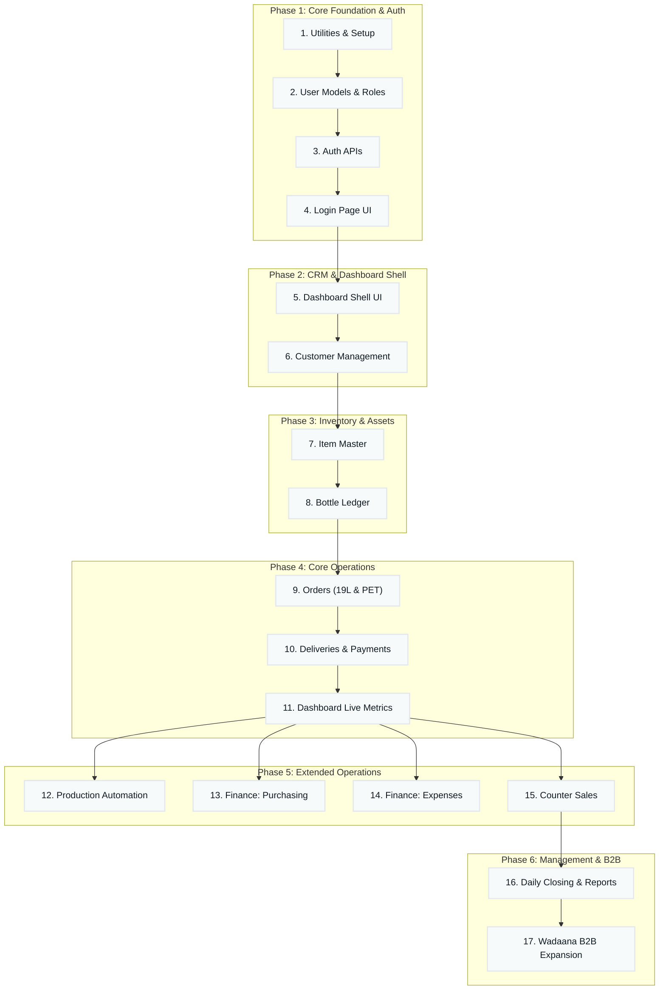

# Development Phases — AQUA Sphere OS (Comprehensive Roadmap)

This roadmap defines the strict hierarchy for building the AQUA Sphere OS. It maps every requirement from the Master Requirements document into actionable, testable phases. **A phase isn't "done" until its exit criteria are fully met.**

---

## 🕒 Phase 1: Core Foundation & Auth (Highest Priority)
**Goal:** Establish backend utilities, user roles, authentication APIs, and the Login Page based exactly on the prototype.

1. **Step 1: Backend Utilities (`backend/src/utils`)**
   - Scaffold Express app connected to PostgreSQL (NeonDB) with Prisma.
   - Populate essential helpers: `ApiError`, `ApiResponse`, `asyncHandler`, `jwtUtils` (token generation), and `hashUtils` (bcrypt).
   - Configure global ESLint + Prettier.
2. **Step 2: Users & Roles (Database)**
   - Define `User` model with roles (`Owner`, `Admin`, `Operator`, `Accountant`).
   - Implement the Dual-Company logic (ensure Users belong to either Aquasphere or Wadaana context).
3. **Step 3: Authentication APIs**
   - Build `/api/v1/auth/login`, `/logout`, and `/me`.
   - Implement `auth.middleware.js` (JWT httpOnly cookies) and `role.middleware.js` (RBAC strict checking).
4. **Step 4: Login Page UI (Frontend)**
   - Convert prototype HTML/CSS/JS into React.
   - Wire up UI to Auth APIs. Establish protected routes (React Router).
   - **Done When:** An Owner and an Operator can log in, receive a secure httpOnly cookie, and be correctly redirected. Unauthenticated users are forced to Login.

---

## 🕒 Phase 2: CRM & Dashboard Basics
**Goal:** Build the primary UI shell and allow the front desk to manage the customer database.

1. **Step 5: Dashboard Shell**
   - Build the responsive layout (Sidebar, Header, Workspace Toggle) from prototype.
   - Implement `x-company-context` header logic to separate Aquasphere and Wadaana HTTP requests.
2. **Step 6: Customer Management (CRM)**
   - `Customer` model: Phone (unique), Map Link, Home Photo URL (via Multer), Category, Default Price, Credit Limit.
   - Build CRUD APIs + Instant Search (<1s response time by phone/name).
   - Customer Detail View showing dynamic balance and bottle held fields.
   - **Done When:** An operator can search a customer instantly, view their profile, and upload a house photo. Customers are fully isolated between the two companies.

---

## 🕒 Phase 3: Inventory & Bottle Ledger
**Goal:** Setup tracking for physical assets and stock before any orders can consume them.

1. **Step 7: Core Inventory (Item Master)**
   - Define Raw Materials (Minerals, Labels, Caps) and Finished Goods (0.5L/1.5L PET packs).
   - Implement `InventoryTransaction` append-only ledger. No manually edited quantities!
   - Setup Reorder Alert Levels (e.g., Sodium < 3kg, Labels < 10kg).
2. **Step 8: 19L Bottle Ledger**
   - The most critical business asset. Track 5 states: Owned, At Factory, With Customers, Broken, Lost.
   - Build `BottleTransaction` append-only ledger.
   - **Done When:** A manual inventory entry updates the stock, and the bottle ledger equation (`at-factory + with-customers + broken == total-owned`) mathematically perfectly reconciles.

---

## 🕒 Phase 4: Core Operations (Orders & Deliveries)
**Goal:** The core business loop (Phone call → Order → Delivery) must be under 20 seconds.

1. **Step 9: Order Entry (19L & PET)**
   - Independent UI flows for 19L orders and PET orders.
   - Implement the "Smart Add Customer" modal inside the order workflow.
   - Soft-block logic: Warn operator if order pushes customer over `creditLimit` (0 = unlimited).
   - Live "Pending Orders" list.
2. **Step 10: Deliveries & Payments**
   - Delivery submission form for drivers returning from routes.
   - 19L Auto-Updates: Consume 1 Large Cap + precise fraction of Mineral Set upon delivery. Increase Customer Bottle Balance.
   - PET Auto-Updates: Reduce Finished Goods stock.
   - Soft-block logic: Customer cannot return more 19L bottles than they currently hold.
3. **Step 11: Live Dashboard Metrics**
   - Connect prototype KPI cards: Today's Sales, Cash Collection, Credit Sales, Pending/Completed Orders.
   - **Done When:** An operator places a 19L order (seeing credit warnings if applicable), completes the delivery, and the Dashboard KPIs, Customer Balance, and Bottle Ledger automatically update via a Prisma `$transaction`.

---

## 🕒 Phase 5: Extended Operations & Management
**Goal:** Complex backend calculations, purchasing, and expenses.

1. **Step 12: Production Automation (PET)**
   - Operator enters "Packs Produced" (e.g., 0.5L).
   - System automatically deducts raw materials using exact decimal precision (1 Mineral Set = 15,140L, 0.5L pack uses 108L fraction, 6.72g labels).
   - Increases Finished Goods stock.
2. **Step 13: Finance (Purchasing & Vendors)**
   - Vendors must exist before purchase.
   - Purchase entry increases inventory and Vendor Payable balance.
   - Mandatory receipt/bill photo upload required.
3. **Step 14: Finance (Expenses)**
   - Record fuel, salaries, electricity, etc.
   - Mandatory receipt photo upload required by Accountant.
   - Impacts profit only, never touches inventory.
4. **Step 15: Counter Sales**
   - Spot sales for walk-ins (Litres sold, caps used, cash collected).
   - **Done When:** A production run perfectly deduces 0.00012 fractions of minerals, and an expense entry with a photo reduces the calculated Dashboard profit.

---

## 🕒 Phase 6: Management, Closing & B2B Expansion
**Goal:** Lockdown mechanisms and future division expansions.

1. **Step 16: Daily Closing & Reports**
   - **Daily Closing:** Admin clicks "Close Day". Transaction modifications for that date are strictly locked for everyone except Owner.
   - **Reports:** Generate PDF/Excel for Sales, Profit, Inventory, and Outstanding Credits.
2. **Step 17: Wadaana B2B Expansion (Future Phase)**
   - While Wadaana currently mirrors Aquasphere, this phase will introduce the specialized Blowing Machine logic.
   - Complex Preform deduction formulas (Pure vs Mix, Factory vs Warehouse).
   - Specific client company ordering logic (Deosani, Pivrifine).
   - **Done When:** The owner can view comprehensive PDF reports, the Admin can lock yesterday's data securely, and Wadaana B2B operations run smoothly in their isolated context.

---

### Execution Rule
Work top to bottom strictly. Do not start a step until the previous step is 100% complete. If a phase turns up a question that isn't answered in `AQUA_Sphere_OS_Master_Requirements.md`, stop and request clarification.
