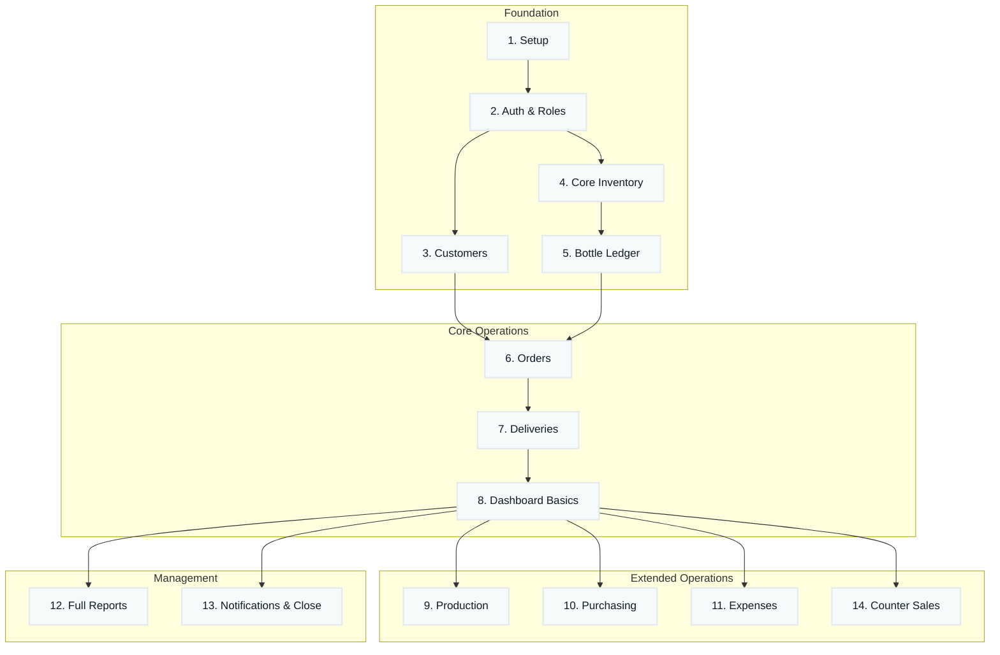

# Development Phases — AQUA Sphere OS

This is the build roadmap. Each phase is a working, testable slice of the product — not just a folder of code. **A phase isn't "done" until its exit criteria are true**, so the AI (or a developer) always knows when to move forward.

I've reordered and expanded your draft list based on real dependencies from `project-requirements.md` and `architecture.md` — mainly: **you can't build Orders before Customers exist, can't build Deliveries before Orders and the Bottle Ledger exist, and a real Dashboard needs real transactions to show.** So a few things moved earlier (Bottle Ledger, Inventory) and a few moved later (full Dashboard, Notifications). I split "Bottle Ledger" out from "Orders" as its own phase since it's the single most business-critical piece of data in the whole system and deserves to be solid before anything writes to it.

---

## Phase 1 — Project Setup

**Goal:** a working, empty skeleton for both client and server.
- Initialize monorepo structure (`frontend/`, `backend/`, `shared/`) per `architecture.md` §6.
- Scaffold React + Vite app with Tailwind v4 installed.
- Scaffold Express app with TypeScript, connect Prisma to NeonDB.
- ESLint + Prettier configured project-wide, per `rules.md` §1.
- `.env.example` files for both apps; secrets excluded from git.
- CORS configured on Express to allow the Vite dev server origin.
- **Done when:** both apps run locally (`npm run dev`), the Express API returns a health-check JSON, the React app can fetch it, and a first empty Prisma migration runs cleanly against NeonDB.

## Phase 2 — Authentication & Roles

**Goal:** people can log in, and every route respects who they are.
- `User` model (Operator/Accountant, Owner/Admin roles) in Prisma.
- JWT login flow (`/api/v1/auth/login`), bcrypt password hashing, httpOnly cookie, per `architecture.md` §3.
- `auth.middleware.ts` + `role.middleware.ts` on Express.
- Login page in React, protected route wrapper, Axios interceptor for cookie-based auth.
- Admin password reset flow requiring accountant approval (per manager notes).
- **Done when:** an Operator and an Owner account can both log in, see different navigation, and an Operator is provably rejected from any Owner-only endpoint (e.g. profit figures).

## Phase 3 — Customer Management

**Goal:** the front desk can create and find customers.
- `Customer` model: ID, name, phone (unique), address, map link, type, deposit, default price, credit limit, remarks, house photo.
- CRUD endpoints + search (by ID/name/phone) + soft-delete.
- Multer upload wired for the house photo (S3 or local disk), per `architecture.md` §11.
- Customer detail view shows the "instant snapshot" fields (balance, bottle count, last delivery, avg monthly orders) — even though some of these will show zero/placeholder until later phases populate real transactions.
- **Done when:** an operator can create a customer, find them by phone number in under a second, and edit their profile.

## Phase 4 — Core Inventory & Item Master

**Goal:** every raw material and finished good exists as a trackable item, before anything tries to consume one.
- `Item` model (raw materials + finished goods) and `InventoryTransaction` ledger, per `architecture.md` §4.
- Manual "opening stock" entry mechanism (a purchase-like transaction) to seed initial quantities from the manager's notes (PETs, caps, 19L bottles, etc.).
- Configurable low-stock reorder levels per item.
- Inventory list screen showing derived current stock (never a stored/edited number), with low-stock flags.
- **Done when:** every raw material and finished-good item from Section 2 of `project-requirements.md` exists in the system with a correct, derived starting stock.

## Phase 5 — Bottle Ledger

**Goal:** the 19L reusable bottle asset — the most business-critical figure — is tracked correctly before any order can touch it.
- `BottleTransaction` append-only ledger; derived totals (owned / at factory / with customers / broken / lost), per `architecture.md` §4 and requirements §10.
- "New bottles added" entry (fleet growth via purchase).
- Manual "mark lost" action (deliberate, separate from returns).
- Bottle summary view showing all five reconciling figures together.
- **Done when:** the five figures always reconcile (`at-factory + with-customers + broken == total-owned`), verified with a test seeding several ledger entries.

## Phase 6 — Orders (19L & PET)

**Goal:** the front desk can take a phone order in under 20 seconds.
- `Order` + `OrderItem` models; two distinct order types (19L, PET) that are never mixed, per requirements §6.
- Independent delivery-status / payment-status tracks, computed (not stored as one flag).
- Order-entry screen built around the real call-taking sequence: find customer → enter type-specific fields → save.
- Live "Pending Orders" list.
- Soft-block check: credit limit vs (outstanding + new order amount), per requirements §9 and `design.md` §10.
- **Done when:** an operator can place a 19L order and a PET order end-to-end, see it in Pending Orders, and see the credit-limit warning trigger correctly (and still be able to proceed).

## Phase 7 — Deliveries

**Goal:** completing a delivery correctly updates every balance in the system automatically.
- `Delivery` + `Payment` models.
- Delivery-completion form (per order type) per requirements §7.
- On submit: recompute order status, update bottle ledger (19L), update customer balance, update raw-material/finished-goods inventory, update cash/profit figures — all inside one Prisma `$transaction` (`architecture.md` §4).
- Soft-block: bottles returned ≤ customer's current balance, with confirm-to-proceed.
- Support multiple partial deliveries against one order.
- **Done when:** completing a delivery — including a partial one — correctly and atomically updates the bottle ledger, inventory, and balances, with no manual math anywhere in the flow.

## Phase 8 — Dashboard (Basics)

**Goal:** the owner has something real to look at, now that real transactions exist.
- Today's Sales, Cash Collection, Credit Sales, Pending/Completed Orders, Bottle Summary card.
- Mobile-first responsive layout per `design.md` §12.
- Live updates via TanStack Query background refetch.
- **Done when:** the owner can open the dashboard on a phone and see today's real activity from Phases 6–7 reflected accurately.

*(This closes out your original "Phase 1" build target from `project-requirements.md` §19 — Customers → Inventory → Bottle Ledger → Orders → Deliveries → basic Dashboard is the highest-value end-to-end slice, and it's now fully working.)*

## Phase 9 — Production (PET)

**Goal:** production runs derive everything automatically from two numbers.
- `ProductionBatch` model.
- Operator enters only pack counts (0.5L / 1.5L produced).
- Shared `mineral-calc` service derives exact-fraction mineral-set consumption, label/shrink-wrap deduction (once conversion factors are confirmed — see Open Decisions), and finished-goods increase — per requirements §4 and §3.
- **Done when:** entering a production run correctly reduces raw materials and increases finished-goods stock, with mineral consumption stored as an exact, unrounded fraction.

## Phase 10 — Purchasing & Vendors

**Goal:** stock can come in, and vendors can be paid over time — not just all-at-once.
- `Vendor`, `Purchase`, `VendorPayment` models.
- Purchase entry increases inventory + vendor payable.
- Vendor payment entry reduces payable, recorded as its own transaction stream.
- 19L bottle purchases route into the Bottle Ledger (Phase 5), not regular inventory.
- **Done when:** a purchase and a partial vendor payment both correctly reflect in inventory and vendor balances.

## Phase 11 — Expenses

**Goal:** operating costs are tracked without touching inventory.
- `Expense` model (fuel, salaries, electricity, rent, repairs, misc.).
- Expense entry screen; reflected in profit calculations only.
- **Done when:** an expense entry changes the profit figure on the dashboard but never touches any inventory or stock number.

## Phase 12 — Expanded Dashboard & Reports

**Goal:** the owner gets the full picture, and the business gets historical reporting.
- Full dashboard: add Today's Expenses, Estimated Profit, Outstanding Customer/Vendor Balances, Raw Material & Finished Goods Inventory with low-stock flags.
- Daily/Weekly/Monthly/Yearly reports: Sales, Profit, Expenses, Inventory, Production, Customer Credits, Vendor Balances, Bottle Summary, Pending Orders.
- PDF export (PDFKit) and Excel export (ExcelJS) for reports and invoices.
- Exact report layouts confirmed with the owner before finishing this phase (flagged as an open item in `project-requirements.md` §10).
- **Done when:** the owner can pull any report for any period and export it as PDF or Excel.

## Phase 13 — Notifications & Daily Closing

**Goal:** the system proactively flags things instead of the operator having to remember.
- Customer reminder alerts (no order in N days — configurable, default 1 week per manager notes).
- Low-stock alerts surfaced on the dashboard and, later, as a notification (email/in-app).
- Daily Closing: locks all transactions on/before the close date; accountant blocked from editing closed-day records at the API layer, per `rules.md` §6.
- **Done when:** a stale customer triggers a reminder, a low-stock item triggers an alert, and closing a day genuinely prevents further edits to it.

## Phase 14 — Counter Sales & Invoicing

**Goal:** walk-in sales and formal billing are supported alongside phone orders.
- Counter sale entry (litres, caps, cash/credit) per manager notes §7.
- Invoice/bill generation (PDFKit) tied to any order or counter sale.
- **Done when:** a walk-in sale can be recorded and an invoice generated for it or for any completed order.

## Phase 15 — Blowing Machine Division (Division 3)

**Goal:** the fully separate third division gets its own tracking, once Divisions 1 & 2 are stable.
- Separate item master, production, and sales/purchase tracking for Aqua Sphere, Deosai, and Pivrifine bottle lines, per requirements §1.3 and manager notes §9–10, §12.
- Explicitly isolated from Division 1/2 data — no shared balances or reports unless later requested.
- **Done when:** Division 3 production and sales can be recorded without affecting any Division 1/2 number.

## Phase 16 — Website

**Goal:** the public-facing site exists and is optimized, per manager notes §8, §13.
- `aquasphere.org`: Customers, Reviews, Work With Us, Find Us sections, social links.
- Performance/SEO optimization pass.
- **Done when:** the site is live, mobile-friendly, and loads quickly — this track can run in parallel with later app phases since it doesn't depend on the internal system.

## Phase 17 — Optimization & Polish

**Goal:** tighten everything now that the full system is in daily use.
- Performance pass per `rules.md` §10 (indexes, pagination audits, N+1 query cleanup).
- Full mobile polish pass against `design.md`.
- Dark mode enabled (tokens already defined in `design.md` §1/§13).
- Individual bottle serialization evaluated (only if the business decides it's worth it — data model already supports adding it, per requirements §10).
- Formal price-history mechanism, if the owner wants it beyond the existing per-order-item snapshot.
- **Done when:** the system has been used in production long enough to reveal real slow points, and those are resolved — this phase is intentionally last and ongoing rather than a one-time task.

---

### How to use this roadmap

Work top to bottom. Don't start a phase until the previous one's **"Done when"** line is genuinely true — a Dashboard built on top of a Bottle Ledger that doesn't reconcile yet will just show wrong numbers confidently, which is worse than showing nothing. If a phase turns up a question that isn't answered in `project-requirements.md`, stop and add it to that document's Open Decisions section rather than guessing (per `rules.md` §9, AI Boundaries).
