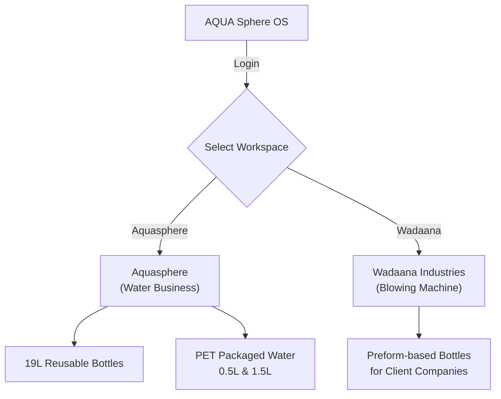

# Project Requirements — AQUA Sphere OS

## 1. Project Overview

AQUA Sphere OS is a custom business management system for AQUA Sphere, a drinking water manufacturing and distribution company. The company runs **two completely separate businesses** under one login system:

1. **Aquasphere (Water Business)** — contains two product lines:
   - **19L Reusable Water Bottles** — delivered to homes, offices, restaurants, shops, and distributors. Bottles are refilled at the moment of delivery, so there is no finished-goods stock for this line — instead, the company must track the reusable bottles themselves as they move between the factory and customers.
   - **Packaged Water (PET Bottles)** — 0.5L and 1.5L bottles, produced in advance and stored as finished goods until sold.

2. **Wadaana Industries (Blowing Machine)** — production of preform-based bottles for client companies (Aqua Sphere, Deosani, Pivrifine), tracked completely separately from the water business.



> **Critical Rule:** These two sides **never share data**. Inventory, orders, customers, and reports are fully isolated. The same 5 roles operate in both, but their actions in one division have zero impact on the other.

Today, the business runs on manual records and phone calls. AQUA Sphere OS replaces this with one web-based system that the front-desk operator, the accountant, the production manager, the marketing manager, the admin, and the owner can all use — at the same time — to manage customers, orders, deliveries, inventory, production, purchasing, expenses, and reporting.

The system is being built as a simple, honest reflection of how this business actually works — not a generic off-the-shelf inventory or ERP template.

## 2. Business Goals

- Replace manual/phone-based order-taking with a system that shows the operator everything they need about a customer in one glance.
- Make every number in the system (inventory, bottle counts, customer balances, vendor balances) trustworthy — calculated from real transaction history, never manually typed in and edited.
- Give the owner a live, accurate picture of the business (sales, cash, profit, stock, bottles) from a phone, at any time.
- Reduce mistakes and disputes around 19L bottle counts, which are the company's own physical assets and easy to lose track of.
- Keep front-desk operations fast — an order should take under 20 seconds to place once the customer is found.
- Keep running costs low by using cloud services with generous free tiers rather than dedicated paid servers, at least in the early stages.

## 3. What to Build

- A cloud-hosted, mobile-responsive web application usable from a phone or an office PC.
- **Two-business workspace** — after login, users select Aquasphere or Wadaana. All data is fully isolated between the two.
- Customer profile management (create, search, view, edit, delete — delete is Owner-only).
- Order management for two separate order types within Aquasphere: 19L orders and PET orders — never mixed within one order.
- **Dual independent status tracks** per order: delivery status (pending → partial → delivered) and payment status (unpaid → partial → paid) — each computed from underlying records, never stored as a single flag.
- Delivery completion workflow that updates bottle balances, inventory, cash, and customer balances automatically.
- A bottle asset ledger for the 19L bottles (total owned, at factory, with customers, broken, lost) — reconciled as: `Total Owned = At Factory + With Customers + Broken + Lost`.
- Raw material inventory tracking with automatic deductions tied to production and delivery.
- Automatic water and mineral-set consumption calculations (no manual math by any operator) — using **exact decimal fractions, never rounded**.
- PET production batch entry (operator enters only pack quantities; everything else is derived).
- **Wadaana Industries module** — preform inventory (Pure/Mix, Factory/Warehouse), production batch entry with auto-deduction, per-company order management.
- Purchasing and vendor management, including partial vendor payments. **Vendor must exist before purchase** — no inline creation.
- Operating expense tracking (fuel, salaries, electricity, rent, repairs, etc.) — **every expense entry MUST have a receipt photo attached**. Text-only entries are disallowed.
- **Spot sales / counter sales** — walk-in customers with non-standard containers.
- **Daily closing** — Admin closes the day, locking all entries. Only Owner can edit after close.
- **Customer reminders** — alert when a customer hasn't ordered in 1 week.
- **Credit breach alerts** — auto-flag when credit limit exceeded, with WhatsApp/email/dashboard notification.
- An owner-facing live dashboard (sales, cash, profit, pending orders, stock levels, bottle summary).
- Daily/weekly/monthly/yearly reports across sales, profit, expenses, inventory, production, and balances.
- Role-based access for 5 distinct roles (Owner, Admin, Production Manager, Accountant, Marketing Manager).
- Support for multiple people using the system at the same time without data conflicts.
- A **soft-block system**: warn on risky actions (credit limit exceeded, more bottles returned than held, stock going negative) but **never hard-stop** the operator mid-call.

## 4. What NOT to Build (for now)

- No individual bottle serialization (barcodes/QR codes per bottle) — bottles are tracked in bulk counts per customer. The data model should leave room to add this later, but it is not needed now.
- No driver/route assignment or dispatch planning — deliveries stay informally assigned for this phase.
- No native mobile app (iOS/Android) — a responsive web app is sufficient.
- No on-site server or self-hosted infrastructure — the system must be cloud-hosted.
- No manual editing of any inventory count, bottle count, or balance field anywhere in the system — every figure must come from a transaction record.
- No mixing of 19L and PET items within a single order — they remain two separate order types.
- No automatic "lost bottle" detection — marking a bottle lost must always be a deliberate, manual action.
- Full reports module detail, exact shrink-wrap conversion factors, and formal price-history are open items — not required for the first build phase (see Section 10, Future Scope).
- No reorder logic for raw materials — stock alerts only, no auto-purchase generation.

## 5. Target Users

| Role | Primary Use |
|------|-------------|
| **Owner / Super Admin** | Oversees both divisions via dashboard and reports, mainly from a phone. Full system control. |
| **Admin** | View-only supervisor. Checks stock, production, orders. Closes the day. Cannot see profit or place orders. |
| **Production Manager** | Enters production counts (PET packs, Wadaana batches). Sees inventory. Cannot see financials or customer records. |
| **Accountant** | Handles vendor payments, expenses (with receipt photos), spot sales, cash reports. Generates invoices. Cannot adjust inventory directly. |
| **Marketing Manager** | Takes phone orders, manages customers, checks delivery status. Cannot delete customers or see profit margins. |

**Customers** (indirect users) — homes, restaurants, shops, and distributors who place recurring 19L and PET orders. They do not log into the system directly; they interact with the operator by phone.

## 6. User Roles & Permissions

### 6.1 Role Hierarchy

```
Owner / Super Admin
    └── Admin (View-Only + Close Day)
        └── Production Manager
            └── Accountant
                └── Marketing Manager
```

### 6.2 Permission Matrix

| Role | Can See | Can Edit | Cannot See | Cannot Edit |
|------|---------|----------|------------|-------------|
| **Owner** | Everything across both divisions | All data, passwords, credit limits, inventory corrections | Nothing | — |
| **Admin** | Inventory, Daily Production, Daily Orders, Customer Alerts | End-of-day close (click OK to lock day) | Profit, Cost, Raw material cost metrics | Daily transactions, Orders |
| **Production Manager** | Inventory (Minerals, Caps, Bottles, Labels, Shrink Wrap, PETs) | Daily production counts, broken bottles | Financials, Sales, Customer records | — |
| **Accountant** | Customers, Expenses, Cash collections | Expenses (with receipt photo), Spot sales, Cash reports | Direct inventory adjustment | Inventory |
| **Marketing Manager** | Customer profiles, Orders, Inventory levels | Orders, Delivery status, Prices, Payment methods, New customers | Delete customers, Profit margins | Credit limits |

### 6.3 Critical Permission Rules

- **Owner** is the only role that can delete customer records, manually override inventory (as logged adjustment), modify all passwords, edit credit limits, and view profit/loss reports.
- **Admin** is strictly view-only — cannot insert/edit daily transactions, cannot view net profit, cannot place orders.
- **Admin password reset** requires accountant confirmation — two-step flow.
- **Daily close** is performed by Admin. After close, no role except Owner can edit that date's records.

## 7. Core Features

1. **Two-Business Workspace** — after login, select Aquasphere or Wadaana. Persistent header shows active workspace. All data fully isolated.
2. **Customer Management** — permanent customer profiles (ID, name, phone as unique lookup key, address, map location, type, deposit, default price, credit limit, remarks, and an optional photo of the house for the delivery driver). Create, search (by ID/name/phone), edit, and delete (Owner-only).
3. **Order Management** — fast phone-order entry for 19L and PET orders separately, with two independent status tracks per order.
4. **Delivery Completion** — recording quantity delivered, bottles returned (good/broken), cash received, and payment method; this single action automatically updates bottle balances, customer balances, inventory, cash/profit figures, and the dashboard.
5. **Bottle Asset Ledger** — an append-only log of every bottle movement (delivery, return, breakage, loss, new purchase), from which all bottle balances are always calculated, never stored as an editable number.
6. **Raw Material & Mineral Set Tracking** — automatic, exact-fraction deduction of raw materials and mineral sets at the correct time (production time for PET, delivery time for 19L).
7. **Production Batches** — operator enters only the number of 0.5L and 1.5L packs produced; the system derives all raw material deductions and finished-goods increases.
8. **Wadaana Industries** — preform inventory (Pure/Mix), production batch entry with auto-deduction, per-company order management (Aqua Sphere, Deosani, Pivrifine), Factory/Warehouse location tracking.
9. **Purchasing & Vendor Management** — recording purchases (which increase stock and vendor payables) and vendor payments (which reduce payables) as separate transaction types. **Vendor must exist before purchase.**
10. **Operating Expenses** — fuel, salaries, electricity, rent, repairs, and miscellaneous expenses, which affect profit but never inventory. **Every expense entry MUST have a receipt photo.**
11. **Spot Sales / Counter Sales** — direct walk-in sales recorded by litres, caps, and cash/credit.
12. **Credit & Soft-Block Warnings** — warnings (not hard blocks) when a credit limit would be exceeded, when a bottle return exceeds a customer's held balance, or when raw material stock would go negative. Credit limit of 0 means "no limit."
13. **Customer Reminders** — alert when a customer hasn't placed an order in 1 week.
14. **Credit Breach Alerts** — auto-detect and notify (WhatsApp/email/dashboard) when a customer exceeds their credit limit or doesn't pay within the credit duration.
15. **Daily Closing** — Admin closes the day, locking all entries. Only Owner can override.
16. **Dashboard** — live view of today's sales, cash collection, credit sales, expenses, estimated profit, pending/completed orders, outstanding balances, inventory levels with low-stock flags, and the full 19L bottle summary.
17. **Reports** — daily, weekly, monthly, and yearly views of sales, profit, expenses, inventory, production, customer credit, vendor balances, bottle summary, and pending orders.
18. **Invoicing** — generating a bill/invoice for an order.
19. **Role-based Access** — 5 distinct roles with API-enforced permissions.
20. **Concurrency Safety** — multiple users working simultaneously without data conflicts.

## 8. Functional Requirements

### Customers
- Store: Customer ID (auto-generated), name, phone number (unique), address, map link/coordinates, customer type (Home / Restaurant / Shop / Distributor), security deposit (in 19L bottles), default selling price (optional, suggested only), credit limit (0 = unlimited), credit duration (months), remarks, and an optional exterior house photo.
- Search customers by ID, name, or phone number. **Only a search option** — no separate browse/list-first view.
- On finding a customer, immediately display: name, phone, address, outstanding balance, current 19L bottle balance, last delivery date, and average monthly orders — all without extra clicks.
- Support full create/edit/delete of customer records. Delete is Owner-only.
- **Smart add customer flow** — if customer not found during order entry, open an "Add New Customer" modal within the order workflow, then return to order with customer auto-selected.

### Orders
- Two distinct order types — 19L and PET — that are **never mixed** within one order.
- 19L order fields: quantity ordered, amount charged, expected delivery date, remarks.
- PET order fields: number of 0.5L PETs, number of 1.5L PETs, amount charged, expected delivery date, remarks.
- Maintain **two independent statuses** per order — delivery status and payment status — each recomputed from the underlying delivery/payment records, not stored as a single flag.
- Maintain a live "Pending Orders" list (delivery status pending or partial), visible to both operator and owner.
- Support multiple partial deliveries against a single order over time.
- **Target: Place an order in under 20 seconds once the customer is found.**

### Deliveries
- On delivery completion, capture: quantity delivered, (for 19L) good and broken bottles returned, cash received, payment method, and remarks.
- Automatically recompute delivery status and payment status, update the customer's bottle balance and outstanding balance, deduct raw materials (Large Caps and Mineral Sets for 19L), reduce finished-goods inventory (for PET), update cash/profit figures, update the customer's last delivery date and average monthly orders, and refresh the dashboard and reports.
- Enforce that a customer cannot return more bottles than their calculated current balance — show a **warning** with their actual balance and require **explicit confirmation** before allowing it (soft-block, never hard-block).

### Inventory & Bottle Ledger
- Raw materials tracked: 0.5L and 1.5L empty PET bottles, small caps, large caps, labels (by kg), shrink wrap (by kg), and mineral sets. Fuel is an expense, not inventory.
- Mineral Sets: 1 set = 2kg Calcium + 1kg Magnesium + 0.5kg Sodium, and treats **15,140 litres** of water.
- Water use per unit: ~23L per 19L bottle filled, ~9L per 0.5L PET bottle, ~12L per 1.5L PET bottle. Mineral set consumption must always be calculated as an **exact decimal fraction, never rounded**.
- PET raw-material and mineral consumption happens at **production time**; 19L Large Cap and mineral consumption happens at **delivery time** (since 19L bottles are never produced ahead of time).
- The 19L bottle asset ledger is append-only; the five figures must always reconcile: `Total Owned = At Factory + With Customers + Broken + Lost`.
- Lost bottles are written off only through a deliberate manual action — loss is NOT automatically inferred from "not returned."
- No inventory quantity, bottle count, or balance is ever directly editable — all figures are calculated from transaction history. Mistakes are corrected via an explicit adjustment/reversal transaction with a required reason.
- Configurable low-stock reorder levels per item, shown as alerts on the dashboard.

### Production (PET only)
- Operator enters only: number of 0.5L packs produced and number of 1.5L packs produced.
- The system automatically derives and applies: empty bottle deduction, cap deduction, label deduction (6.72g per 0.5L pack, 7.86g per 1.5L pack), shrink-wrap deduction (pending confirmation), mineral set deduction (exact fraction), and finished-goods increase.

### Wadaana Industries (Blowing Machine)
- **Client companies**: Aqua Sphere (Pure only), Deosani (Pure + Mix), Pivrifine (Pure + Mix). Not hardcoded — stored in a Companies table.
- **Preform types**: Pure and Mix — two entirely separate running totals, never merged.
- **Inventory locations**: Factory (raw preform) and Warehouse (finished bottles). Both can store preform.
- **Preform conversion** (hardcoded): 0.5L Mix = 27g, 1.5L Mix = 15g, 1.5L Pure = 13g, 0.5L Pure = 15g per bottle.
- PM enters batch: bottle size, preform type, quantity, source location. System auto-deducts preform.
- Marketing Manager manages orders **separately per company** — three independent order lists.

### Purchasing & Vendors
- **Vendor must exist first** — a purchase can ONLY be recorded against a vendor that ALREADY EXISTS in the system. No "quick add" shortcut.
- Recording a purchase automatically increases the relevant raw material inventory and the vendor's outstanding payable.
- Vendor payments are recorded separately from purchases and reduce the payable — purchases are not assumed paid in full at purchase time.
- New 19L bottle purchases (fleet growth) go into the bottle asset ledger, not regular inventory, since bottles are a durable asset.
- **Every purchase entry MUST have a bill photo attached.**

### Credit & Warnings (Soft-Block Philosophy)
- Before placing an order, check (existing outstanding balance + new order amount) against the customer's credit limit; if exceeded, warn with current balance, limit, and new balance, but allow the operator to proceed.
- A credit limit of **zero means "no limit,"** not "block everything."
- If any transaction would take raw material stock below zero, warn but still allow it to be recorded.
- The system should **never hard-block** the operator mid-call.

### Expenses
- Types: Fuel, Salaries, Electricity, Plant Rent, Vehicle Repair, Machine Repair, Miscellaneous.
- **Every expense entry MUST have a picture of the physical bill/receipt attached.** Text-only entries are DISALLOWED.
- Alternative: Upload picture of hand-written paper ledger, then transcribe details below the image.
- Expenses reduce profit on reports and dashboard but **never affect inventory**.

### Spot Sales (Counter Sales)
- Walk-in customers bring non-standard personal containers.
- Fields: Total water sold (litres), number of caps issued, cash collected, assigned credit limits (if applicable).

### Daily Closing
- Admin cross-verifies stock numbers, production, and orders (via WhatsApp + Portal), then clicks "Close Day."
- After Admin closes the day, **no entries can be added or edited by any role except Owner**.
- All orders placed on the current date must be closed or marked complete by end-of-day. Any un-cleared orders automatically escalate to Owner's and Admin's dashboard with warning indicators.

### Dashboard & Reporting
- Live dashboard: today's sales, cash collection, credit sales, expenses, estimated profit, pending/completed orders, outstanding customer and vendor balances, raw material and finished-goods inventory with low-stock flags, and the full 19L bottle summary (all 5 reconciling figures).
- Daily, weekly, monthly, and yearly reports covering sales, profit, expenses, inventory, production, customer credit, vendor balances, bottle summary, and pending orders.
- Once a day is closed, its records cannot be edited by the accountant or any non-Owner role.

### Access & Concurrency
- Separate logins for 5 distinct roles.
- Admin can reset an accountant's password with the accountant's permission.
- Multiple users must be able to work at the same time without producing an impossible or conflicting state — any action that reads a balance and then writes to it must be handled safely at the database level (transactions/locking).

## 9. Non-Functional Requirements

- **Platform**: Web application only, not native mobile or desktop, genuinely mobile-responsive (the owner's primary access point is a phone).
- **Hosting**: Cloud-hosted, accessible from anywhere, no on-site server to maintain.
- **Cost**: Favor low/no-cost hosting (e.g. a managed Postgres free tier plus a free-tier app host) until usage outgrows it.
- **Performance/UX**: Every operator action should be fast — placing an order should take under 20 seconds once the customer is found; large touch targets and minimal clicks for phone use.
- **Data integrity**: Every change must be traceable through transaction history — this underpins trust in every number the system shows.
- **Concurrency**: The system must behave correctly when multiple people (operator, owner, accountant) use it at the same time.
- **Auditability**: No back-door edits to balances or inventory — only transactions and explicit, reasoned adjustments.
- **Decimal precision**: Mineral consumption and all derived fractions must use exact decimal math — no rounding at transaction time to prevent cumulative drift.
- **Security**: Role-based access control, with admin-level password reset requiring accountant permission.
- **Division isolation**: Aquasphere and Wadaana data must never mix — same user, different workspace, zero shared records.

## 10. Future Scope

The following are intentionally deferred and should be revisited later:

- Exact shrink-wrap conversion factors (kg consumed per PET pack) — to be provided by the owner.
- A formal price-history mechanism beyond the per-order-item price snapshot, e.g. generating historical reports at a customer's rate as of a past date.
- Full detail of the Reports module — exact layouts for daily/weekly/monthly/yearly rollups, to be worked out with the owner once core workflows are stable.
- Driver/route assignment and delivery dispatch planning.
- Individual bottle serialization (barcode/QR per bottle) for more precise loss auditing, if the business decides it's worth the added overhead later.
- Company website (aquasphere.org) optimization and a public-facing site with customer info, reviews, "work with us," and "find us" sections.
- Advanced Wadaana features: adding new client companies beyond the initial three, complex preform pricing models.

### Suggested Build Order

- **Phase 1**: Foundation (DB, auth, 5-role system, company context), Customers, item master, core inventory ledger, 19L order desk + delivery + bottle ledger, PET order desk + delivery, basic dashboard.
- **Phase 2**: Purchasing, vendors, production batches with automatic raw-material/mineral deduction, operating expenses with receipt photos, spot sales, expanded dashboard (stock levels, low-stock alerts, profit), daily closing.
- **Phase 3**: Full reports module, Wadaana Industries module (preform, production, per-company orders), price history (if needed), and refinements to user roles/permissions.
